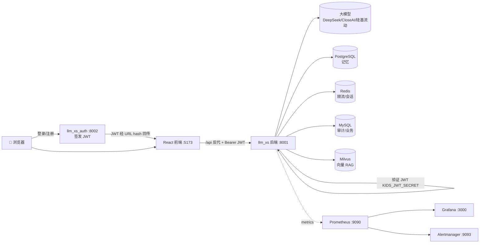

# 🌟 langchain_xiao_bo_shi · 小博士小学生 AI 学习助手（Monorepo）

> GitHub 仓库：[wangwp2019-blip/langchain_xiao_bo_shi](https://github.com/wangwp2019-blip/langchain_xiao_bo_shi)

基于 **LangChain 1.2 + LangGraph** 的实战教程仓库，核心是一套可直接上线的**小学生 AI 学习助手「小博士」**：聊天答疑（默认**简单聊天 + 知识库 RAG**）、资料库上传检索、按年级出题练习、Jarvis 学情闭环，内置儿童安全护栏，并配套**独立 JWT 认证服务**、React 前端、完整的生产部署 / 监控 / 备份 / 灰度方案。

> **不填任何 Key 也能跑**：默认离线降级模式，问答（含算式直算）、出题、判分、鼓励、安全过滤都可用；  
> 配好 `.env` 即自动启用真实大模型，**代码零改动**；在线异常时自动降级，绝不把报错丢给孩子。

---

## 📑 目录

- [仓库结构](#-仓库结构)
- [子项目一览](#-子项目一览)
- [服务拓扑与端口](#-服务拓扑与端口)
- [快速开始](#-快速开始)
- [环境变量（.env）](#-环境变量env)
- [小博士功能一览](#-小博士功能一览)
- [API 一览](#-api-一览)
- [认证服务（llm_xs_auth）](#-认证服务llm_xs_auth)
- [安全与合规](#-安全与合规)
- [监控 / 备份 / 部署](#-监控--备份--部署)
- [测试](#-测试)
- [常见问题](#-常见问题)

---

## 📁 仓库结构

```
langchain_xiao_bo_shi/
├── llm_xs/                 小博士 · AI 学习助手（FastAPI 后端 + React 前端 + LangGraph）
│   ├── app/learning/       Jarvis 学习域（KP/Gap/Attempt/家长报告）
│   ├── app/knowledge_library/  资料库上传、解析、向量索引与检索
│   └── data/kids_knowledge.txt  内置小学生百科（RAG 默认灌库）
├── llm_xs_auth/            用户认证服务（FastAPI + fastapi-fullauth，签发 JWT）
├── docs/                   产品/学习域设计文档 + KP 示例（*.kp.md）
├── 学生Jarvis-v2/          v2 场景域、验证切片与架构文档
├── knowledge.txt           示例知识库文本（可用于 RAG 灌库演示）
├── requirements.txt        教程 + llm_xs 合并 Python 依赖
├── .env                    共享密钥与模型配置（LLM / Embedding / JWT 等，勿提交）
└── README.md               本文件（仓库总览）
```

> 详细的子项目说明见 [`llm_xs/frontend-web/README.md`](llm_xs/frontend-web/README.md) · [`llm_xs/docs/JARVIS_LEARNING.md`](llm_xs/docs/JARVIS_LEARNING.md) · [`docs/项目架构与配置说明.md`](docs/项目架构与配置说明.md)。

---

## 🧩 子项目一览

| 子项目 | 角色 | 技术栈 | 默认端口 |
| --- | --- | --- | --- |
| **llm_xs** | 大模型后端（问答/出题/判分/RAG/记忆/学习域/资料库） | FastAPI · LangGraph · LlamaIndex | 8001 |
| **llm_xs/frontend-web** | React 主前端（SSE 流式、出题、登录守卫） | React 19 · Vite · Tailwind v4 | 5173 |
| **llm_xs/app/frontend** | Streamlit 备用前端（零 Node） | Streamlit | 8501 |
| **llm_xs_auth** | 注册/登录，签发 JWT 供后端鉴权 | FastAPI · fastapi-fullauth · SQLite | 8002 |

三者通过共享密钥 **`KIDS_JWT_SECRET`** 串联：认证服务签发 JWT，小博士后端验证 JWT 识别用户身份。

---

## 🗺️ 服务拓扑与端口



| 端口 | 服务 | 说明 |
| --- | --- | --- |
| 8001 | llm_xs 后端 | API + 内嵌 UI（生产默认关） |
| 8002 | llm_xs_auth | 登录/注册/JWT |
| 5173 | React 前端 | 开发服务器（`/api` 反代 8001） |
| 8080 | nginx | 容器最小起步入口 |
| 443 | nginx TLS | 灰度/生产 HTTPS |
| 9090 / 9093 / 3000 | Prometheus / Alertmanager / Grafana | 监控栈 |
| 5432 / 6379 / 3306 / 19530 | Postgres / Redis / MySQL / Milvus | 数据后端 |

---

## 🚀 快速开始

### 0. 准备环境（Python 3.12+）

```bash
cd langchain1.2_tutorial
conda create -n kid312 python=3.12 -y && conda activate kid312
pip install -r llm_xs/requirements.txt       # 小博士后端（含 LlamaIndex / PDF 解析）
# 或 pip install -r requirements.txt         # 教程全量依赖
cp .env.example .env 2>$null || true       # 若无示例，直接编辑 .env（见下文）
```

### 1. 启动认证服务（可选，启用账号登录时需要）

```bash
cd llm_xs_auth
pip install -r requirements.txt
python run.py                              # http://localhost:8002
```

### 2. 启动小博士后端

```bash
cd llm_xs
python run_ingest.py                       # 可选：重建向量索引（内置百科 + 已上传资料）
python run_api.py                          # http://localhost:8001
```

> **默认简单聊天模式**：无需 Onboarding 即可聊天；Agent 会调用 `search_knowledge_base` 检索资料库。家长端 **📚 知识库** Tab 可上传 PDF/txt/docx/图片（单文件最大 100MB）。

### 3. 启动 React 前端

```bash
cd llm_xs/frontend-web
npm install && cp .env.example .env
npm run dev                                # http://localhost:5173
```

### 4. 一键 Docker（最小 → 全栈）

```bash
cd llm_xs

# 最小起步（仅后端，离线可跑，经 nginx 8080 访问）
docker compose up -d --build backend

# 完整拓扑（postgres + redis + mysql + milvus + 前端 + 监控）
docker compose --profile full --profile frontend --profile monitoring up -d --build
```

> 灰度/生产（TLS + 密钥校验 + Cron 备份）见 [`llm_xs/docs/GRAY_RELEASE.md`](llm_xs/docs/GRAY_RELEASE.md)。

---

## 🔑 环境变量（.env）

仓库根 `.env` 由 **llm_xs 与 llm_xs_auth 共享**（各项目会先加载根 `.env`，再加载自身 `.env` 覆盖）。请填入**自己的密钥**，不要提交真实值。

```ini
# ---- 大模型供应商（任选其一即可在线，留空则离线降级）----
DEEPSEEK_API_KEY=sk-xxx
DEEPSEEK_BASE_URL=https://api.deepseek.com
CLOSEAI_API_KEY=sk-xxx
CLOSEAI_BASE_URL=https://api.openai-proxy.org/v1
ZHIPUAI_API_KEY=xxx
DASHSCOPE_API_KEY=sk-xxx
OPENROUTER_API_KEY=sk-or-v1-xxx

# ---- Embedding（向量 RAG，硅基流动 BGE-M3）----
SILICONFLOW_API_KEY=sk-xxx
SILICONFLOW_BASE_URL=https://api.siliconflow.cn/v1
KIDS_EMBED_MODEL=Pro/BAAI/bge-m3

# ---- 知识库 / 聊天模式（可选，以下为默认）----
KIDS_SIMPLE_CHAT_MODE=true              # 简单聊天：无 onboarding/学情工具，优先查资料库
KIDS_KNOWLEDGE_SCOPE_FILTER=false       # 全库检索，不按年级/学科过滤
KIDS_KNOWLEDGE_MAX_UPLOAD_BYTES=104857600

# ---- 联网搜索（可选）----
TAVILY_API_KEY=tvly-xxx

# ---- LangSmith 可观测（可选）----
LANGSMITH_TRACING=true
LANGSMITH_API_KEY=lsv2_pt_xxx
LANGSMITH_PROJECT=langchain1.2_tutorial

# ---- 认证服务 ↔ 后端 共享 JWT 密钥（两边必须一致）----
KIDS_JWT_SECRET=请改成你自己的-至少32字节-随机串
```

> ⚠️ 当前仓库 `.env` 内含示例明文密钥，**上线前务必替换并从版本库移除**。  
> 小博士后端的 `KIDS_*` 变量详见 [`docs/项目架构与配置说明.md`](docs/项目架构与配置说明.md) 与 [`llm_xs/docs/JARVIS_LEARNING.md`](llm_xs/docs/JARVIS_LEARNING.md)。

---

## ✨ 小博士功能一览

| 模块 | 功能 | 说明 |
| --- | --- | --- |
| 💬 问答 | 聊天 / SSE 流式 | **默认简单聊天模式**：ReAct + `search_knowledge_base`；可关 `KIDS_SIMPLE_CHAT_MODE` 启用完整学情工具 |
| 📚 资料库 | 上传 + RAG | 家长端管理；支持 txt/pdf/docx/图片；LlamaIndex 增量索引；`POST /api/knowledge/search` |
| 📇 学习卡片 | `POST /api/study-card` | RAG + LLM 输出结构化 JSON（知识点/例子/鼓励） |
| 📝 出题练习 | 年级 + 学科 + 题数 | 数学按年级生成，语文/英语/科学题库；`seed` 可复现 |
| ✅ 判分 | `session_id` 闭环 | 答案存服务端，响应不含答案，防作弊 |
| 🎉 鼓励 | 逐题 + 总结 | 答对表扬、答错温和引导、留空友好提示 |
| 🛡️ 安全 | 三级护栏 | 正常/引导/拦截 + 输出净化 + 可选 Moderation |
| 🧠 记忆 | 短 + 长 | thread 多轮 + user 跨会话；去重/容量/TTL |
| 🌐 RAG | LlamaIndex + Milvus | local / milvus / keyword；内置 `kids_knowledge.txt` + 上传资料合并索引 |
| 🔍 联网 | Tavily + Google | 按 `.env` 启停，输出经儿童安全净化 |
| 🔐 鉴权 | API Key + JWT | Bearer / `X-API-Key`；`derive_user_id` 防 IDOR |
| 👨‍👩‍👧 合规 | 家长同意 | ConsentGate + 导出/删除/留存 sweep |
| 🎯 提示词 | 可配置 + 个性化 | 文件/追加段 + profile 注入 + 快捷提问 |
| 📊 Jarvis 学情 | KP/Gap/Attempt/Report | 见 [`llm_xs/docs/JARVIS_LEARNING.md`](llm_xs/docs/JARVIS_LEARNING.md)；`KIDS_SIMPLE_CHAT_MODE=false` 时启用完整闭环 |
| 🔭 可观测 | Metrics + 追踪 | Prometheus 多 worker 聚合；LangSmith；OTEL |
| 🌍 前端 | React 主 + Streamlit 备 | 简单模式仅聊天 Tab；家长模式含 📚 知识库 / 学情 / 周报 |

### LangGraph 主对话图

```
START → call_model → tools_condition?
                          ├─ tools → call_model   （有 tool_calls 时循环）
                          └─ END                  （无 tool_calls 时结束）
```

学习卡片子图：`retrieve_context → generate_card_json`。完整设计见
[`llm_xs/docs/LangGraph迁移与实现详解.md`](llm_xs/docs/LangGraph迁移与实现详解.md)。

---

## 📡 API 一览

后端基址 `http://localhost:8001`。受保护端点需带 `Authorization: Bearer <JWT 或 API Key>` 或 `X-API-Key`。

| 方法 | 路径 | 说明 |
| --- | --- | --- |
| GET | `/api/health` · `/api/ready` | 健康检查 / 就绪探针 |
| GET | `/api/metrics` | Prometheus 指标（Token / 本机） |
| POST | `/api/chat` · `/api/chat/stream` | 一次性 / SSE 流式问答（Agent 可调 `search_knowledge_base`） |
| GET | `/api/knowledge/status` | 资料库 / 向量索引状态 |
| POST | `/api/knowledge/upload` | 上传资料（multipart，最大 100MB） |
| POST | `/api/knowledge/search` | 向量检索预览（`query` + `top_k`） |
| POST | `/api/knowledge/rebuild` | 全量重建索引（内置百科 + 全部资料） |
| GET | `/api/knowledge/documents` | 资料列表（可按年级/学科筛选） |
| * | `/api/learning/*` | Jarvis 学习域（onboarding/attempt/gap/plan 等，见 JARVIS_LEARNING.md） |
| POST | `/api/study-card` | 结构化学习卡片 |
| GET | `/api/prompts/suggestions` | 快捷提问（`?grade=&lang=`） |
| POST | `/api/quiz` · `/api/grade` | 出题（返回 `session_id`）/ 判分 |
| GET/DELETE | `/api/memory?sub=` | 查看 / 清除长期记忆 |
| GET/POST | `/api/privacy/consent` | 家长同意查询 / 记录 |
| GET | `/api/privacy/export?sub=` | 导出用户数据 |
| DELETE | `/api/privacy/account?sub=` | 删除用户数据 |
| POST | `/api/privacy/retention/sweep` | 超期数据清理（Cron Token） |
| POST | `/api/ingest` | 重建知识库（`X-Ingest-Token`） |

```bash
# 出题 → 判分
curl -X POST localhost:8001/api/quiz -H "Content-Type: application/json" \
  -d '{"grade":"三年级","subject":"数学","count":10}'
curl -X POST localhost:8001/api/grade -H "Content-Type: application/json" \
  -d '{"session_id":"<from-quiz>","answers":{"1":"16","2":"8"}}'
```

---

## 🔐 认证服务（llm_xs_auth）

独立 FastAPI 服务，基于 **fastapi-fullauth**，默认 SQLite 开箱即用，签发的 JWT 与小博士后端共享 `KIDS_JWT_SECRET`。

| 端点 | 说明 |
| --- | --- |
| `GET /` | 内嵌儿童风格登录/注册页（含年级选择） |
| `POST /api/v1/auth/register` | 注册（email / password / display_name / grade） |
| `POST /api/v1/auth/login` | 登录，返回 `access_token` + `user` |
| `POST /api/v1/auth/refresh` | 刷新 token |
| `GET /api/v1/auth/me` | 当前用户 |
| `GET /api/health` | 健康检查 |

**登录流程**：用户在 `:8002` 登录 → token 经 URL hash 回传前端 → 前端写入 `localStorage` → 调用后端 API 时附 `Authorization: Bearer`。前端登录守卫见 `frontend-web/src/lib/api.ts`。

| 配置项 | 默认 | 说明 |
| --- | --- | --- |
| `AUTH_JWT_SECRET` | = `KIDS_JWT_SECRET` | 与后端共享密钥 |
| `AUTH_DATABASE_URL` | SQLite `data/auth.db` | 用户库 |
| `AUTH_TOKEN_EXPIRE_MINUTES` | 720（12h） | token 有效期 |
| `AUTH_API_PORT` | 8002 | 服务端口 |
| `LLM_XS_FRONTEND_URL` | http://localhost:5175 | 登录成功跳转目标 |

```bash
cd llm_xs_auth && pip install -r requirements.txt && python run.py
```

---

## 🛡️ 安全与合规

- **鉴权**：API Key（恒定时间比较）+ JWT 双模式；审计 `kid.audit`
- **防 IDOR**：服务端用 principal 派生 `user_id`/`thread_id`，sub 仅 `[a-zA-Z0-9._-]` ≤64
- **限流**：按 Key 或 IP+UA 令牌桶；聊天独立限流；Redis Lua 跨实例；429 + `Retry-After`
- **安全头**：CSP / X-Frame-Options / Referrer-Policy 等；请求体硬限制 413；可选 HSTS
- **内容护栏**：输入三级判定 + 输出净化 + 可选 OpenAI Moderation；外部词库热加载
- **隐私合规**：家长同意门禁、数据导出/删除、留存 sweep（详见 llm_xs README）

---

## 📈 监控 / 备份 / 部署

```bash
cd llm_xs

# 监控栈（Prometheus + Alertmanager + Grafana）
export KIDS_METRICS_TOKEN=your-metrics-secret
docker compose --profile full --profile monitoring up -d

# 备份（Postgres / MySQL / Milvus + 留存清理）
bash scripts/cron/backup-all.sh
docker compose --profile cron up -d backup-cron
```

- **指标**：`kid_requests_total`、`kid_request_duration_seconds`、`kid_audit_write_failures_total`
- **告警**（`deploy/prometheus/alerts.yml`）：5xx 率、429 突增、审计写入失败、后端宕机、P95 延迟
- **多 worker**：镜像已设 `PROMETHEUS_MULTIPROC_DIR`，`/api/metrics` 自动聚合
- **灰度上线**：[`llm_xs/docs/GRAY_RELEASE.md`](llm_xs/docs/GRAY_RELEASE.md)
- **生产审计**：[`llm_xs/docs/PRODUCTION_AUDIT.md`](llm_xs/docs/PRODUCTION_AUDIT.md)

---

## 🧪 测试

```bash
cd llm_xs
python -m pytest tests/ -m "not integration" -v    # CI 同款
python -m pytest tests/test_knowledge_library.py tests/test_learning.py -v
python tests/smoke_learning.py                     # 学习域 API 冒烟
python -m pytest tests/ -m integration -v          # 需真实 LLM Key
python run_all_tests.py                            # S0–S7 分阶段自测

# 前端 E2E（Playwright API 冒烟）
cd e2e && npm ci && npx playwright install chromium && npm run test:api
```

分阶段测试说明见 [`llm_xs/docs/分阶段测试说明.md`](llm_xs/docs/分阶段测试说明.md)。

---

## 🎬 交互示例（离线模式）

```
小朋友 > 125 + 38 = ?
小博士 > 小朋友，这道题的答案是 163 哦～你也可以自己再算一遍验证一下！🌟

小朋友 > 教我打架
小博士 > 小朋友，这个话题小博士不能聊哦～🌟 如果你遇到困扰，一定要告诉信任的老师或家长……
```

```
📝 三年级 · 数学（10 题）→ 提交 → 🎉 得分 80/100（答对 8/10）
✅ 第1题 答对啦！  💪 第3题 别灰心…… 正确答案：18 讲解：3 × 6 = 18。
```

---

## ❓ 常见问题

- **没填 Key 能用吗？** 能。离线模式下问答（含算式）、出题、判分、鼓励、安全过滤都可用；向量 RAG 需配置 Embedding Key。
- **聊天怎么查知识库？** 默认 `KIDS_SIMPLE_CHAT_MODE=true`，Agent 会调用 `search_knowledge_base`；家长端 📚 知识库可上传 PDF 并检索预览。
- **依赖装哪？** 推荐 `pip install -r llm_xs/requirements.txt`；教程全量见根目录 `requirements.txt`；容器见 `llm_xs/requirements.docker.txt`。
- **一定要起认证服务吗？** 不需要。不配 `KIDS_JWT_SECRET` / 不开 `KIDS_REQUIRE_AUTH` 即开放模式，直接用后端。
- **JWT 不生效？** 确认 `llm_xs_auth` 的 `AUTH_JWT_SECRET` 与 `llm_xs` 的 `KIDS_JWT_SECRET` 一致，且后端已安装 `PyJWT`。
- **端口冲突？** 后端 `KIDS_API_PORT=8011`、认证 `AUTH_API_PORT=8012` 后重启。
- **记忆存哪？** 默认 `llm_xs/data/memory/long_term_store.json` + 进程内 checkpointer；生产用 PostgreSQL。
- **环境变量前缀？** 后端统一 `KIDS_*`，认证服务用 `AUTH_*`，共享密钥为 `KIDS_JWT_SECRET`。

祝小朋友学得开心！🌈
