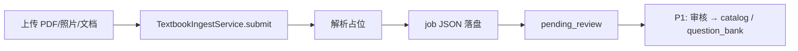

# P0 — 教材 Ingest（PDF / 拍照 / 文档）· 详细设计

> **状态**：Stub 已实现（v1 占位）  
> **代码**：`agent_platform/learning/textbook_ingest.py`  
> **依赖**：`KpCatalogService`（审核后写入）· Wiki ingest（P1）

---

## 1. 业务目标

PRD 要求教材来源支持 **PDF、拍照、文档**。P0 交付 **可运行的 ingest 管道占位**：

1. 接收三种来源文件/路径  
2. 生成 **IngestJob**（状态 `pending_review`）  
3. 输出 **KP 候选** 与文本预览（stub 为固定模板）  
4. **不** 自动写入 catalog / 题库（需人工或 P1 审核流）

---

## 2. 流程（v1 Stub）



| 来源 | Stub 行为 |
|------|-----------|
| `pdf` | 记录路径；`extracted_text_preview` = 占位说明 |
| `photo` | 记录路径；标注「待 OCR」 |
| `document` | 记录路径；标注「待结构化解析」 |

---

## 3. 数据模型

### TextbookIngestJob

| 字段 | 说明 |
|------|------|
| `job_id` | `ing-{timestamp}-{hex}` |
| `source_type` | `pdf` / `photo` / `document` |
| `source_path` | 原始文件路径 |
| `status` | `stub_received` → `pending_review` |
| `grade_level` | 默认 2 |
| `subject` | 数学 / 语文 / null |
| `unit_id_hint` | 可选，关联 pilot unit |
| `extracted_text_preview` | 前 500 字预览（stub） |
| `kp_candidates[]` | `{knowledge_point_id, title, confidence, source_span}` |
| `created_at` | UTC |

**落盘路径**：`{data_root}/_textbook_ingest/{job_id}.json`

---

## 4. 接口清单

### TextbookIngestService

| 方法 | 说明 |
|------|------|
| `submit_pdf(path, **opts)` | 创建 PDF job |
| `submit_photo(path, **opts)` | 创建拍照 job |
| `submit_document(path, **opts)` | 创建 Word/Markdown 等 job |
| `get_job(job_id)` | 读取 job |
| `list_jobs(status?)` | 列表，默认全部 |

### CLI（P0）

```bash
PYTHONPATH=. python agent_platform/learning/cli_student.py ingest submit \
  --type pdf --path ./samples/g2-math-unit.pdf --subject 数学
PYTHONPATH=. python agent_platform/learning/cli_student.py ingest list
PYTHONPATH=. python agent_platform/learning/cli_student.py ingest show JOB_ID
```

---

## 5. Stub 与真实实现差距

| 能力 | P0 Stub | P1 目标 |
|------|---------|---------|
| PDF 文本提取 | 占位字符串 | PyMuPDF / pdfplumber |
| 拍照 OCR | 占位 | 视觉模型 / 专用 OCR |
| 文档解析 | 占位 | docx/md 解析 |
| KP 对齐 | 模板候选 | LLM + catalog 对齐 + 人工审核 |
| 写入 catalog | 无 | 审核 API |

---

## 6. 测试

| 用例 | 期望 |
|------|------|
| submit_pdf 合法路径 | job 落盘，`status=pending_review` |
| get_job 未知 id | `KeyError` |
| list_jobs 过滤 | 按 status 返回 |

运行：`pytest agent_platform/tests/test_textbook_ingest.py -q`

---

## 7. 验收（PRD §8）

- 三种来源 **各成功 ingest 1 例** 进入 `pending_review`（accept 或手工 CLI 演示）
- 不产生未审核内容进入推题路径
