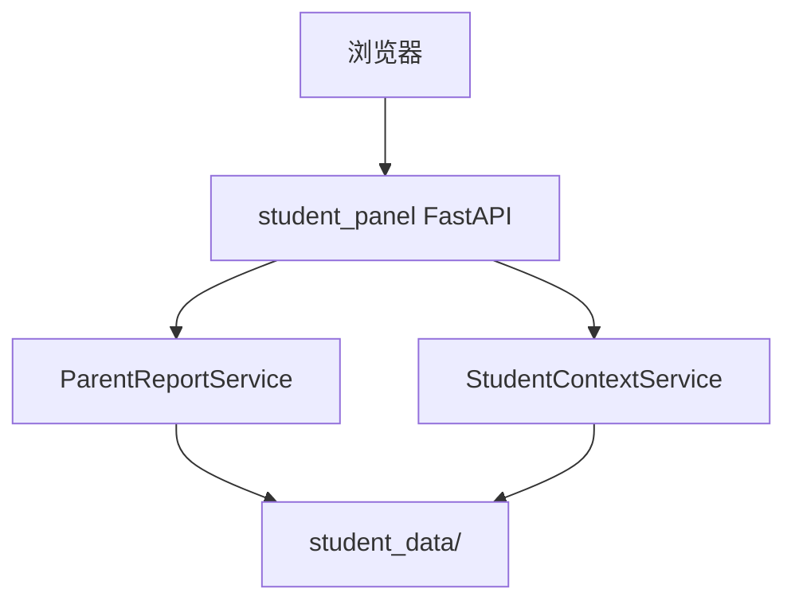

# P0 — Web 家长学情面板 · 详细设计

> **状态**：已实现（v1）  
> **代码**：`agent_platform/api/student_panel.py` · `templates/student_panel.html`  
> **端口**：`127.0.0.1:8770`（yaml `web_panel`）

---

## 1. 业务目标

PRD **B 决策**：P0 产品入口 = **Web 家长学情页** + Hermes 对话。

面板 v1 聚焦：

- 查看 **家长周报告**（summary、维度、建议）  
- 按 student_id 查询（本地 `student_data`）  
- 生成并保存报告 JSON

**不含**：学生做题 UI（P1）、账号登录（P1）。

---

## 2. 架构



---

## 3. HTTP API

| 方法 | 路径 | 说明 |
|------|------|------|
| GET | `/health` | `{status, grade_pilot, port}` |
| GET | `/` | HTML 面板 |
| GET | `/api/students` | 有 context.json 的 student_id 列表 |
| GET | `/api/students/{id}/parent-report?days=7&save=false` | 报告 JSON |
| POST | `/api/students/{id}/parent-report/generate?days=7` | 生成并落盘 |

### ParentReportOut

与 `ParentWeeklyReport` 字段对齐（JSON 模式）；`dimension_scores` / `evidence` 为 dict 列表。

---

## 4. 前端（v1）

单页 HTML + 原生 JS：

- 输入 `student_id`、周期天数  
- **查看报告** → GET  
- **生成并保存** → POST  

样式：卡片布局；维度条形成简易可视化。

---

## 5. 配置

```yaml
web_panel:
  host: "127.0.0.1"
  port: 8770

data:
  root: student_data
```

**注意**：accept / 测试须传入与数据目录一致的 `ParentReportService(data_root=...)`，不可只用默认 repo 根目录。

---

## 6. 启动

```bash
cd $AGENT_COMMUNITY_ROOT
export PYTHONPATH=.
python agent_platform/api/student_panel.py
# 浏览器 http://127.0.0.1:8770
```

演示前需：

```bash
cli_student onboard demo-stu-g2
cli_student attempt submit demo-stu-g2 q-g2m-002 80
# ... 若干次
```

---

## 7. 测试与验收

| 项 | 说明 |
|----|------|
| `accept_learning_p0_smoke` | TestClient + 临时 data_root |
| 手工 | health 200 + 报告 attempts_total>0 |

---

## 8. 安全（P0 范围）

- 仅绑定 localhost，无鉴权（开发/试点）  
- P1：家长 token、HTTPS、多租户隔离  

---

## 9. 后续（P1）

- 学生练习嵌入页 / iframe Hermes  
- 报告历史列表、周对比图  
- 与 onboarding Web 向导合并为单一 SPA
