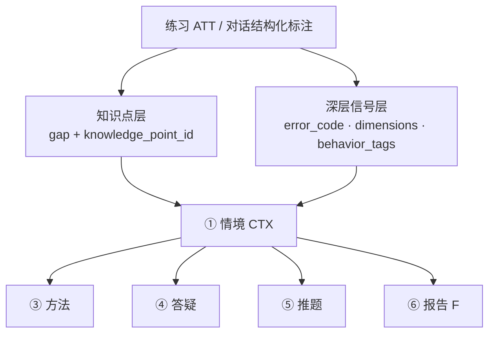
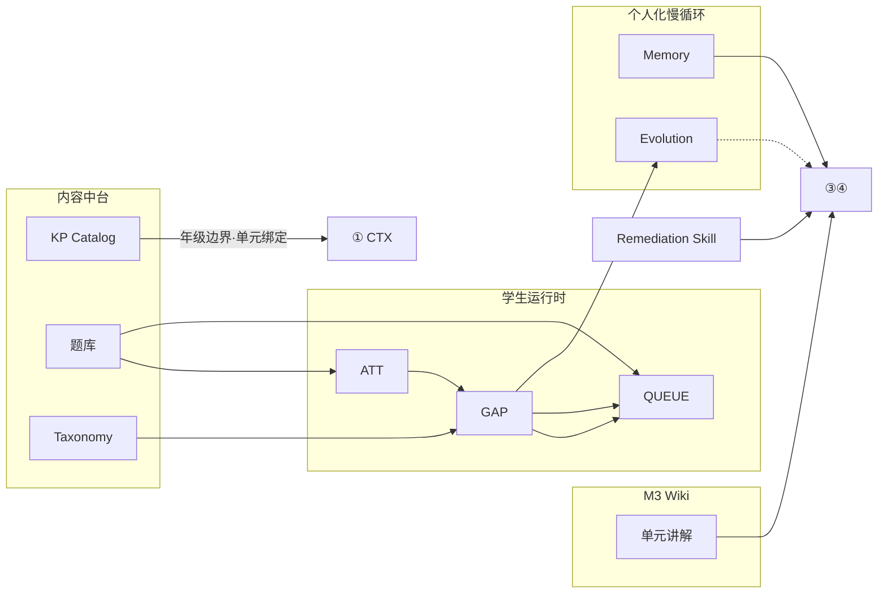

# 学生 Jarvis — 产品需求与 PRD

> **版本**：v0.2（需求重整）  
> **日期**：2026-06-02  
> **状态**：**待确认** — 确认后进入研发设计阶段  
> **关联**：[架构图](./学生Jarvis-v1-架构图.md) · [验证与用户故事](./学生Jarvis-v1-验证与用户故事.md) · [研发阶段计划](./学生Jarvis-v1-研发阶段计划.md)

---

## 修订说明（v0.2 相对 v0.1）

本版在 v0.1 决策基础上，根据产品深入讨论 **重整表述**，主要变化：

1. **明确产品哲学**：Jarvis 不是「知识点刷题机」；知识点是 **可观测、可推题、可报告的坐标系**，深层困难包括题意理解、方法、习惯、能力维度。
2. **双层诊断模型**：知识点层（gap/kp）+ 能力/行为/题意层（error_code、dimensions、behavior_tags）并列，报告与路径决策需同时呈现。
3. **内容资产与框架模块映射**：厘清 KP Catalog、题库、Wiki、Memory、Evolution 在架构中的位置与职责边界。
4. **诚实区分「目标能力」与「当前实现」**：推题 v1 为 **选题非生题**；综合题/多知识点需靠内容与策略设计补足。
5. **合并**原 PRD、产品需求对齐等分散文档为本文件 + [验证与用户故事](./学生Jarvis-v1-验证与用户故事.md)。

---

## 1. 产品定位

### 1.1 一句话

面向 **小学全学段** 的 **数学 + 语文** 窄域 AI 学伴：以 **校本教材驱动** 的知识体系为锚，用 **做题与对话证据** 诊断学习困难（含知识、能力、习惯、题意），提供 **练—辅—讲—推—报告** 闭环；对话 **域外拒答再拉回**，不做开放域聊天机。

### 1.2 不是什么

| 不是 | 而是 |
|------|------|
| 通用 ChatGPT 教辅 | 窄域、有年级边界、有证据链 |
| 知识点背诵/刷题机 | 以目标驱动的学习助理（攻克某类困难） |
| 纯 LLM 猜薄弱点 | 掌握/漏洞结论来自 attempt → gap 规则管道 |
| 仅标注知识点的错题本 | 同时呈现能力维度、行为习惯、题意类困难 |

### 1.3 核心原则（产品级）

| # | 原则 | 含义 |
|---|------|------|
| P1 | **证据优先** | 无 attempt/gap 不声称掌握或「你总是错在…」 |
| P2 | **课标锚定** | 推题、答疑、计划不得脱离校本 KP 树与年级边界 |
| P3 | **双层诊断** | 同一错题同时回答「哪个 KP」与「为什么错（错因/维度）」 |
| P4 | **快循环 + 慢循环** | 练题实时调整（ATT→GAP→QUEUE）与策略进化（Memory/Evolution）分工 |
| P5 | **适龄与安全** | 域外拒答、短句鼓励、防误导（无 Wiki 不装懂课本） |

---

## 2. 产品哲学：知识点是表象还是本质？

### 2.1 结论

**知识点往往是可操作的表象，不总是本质原因。**

孩子学习困难可能来自：

| 类型 | 典型表现 | 产品应如何表达 |
|------|----------|----------------|
| **知识漏洞** | 同类基础题反复错 | gap 关联 `knowledge_point_id`；推同 KP 巩固题 |
| **题意/审题** | 应用题读不懂、不知列什么式 | `READING_ERROR` 等错因 + 审题维度 + 先澄清题意再推题 |
| **方法/步骤** | 知道概念但步骤乱 | `PROCEDURE_ERROR` + remediation skill + Wiki 步骤 |
| **习惯/粗心** | 会算但常算错、跳步 | behavior 维度 + 验算训练，报告单独呈现 |
| **情绪/动力** | 「今天不想做」 | M2 偏好 + 共情话术 + 拉回学习动作（非聊天机） |

**工程策略**：

- **KP Catalog** 提供统一 ID 与年级边界（必须有）。
- **错因 taxonomy + 能力维度** 表达「为什么错」（必须加强）。
- **家长/教师报告** 主栏展示维度与行为，KP 作为可展开的「知识坐标」。

### 2.2 双层诊断模型

| 层次 | 回答的问题 | 数据载体 | 消费者 |
|------|------------|----------|--------|
| **知识点层** | 课标哪一块薄弱？ | `gap_map` · `knowledge_point_id` | 推题、知识掌握报告、教研 |
| **深层信号层** | 为什么错？哪类能力/习惯？ | `error_code` · `learning_dimensions` · `behavior_tags` | 方法路径、家长报告、计划 |

**要求**：任何面向用户的「诊断结论」须能追溯到 `attempt_id` / `gap_id`，LLM 仅用于讲解生成，不单独裁决掌握度。

---

## 3. 目标用户与角色

| 角色 | 优先级 | 核心诉求 | v0.2 能力预期 |
|------|--------|----------|---------------|
| **学生（G1～G6）** | P0 使用者 | 题合适、讲得懂、有目标地练 | Onboarding、练题、答疑、微计划 |
| **家长** | P0 主读者 | 安全、看得见进步、有依据 | 周报告（知识+维度+行为+证据） |
| **教师/教研** | P0 内容供给 | 校本一致、可审核发布 | KP 入库审核、catalog 浏览 |
| **校方** | P1 | 可控试点、审计 | 多校策略、运营台 |

**已冻结决策（延续 v0.1）**：

- P0 试点年级：**二年级**
- P0 产品入口：**Web 家长学情（:8770）+ Hermes 学生对话**
- 首发学科：**数学 + 语文**（产品覆盖小学全学段，工程分阶段 rollout）
- 域外策略：**先拒答，再共情，再拉回学习**
- 个性化：**多维度诊断**（非固定「逻辑 vs 基础」二分）

---

## 4. 框架模块与内容资产（产品视角）

以下说明 **产品内容** 落在 agent_community 框架的哪些部分，以及在学习功能中如何发挥作用。

### 4.1 总览映射

| 产品资产 | 框架层级 | 代码/存储（参考） | 结构 | 职责 |
|----------|----------|-------------------|------|------|
| **KP Catalog** | 内容中台 · 主数据 | `learning/catalog/kp_catalog.json` · `KpCatalogService` | 结构化 JSON | 单元树、kp_id、年级边界 |
| **题库 QB** | 内容中台 · 练习素材 | `learning/question_bank/` · SQLite | 结构化 | 题干、答案、绑定 unit/kp/错因 |
| **错因 Taxonomy** | 内容中台 · 配置 | `student_learning.yaml` → `error_taxonomy` | 配置 | error_code → kp_id · behavior_tags |
| **Wiki 单元知识** | Jarvis 本体 M3 | `agent_platform/wiki/` · `wiki_data/` | 非结构化 MD | 课标讲法、概念步骤（③④ 检索） |
| **Remediation Skill** | 学习域 + C7 | `learning/skills/remediation/*.yaml` | 半结构 | 通用补救 playbook（③） |
| **StudentContext** | 学习域 ① | `student_data/{id}/context.json` | 结构化 | 慢/快变量聚合快照 |
| **GapMap** | 学习域 ② | `student_data/{id}/gap_map.json` | 结构化 | 漏洞地图（权威薄弱信号） |
| **Push Queue** | 学习域 ⑤ | `student_data/{id}/push_queue.json` | 结构化 | 下一包练什么 |
| **Memory M2** | Jarvis 本体 | `memory_service` · Hermes `agent_memory_*` | 半结构 | 个人偏好、备注（**非课标**） |
| **Evolution C7** | Jarvis 本体 | `evolution_bridge` · `evolution/skills/` | 半结构 | 个人化讲法策略晋升（**不改 catalog**） |

### 4.2 三类「内容」如何支撑 ①～⑦

| 业务功能 | Catalog | 题库 | Wiki | Taxonomy | Memory | Evolution |
|----------|---------|------|------|----------|--------|-----------|
| ① 情境 | 绑定 unit、校验年级 | — | — | — | 偏好补充 | — |
| ② 漏洞 | kp 坐标 | 产生 ATT | — | 错因归类 | — | — |
| ③ 方法 | 知道弱在哪块内容 | — | 查步骤/定义 | 选 skill | 个性化语气 | 个人 skill |
| ④ 答疑 | 限定学科单元 | — | 查讲法 | — | 偏好 | 个人 skill |
| ⑤ 推题 | 单元边界 | **选题来源** | — | 匹配错因 | — | — |
| ⑥ 主动 | 单元语境 | 推下一包 | — | — | — | — |
| ⑦ 进化 | 不改 | 不改 | 可沉淀（可选） | — | 独立 | gap 效果→skill |
| F 报告 | 知识掌握摘要 | attempt 证据 | — | 维度信号 | — | — |

### 4.3 题库：选题还是生题？（产品定义）

| 阶段 | 推题能力 | 说明 |
|------|----------|------|
| **当前 v1（已实现）** | **仅从题库选题** | 按 gap 的 kp + error_code 匹配已有题；无 gap 时单元泛练 |
| **P0 目标** | 选题 + 试点单元 **≥30 题/单元** | 靠教研扩充 seed，不靠 LLM 即时生题 |
| **P1** | 选题为主 + **模板变式** | 在 seed 题基础上改数字/情境，经规则或审核后入库 |
| **P1+** | 可选 LLM 辅助出题 | 必须可批改、挂 kp_id、进审核流 |

**综合题 / 多知识点**：

- v1 每题仅绑 **一个** `knowledge_point_id`。
- 产品策略：综合题失败时，**优先用错因区分**「题意不懂（READING）」与「某 KP 不会」，而非强行拆多个 kp gap。
- P1 可为题目标注 `primary_kp` + `secondary_kps[]`，推题策略按主/辅 gap 组合。

### 4.4 Wiki：冷启动与演进

| 机制 | 优化对象 | 产品预期 |
|------|----------|----------|
| **教研编写 Wiki** | 公共校本讲法 | P0 试点单元 **必须有** 基础 Wiki |
| **Wiki 沉淀（precipitate）** | 高价值对话 → 经确认写入 | 可选；与 kp 强绑定待 P1 |
| **Evolution** | 对 **该学生** 有效的讲法步骤 | gap 掌握或错率下降 → 晋升个人 remediation skill |

**分工**：Wiki = 共性知识；Evolution = 个人策略；**掌握结论仍只来自 gap/attempt**。

### 4.5 Memory 与 Evolution（产品级定义）

**Memory（M2）**

- **存**：偏好（「喜欢画图」）、家长备注、长期事实。
- **不存**：知识点树、题库、Wiki 正文。
- **作用**：让 Jarvis **记得这个孩子**，不改变 gap 统计规则。
- **示例**：家长备注「怕退位减法」→ 答疑先鼓励；是否掌握仍看 attempt。

**Evolution（C7）**

- **触发**：每次练习后评估 gap 效果（掌握 / 7 日错率下降）。
- **产出**：个人 skill `student/{id}/remediation-{error_code}`，procedure 源自公共模板 + 效果加权。
- **不做**：不改 KP Catalog、不自动改 gap 规则、不把 raw 聊天当真理晋升。
- **作用**：③④ 的 playbook **越用越贴这个孩子**，属慢循环。

---

## 5. 六大需求域（A～F）

### A — 内容与知识中台

| ID | 需求 | 优先级 |
|----|------|--------|
| A1 | 多模态教材入库（PDF/拍照/文档） | P0 stub → P1 实装 |
| A2 | 知识点提炼（`.kp.md` → 审核 → catalog） | **P0 已实现 Web 链路** |
| A3 | KP 树：学段→年级→学科→单元→知识点 | **P0 已实现** |
| A4 | 年级边界 enforced（推题/答疑/计划） | P0 |
| A5 | 题/错因/Wiki 挂 `knowledge_point_id` | P0 进行中 |
| A6 |  ingest · 审核 · 发布 · 回滚 · 浏览 | **审核+入库+浏览已实现** |

### B — 用户画像

| ID | 需求 | 优先级 |
|----|------|--------|
| B1 | Onboarding：年级、学科、单元、结构化自评 | P0 |
| B2 | 慢变量：习惯、偏好、家长备注（M2） | P0/P1 |
| B3 | 快变量：gap、掌握度、正确率（来自 ATT） | **骨架已有** |
| B4 | 行为画像：粗心、审题等（tags + 维度） | P0 报告已有雏形 |
| B5 | 单一学情视图（CTX 聚合） | P0 |
| B6 | 升年级归档与边界迁移 | P1 |

### C — 学习闭环 ①～⑦

| # | 功能 | 产品要求（学生可感知） |
|---|------|------------------------|
| ① | 学习画像与情境 | 知道学到哪、什么阶段、今日练了多少；Top gap / 队列头 |
| ② | 漏洞查找 | **哪类错、几次、趋势**；含 kp + 错因/维度；有证据 |
| ③ | 学习方法 | 可执行微计划；题意类困难先「复述题目」再讲 KP |
| ④ | 情境内答疑 | 校本 Wiki + 情境；无证据不断言掌握 |
| ⑤ | 练习题库与推题 | 按漏洞/维度路径 **选题**；掌握后降频 |
| ⑥ | 伴随主动 | 练后小结、复发、考前；规则触发 |
| ⑦ | 个人/组织进化 | 有效策略晋升 skill；可审计；不改当下 gap 规则 |

### D — 对话与安全

- 域内：学习、做题、讲题、计划、学情。
- 域外：代写、娱乐、成人内容等 → **拒答 → 共情 → 拉回**。
- AnswerGate：薄弱/掌握声称需 gap_id / attempt_id。
- 无 Wiki 命中：不假装「教材就是这样讲的」。
- 适龄：年级越低，语言越短越具体。

### E — 智能个性化

- 可配置 **能力维度**（基础、逻辑、审题、粗心…），由错因 + 行为标签聚合。
- 推题、微计划、主动：**Top 维度 + Top gap** 联合决策（P1 深化）。
- 避免「题库播放器」：以「攻克某类困难」为叙事目标。

### F — 学情报告

- 周期：默认周；读者：首期 **家长**。
- 结构：**知识掌握 | 能力/维度 | 行为习惯 | 建议 | 证据附录**。
- 每条结论可展开至 attempt_id / gap_id。

---

## 6. 分期路线图

### 6.1 P0 — 可试点 MVP（二年级 · 双学科）

**目标**：1 个年级 × 双学科各至少 1 单元，端到端跑通，家长能看 **多维** 周报告。

| 模块 | 交付 |
|------|------|
| A | KP Catalog + `.kp.md` 审核入库 + **catalog 浏览** |
| A | 试点单元题库 **≥30 题/单元** + taxonomy 对齐 |
| A | 试点单元 **Wiki 必填** |
| B～F | Onboarding、闭环 ①～⑦、安全、维度报告、Web |

### 6.2 P1 — 加深

- 小学更多年级/单元 rollout  
- 综合题标注、推题策略升级、模板变式出题  
- 题意理解结构化（对话澄清 → 标注回写）  
- 教师版报告、校方运营台  
- 维度模型驱动推题/计划分流  

### 6.3 P2 — 规模化

- Org Brain、作业批量导入、师审 skill  
- 多学科扩展  

---

## 7. 当前实现状态（截至 2026-06，诚实对照）

> 供确认需求与排期用；确认后转入研发设计。

### 7.1 已完成（相对 P0 目标）

| 项 | 状态 |
|----|------|
| 初二 → 二年级 Pivot（配置、种子、accept） | ✅ |
| KP Catalog + 年级边界 | ✅（4 单元、23 知识点，含语文入库） |
| `.kp.md` 解析、审核 Web、批准合并 | ✅ `/kp-review` |
| Catalog 浏览 | ✅ `/kp-catalog` |
| learning 闭环 ATT→GAP→QUEUE→CTX | ✅ |
| 家长周报告 + 维度雏形 | ✅ |
| 域外拒答、AnswerGate、二年级 prompt | ✅ |
| textbook_ingest stub（PDF/拍照） | ✅ 占位 |

### 7.2 部分完成 / 与目标仍有差距

| 项 | 现状 | 目标差距 |
|----|------|----------|
| 题库 | 数学/语文各 **10 题**，仅覆盖 2 个试点单元 | PRD 要求 **≥30 题/单元**；`chinese-g2-words-collocation` **无题** |
| Wiki | 种子校验仅 warning | 试点单元 **应有** Wiki |
| 推题 | **仅选题**，单 kp | 综合题/题意策略待 P1 |
| 维度驱动推题/计划 | 维度仅进报告 | 未 fully 联动 ③⑤ |
| 学生 Onboarding UI | CLI 为主 | 产品化入口 P1 |
| PDF/拍照 → KP | stub | 实装 P1 |

### 7.3 满足度粗估（产品层）

| 需求域 | 满足度 | 说明 |
|--------|--------|------|
| A 内容中台 | 🟡 55% | KP 链路通；题/Wiki 未达标 |
| B 画像 | 🟡 45% | CTX+gap 有；自评/M2 产品化弱 |
| C 闭环 ①～⑦ | 🟡 60% | 规则骨架通；③④ 缺 Wiki 强制 |
| D 安全 | 🟡 55% | 策略有；需持续验收 |
| E 个性化 | 🟡 35% | 维度在报告；路径分流弱 |
| F 报告 | 🟡 50% | 家长周报有；教师版无 |

---

## 8. P0 验收标准（更新）

- [ ] 二年级学生：Onboarding → 做题 → **双层诊断可见**（gap + 维度）→ 推题 → 家长周报告  
- [ ] 超年级内容 **0 泄漏**  
- [ ] 域外请求 **100%** 拒答并拉回（抽检）  
- [ ] 数学+语文试点单元各 **≥30 题** + **Wiki** + taxonomy 对齐 catalog  
- [ ] KP 入库审核流可演示（已实现，可签字）  
- [ ] 用户故事 US-01～02、05～06、11 通过（见验证文档）  

---

## 9. 待你确认的事项

确认本 PRD 后，再进入详细研发设计。建议重点确认：

| # | 议题 | 建议默认 |
|---|------|----------|
| 1 | 综合题失败时，是否 **优先诊断题意/审题**，再归因 kp？ | 是 |
| 2 | P0 推题坚持 **只选题**，不承诺 LLM 生题？ | 是 |
| 3 | 家长报告 **主展示维度+行为**，KP 作展开？ | 是 |
| 4 | P0 第二语文单元 `chinese-g2-words-collocation` 纳入试点包？ | 是（与 catalog 一致） |
| 5 | Wiki 为 P0 **阻塞项**（无 Wiki 不算 P0 完成）？ | 建议是 |

---

## 10. 相关文档索引

| 文档 | 用途 |
|------|------|
| [学生Jarvis-v1-验证与用户故事.md](./学生Jarvis-v1-验证与用户故事.md) | 场景验证、用户故事、验收剧本 |
| [学生Jarvis-v1-架构图.md](./学生Jarvis-v1-架构图.md) | 业务×本体×数据（研发详设） |
| [学生Jarvis-v1-研发阶段计划.md](./学生Jarvis-v1-研发阶段计划.md) | 工程阶段 1～7 |
| [学生Jarvis-v1-研发阶段计划-P0.md](./学生Jarvis-v1-研发阶段计划-P0.md) | P0 Pivot 任务 |
| [learning/p0/](./learning/p0/README.md) | P0 模块详细设计 |
| [learning/p1/](./learning/p1/kp-review-design.md) | KP 入库详细设计 |

### 文档沿革

v0.2 合并并取代原 PRD v0.1、产品需求对齐等分散文档（已删除）。

---

## 修订记录

| 日期 | 说明 |
|------|------|
| 2026-06-02 | v0.1 决策冻结（见归档 PRD v0.1） |
| 2026-06-14 | v0.1 PRD 发布 |
| 2026-06-02 | **v0.2**：双层诊断、内容资产映射、实现诚实对照、合并需求文档 |
