# 学生 Jarvis 助理 v1 — 业务 × 本体融合架构

> **版本**：2026-06-05  
> **范围**：单学生 · 1～2 学科 · 单元级 · 错因驱动闭环（漏洞→方法→答疑→练题→实时调整）  
> **目的**：论证框架可行性 + 明确开发工作项  
> **关联**：[项目架构与配置说明.md](./项目架构与配置说明.md) · [模型与产品层边界.md](./模型与产品层边界.md)

---

## 1. 总览：业务层 × Jarvis 本体 × 数据 × 运行时

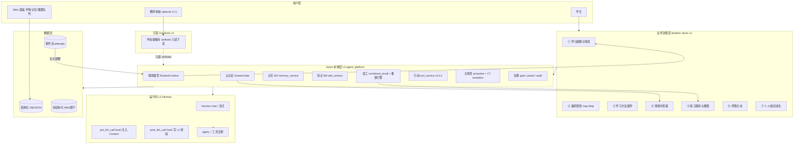

**图例**：实线 = v1 必做 · 虚线 = v1.5+ 可选

---

## 2. 数据种类、存储与获取方式

### 2.1 数据分类总表

| 数据 ID | 名称 | 结构/非结构 | 存储位置（建议） | 获取方式 | 消费方 |
|---------|------|-------------|------------------|----------|--------|
| **CTX** | 学生情境快照 | 结构化 JSON | `student_data/{id}/context.json` | 每次 attempt/对话后 **规则更新** | 全业务 + pre_llm 注入 |
| **ATT** | 练习/答题记录 | 结构化 | `student_data/{id}/attempts/*.json` | 学生提交、题库 MCP、作业导入 | 漏洞、推题、诚实断言 |
| **GAP** | 漏洞/错因地图 | 结构化 | `student_data/{id}/gap_map.json` | **ATT 批处理后** 规则+可选 LLM 归类 | 画像、方法、推题 |
| **MST** | 掌握度标记 | 结构化 | 嵌入 GAP 或独立表 | 连续 N 次正确 / 间隔复测 | 推题降频、答疑语气 |
| **M2** | 个人学习记忆 | 半结构 | `skills_data/memory_store.json` 或 MemVerse | `agent_memory_write` / 规则写入 | 偏好、备注、教师评语 |
| **WIKI** | 课标/知识点/讲法 | 非结构 MD | `wiki_data/wiki/` | 校方 ingest、教师上传 | 答疑对齐、方法 skill 来源 |
| **QB** | 题库元数据+题干 | 结构+非结构 | `question_bank/` SQLite+MD | 校方导入、第三方 API | 推题引擎 |
| **QUEUE** | 推题队列 | 结构化 | `student_data/{id}/push_queue.json` | **推题引擎** 写，attempt 后重排 | 练题、主动提醒 |
| **PLAN** | 微计划 | 结构化 | CTX 子字段或独立 | 方法模块生成 | 学生端展示 |
| **EPI** | 对话 episodic | 非结构 | Hermes transcript + 可选摘要 | chat 自然产生 | 答疑上下文（非真理源） |
| **SKL** | 个人/组织 skill | 半结构 YAML/MD | `skills_data/` + Org Brain | C7 promote、教师审核 | 方法辅导、讲评模板 |
| **EVO** | L1 经验 raw | 半结构 | `skills_data/experiences/` | post_llm hook | C7 合成 skill |
| **AUD** | 审计/删改 | 结构化 | audit db / panel | 面板删除、gate | 合规 |

### 2.2 数据流（实时调整的核心）

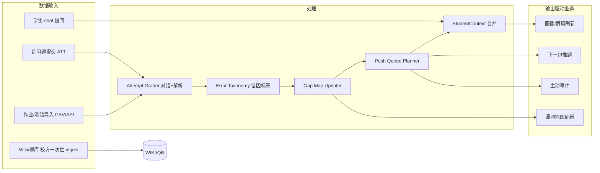

**原则**：**「实时调整」= ATT → GAP/QUEUE/CTX 的规则管道**；LLM 参与错因归类与讲解，**不单独决定掌握度**。

---

## 2.3 业务功能之间的关系（①～⑦）

### 2.3.1 总览结论

| 理解 | 结论 |
|------|------|
| ① 是 ②～⑥ 的**共享情境与默认阶段** | **对** |
| ① **单独决定**用 ②～⑥ 哪一个 | **部分对** — 还有学生动作、事件触发 |
| ① 为各功能**提供上下文** | **对** |
| ⑦ 对 ①～⑥ **无约束全自动重写** | **不对** — ⑦ 主要迭代 **skill/策略库**，且需验证/审核 |
| ⑦ 让 ①～⑥ **越用越好** | **方向对** — 慢循环、可审计 |

### 2.3.2 ① 学习画像与情境：不只是「背景板」

① 是 **学习与情境的读写聚合根（Aggregate Root）**：

- **慢变量**（人/师设定）：`curriculum`、`goal`、`pipeline_stage`、`flags`
- **快变量**（管道写回）：`focus.top_gap_ids`、`focus.queue_head_question_ids`、`session_stats`

```text
         ┌─────────────────────────────────┐
         │  ① 学习画像与情境 (CTX 快照)      │
         │  · 慢变量：单元、目标、阶段        │
         │  · 快变量：Top漏洞、队列头、统计   │
         └───────────▲───────────┬─────────┘
                     │           │
              管道写回           │ 读取
                     │           ▼
              ②⑤ 练习/漏洞/推题   ③④⑤⑥ 各功能
```

**注意**：完整「画像」还分布在 **② `gap_map`**（漏洞侧）与 **M2**（偏好/备注）。① 的 `focus` 是指向 ② 的**指针**，不是替代 ②。

**谁触发 ②～⑥？** — ① + 行为 + 事件：

| 触发 | 更可能走 |
|------|----------|
| 学生聊天提问 | ④ 答疑 |
| 学生提交练习 | ② → ⑤ → ⑥ 练后小结 |
| `pipeline_stage=remediation` | 默认 ③+⑤ |
| 考前 cron / gap 复发 | ⑥ 主动（规则） |

### 2.3.3 ②～⑥：同一情境下的不同「服务面」

③④⑤⑥ **非固定串行**；均在读取 **① CTX + ② GAP** 后服务学生。

### 2.3.4 ⑦ 进化：慢循环，改「怎么做」不改「当下状态」

| ⑦ 会做的 | ⑦ 不会做的（v1） |
|----------|------------------|
| promote 已验证的 skill / 讲法模板 | 自动改 `context.json` 单元设定 |
| 错率趋势 + 确认后晋升策略 | 无验证上浮 raw 对话 |
| 纠错后降权坏 skill | 替代 ② 的 gap 统计规则 |

**实时调整**仍靠快循环：`ATT → GAP → QUEUE → CTX`。**⑦** 优化 ③④⑤ 消费的 **playbook**。

### 2.3.5 关系图（快循环 / 慢循环）

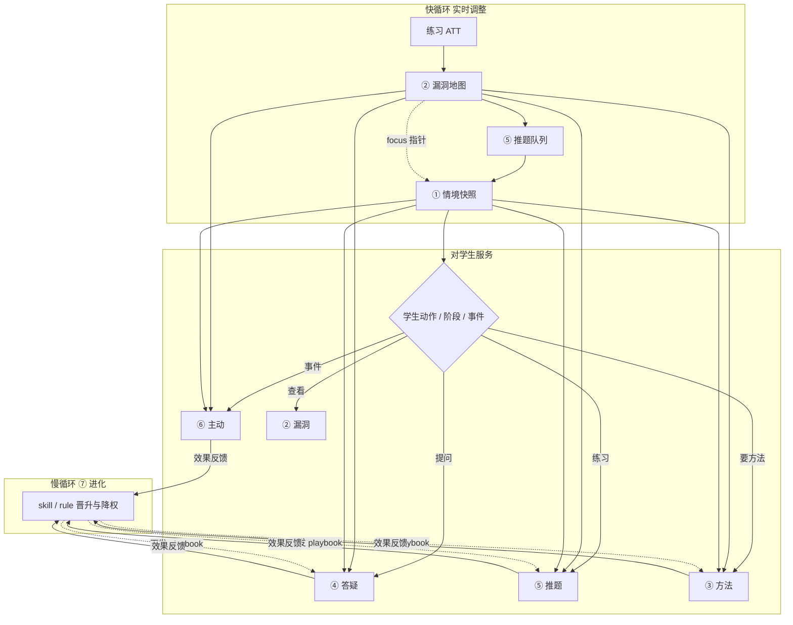

---

## 3. 业务功能 × Jarvis 本体 × Pipeline

### 3.1 融合映射表

| 业务功能 | Jarvis 本体组件 | 执行 Pipeline（摘要） | Hermes 工具 / Skill / Prompt |
|----------|-----------------|---------------------|------------------------------|
| **① 学习画像与情境** | **StudentContext**（新建）+ M2 | ATT/对话 → 更新 CTX → pre_llm 注入 | `student_context_get` · hook **CTX 块** |
| **② 漏洞查找** | Gap Map + M2 + AnswerGate | ATT → grader → taxonomy → gap_map | `gap_map_query` · `attempt_list` |
| **③ 学习方法辅导** | Wiki + C7 skill + CTX | GAP 优先级 → 选 skill/模板 → PLAN | `study_plan_generate` · skill: `remediation/*` |
| **④ 情境内答疑** | combined_recall + AnswerGate + Wiki | 问句 → recall(M2+Wiki+GAP) → 生成 → **证据校验** | `agent_combined_recall` · `agent_calibrate_output` · prompt **AnswerGate** |
| **⑤ 练习题库推题** | 推题引擎（新建）+ QB MCP | GAP → queue → fetch 题 → ATT 闭环 | `question_fetch` · `attempt_submit` · MCP `question_bank/*` |
| **⑥ 伴随主动** | proactive + 事件 | attempt 完成 / gap 复发 / 考前 cron | `agent_proactive_*` · 规则引擎 **非 LLM 猜** |
| **⑦ 进化** | C7 evolution + Org Brain | 策略效果达标 → promote skill → 可选上浮 | `agent_evolution_*` · post_llm · **教师 approve** |

### 3.2 各业务 Pipeline 详图

#### ① 学习画像与情境

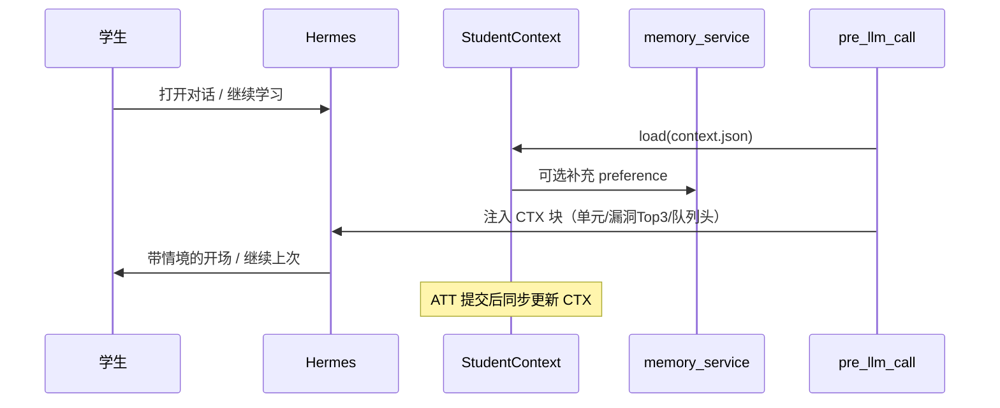

#### ② 漏洞查找

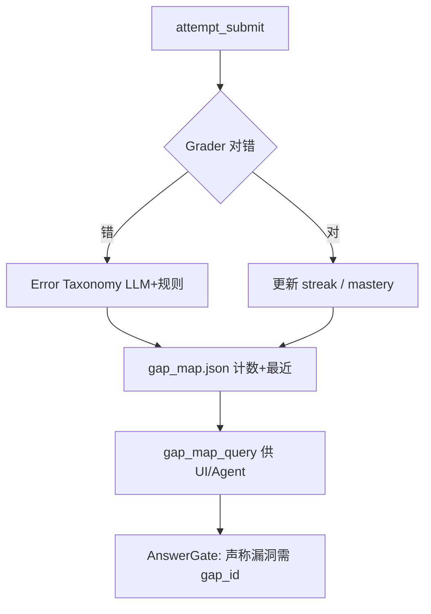

#### ③ 学习方法辅导

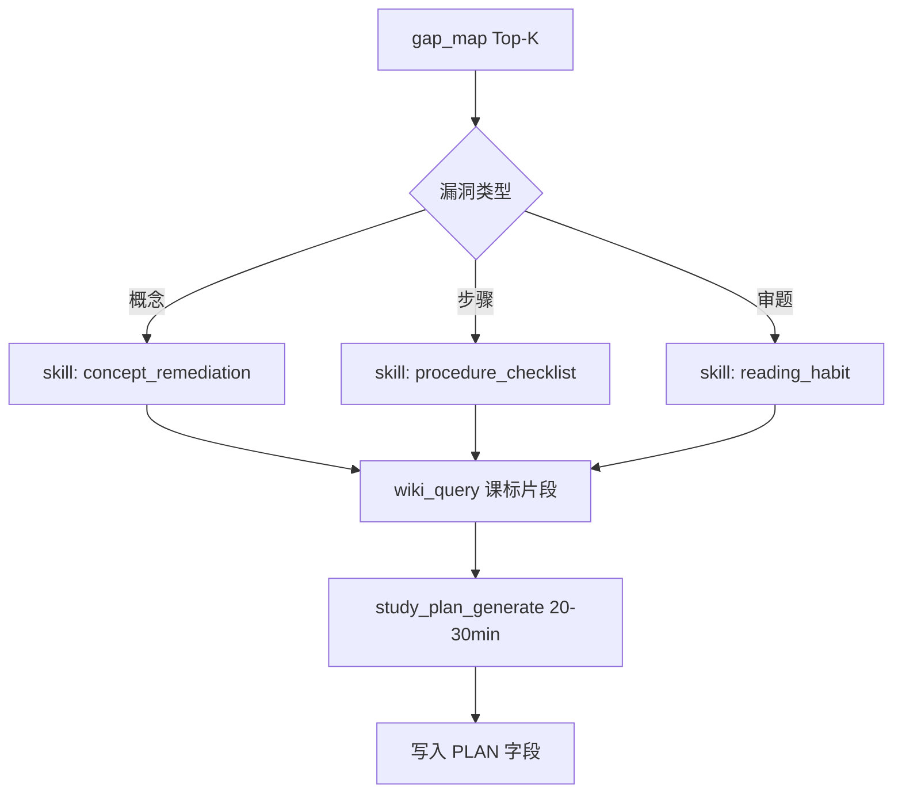

#### ④ 情境内答疑

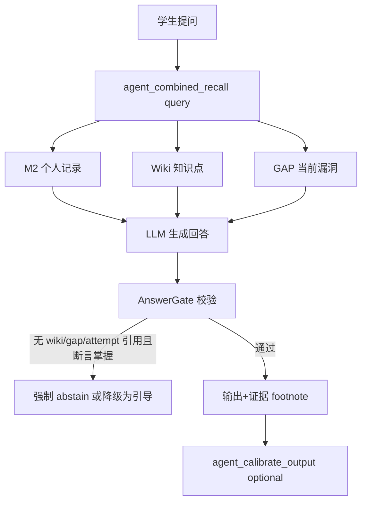

#### ⑤ 练习题库 + 实时推题

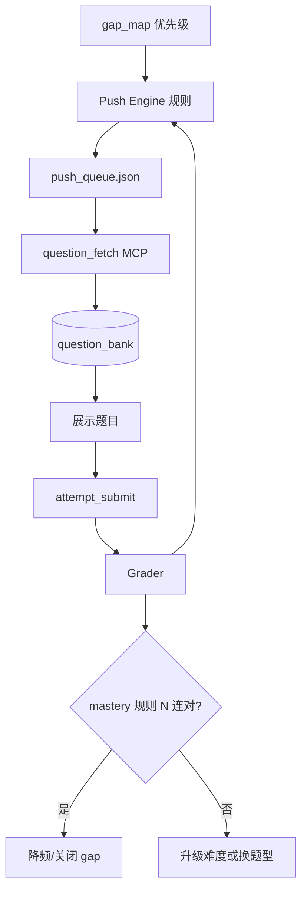

#### ⑥ 伴随主动

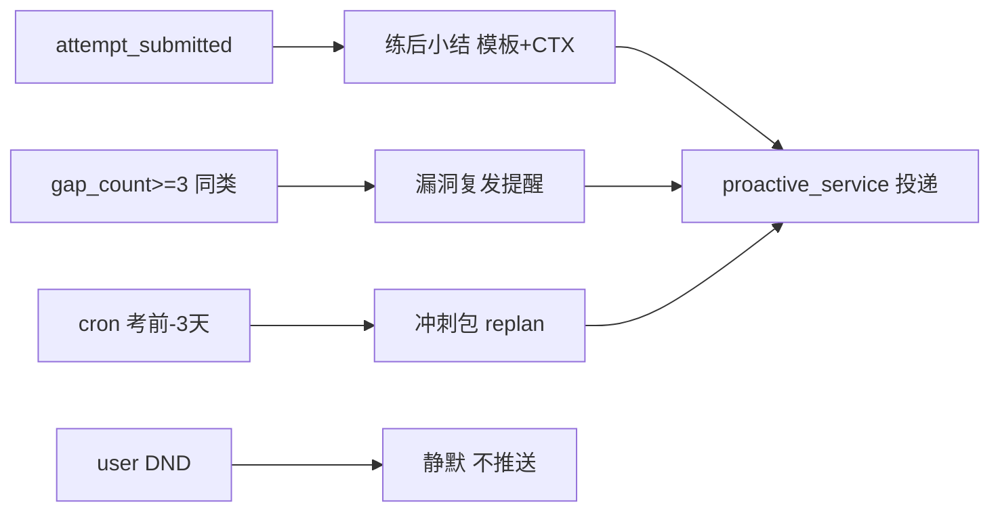

#### ⑦ 进化（个人 + 可选 Org）

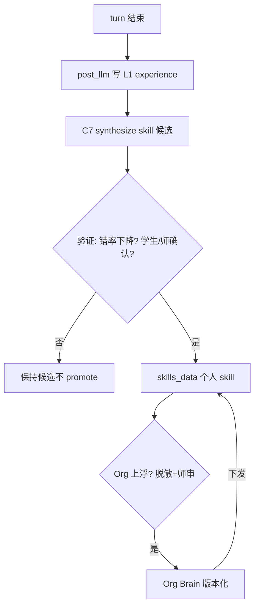

---

## 4. Jarvis 本体层：复用 vs 新建

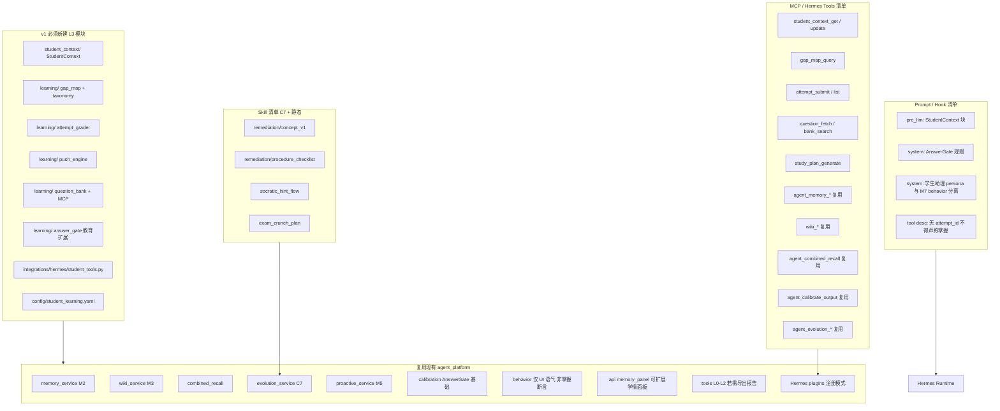

---

## 5. 一层图：从学生动作到本体组件（可行性速查）

```
┌─────────────────────────────────────────────────────────────────────────────┐
│ 学生动作          数据写入           本体更新              业务输出          │
├─────────────────────────────────────────────────────────────────────────────┤
│ 聊天提问    →  EPI + query    →  recall+AnswerGate    →  情境内答疑         │
│ 提交练习    →  ATT             →  GAP+QUEUE+CTX      →  反馈+下一题       │
│ 完成计划    →  ATT streak      →  MST+GAP 降频        →  画像「已掌握」     │
│ 标记没用    →  M2/skill 降权   →  C7 correction       →  策略切换           │
│ 打开 App    →  —               →  pre_llm CTX 注入    →  续接上次           │
│ 考前 3 天   →  cron 事件       →  push_engine        →  冲刺包+主动提醒     │
└─────────────────────────────────────────────────────────────────────────────┘
```

---

## 6. 框架可行性结论

| 问题 | 结论 |
|------|------|
| **业务是否在 Jarvis 窄域内？** | **是**。单学生、单元级、错因闭环，满足可验证+重复流+typed memory。 |
| **现有 L3 能否覆盖？** | **约 45% 现成**（M2/Wiki/C7/proactive/calibration/Hermes 插件模式）；**约 55% 需新建**（StudentContext、GAP、题库、推题、AnswerGate 教育版、student_tools）。 |
| **「实时调整」能否不靠 prompt 堆砌？** | **能**，若调整走 **ATT→GAP/QUEUE/CTX 管道**；LLM 只负责讲解与归类建议。 |
| **最大风险** | ① 题库与标注质量 ② AnswerGate 执行力度 ③ 错因 taxonomy 稳定性 ④ 勿与 M7 behavior 混源 |
| **整体判定** | **框架可行**；不是重造 Agent 壳，而是在 **现有 Hermes + agent_platform** 上增 **learning 域 L3**。 |

---

## 7. 开发工作清单（按优先级）

### P0 — 无此无闭环（4～6 周）

| # | 工作项 | 产出 |
|---|--------|------|
| 1 | **StudentContext** 服务 + `context.json` schema | 情境状态机 |
| 2 | **Attempt** 模型 + `attempt_submit` 工具 + 存储 | ATT 数据 |
| 3 | **Error taxonomy** 配置 + grader（对错+错因） | GAP 输入 |
| 4 | **Gap Map**  updater + `gap_map_query` | 漏洞地图 |
| 5 | **Push Engine** + `push_queue.json` + `question_fetch` | 推题闭环 |
| 6 | **Question Bank** 最小实现（SQLite+导入 CLI） | QB 数据 |
| 7 | **pre_llm hook** 注入 CTX + **AnswerGate** prompt/规则 | 诚实+情境 |
| 8 | **Hermes plugin** `agent-student` 注册 M1–M5 | 工具面 |
| 9 | **1 单元种子数据**（Wiki+30 题+taxonomy） | 可演示 |

### P1 — 业务完整（+3～4 周）

| # | 工作项 | 产出 |
|---|--------|------|
| 10 | `study_plan_generate` + remediation skills 静态 4 条 | 方法辅导 |
| 11 | `agent_combined_recall` 适配（GAP 进 recall） | 答疑 |
| 12 | **Mastery 规则** N 连对 + 间隔复测 | 掌握度 |
| 13 | **proactive** 三事件：练后/复发/考前 | 伴随主动 |
| 14 | **学情 Web 面板**（CTX+GAP+QUEUE 只读） | 学生/师查看 |
| 15 | **memory_panel** 扩展或独立 panel :8768 | 删改 M2 |

### P2 — 进化与组织（+4～8 周）

| # | 工作项 | 产出 |
|---|--------|------|
| 16 | C7 **promote 条件**（错率↓+师审） | 个人进化 |
| 17 | **Org Brain** 只读下发 skill/wiki | 学校复制 |
| 18 | 作业/LMS **CSV/API 导入** | ATT 批量 |
| 19 | **agent_calibrate_output** 接入答疑链 | 置信度 |
| 20 | 试点 KPI 仪表盘 | 验收 |

### 明确不做（v1）

- 家长分身、管理分身、全自动备课生成  
- 全科开放域答疑  
- 无 attempt 的「你已掌握」UI  
- Org 上浮 raw 对话或成绩明细  

---

## 8. 配置与目录（建议）

```text
agent_platform/
  learning/                 # 新建域
    student_context.py
    gap_map.py
    attempt.py
    push_engine.py
    answer_gate.py
    question_bank/
  config/
    student_learning.yaml     # taxonomy、mastery N、主动白名单
  integrations/hermes/
    student_tools.py          # Hermes 工具
    agent_student/            # plugin  symlink

student_data/{student_id}/
  context.json
  gap_map.json
  push_queue.json
  attempts/

question_bank/
  bank.sqlite
  import/

wiki_data/wiki/               # 单元知识点 复用 M3
skills_data/                  # M2 + C7 复用
```

---

## 9. Prompt / Skill / MCP 速查表

| 类型 | 名称 | 用途 | 状态 |
|------|------|------|------|
| **Hook** | `pre_llm_student_context` | 注入 CTX 块 | 新建 |
| **Hook** | `post_llm_learning_experience` | 写 L1（可选） | 复用 C7 |
| **Prompt** | `STUDENT_JARVIS_SYSTEM` | 助理 persona | 新建 |
| **Prompt** | `ANSWER_GATE_RULES` | 证据绑定/abstain | 新建 |
| **Prompt** | 与 M7 `behavior` **分离** | 避免「简短」混掌握 | 规则 |
| **Skill** | `remediation/concept_v1` | 概念型漏洞 | 新建 |
| **Skill** | `remediation/procedure_checklist` | 步骤型 | 新建 |
| **Skill** | `socratic_hint_flow` | 引导式答疑 | 新建 |
| **Skill** | `exam_crunch_plan` | 考前冲刺 | 新建 |
| **Tool** | `student_context_get/update` | 情境 | 新建 |
| **Tool** | `gap_map_query` | 漏洞 | 新建 |
| **Tool** | `attempt_submit/list` | 练习 | 新建 |
| **Tool** | `question_fetch` | 推题 | 新建 |
| **Tool** | `study_plan_generate` | 微计划 | 新建 |
| **Tool** | `agent_memory_*` | 个人记忆 | 复用 |
| **Tool** | `wiki_query/ingest` | 知识 | 复用 |
| **Tool** | `agent_combined_recall` | 联合召回 | 复用+扩展 |
| **Tool** | `agent_calibrate_output` | 校准 | 复用 |
| **Tool** | `agent_evolution_*` | 进化 | 复用 |
| **MCP** | `question_bank` server | 题库检索 | 新建 optional |

---

## 10. 读后自检（两问）

**① 框架是否可行？**  
→ 见 §6：**可行**；关键是 **learning 域 L3 + ATT 驱动管道**，不是扩 prompt。

**② 要开发什么？**  
→ 见 §7 **P0 共 9 项** 即可跑通「错题→漏洞→推题→再练→调整」；P1 补全答疑/方法/主动；P2 进化与 Org。

---

---

## 附录 A — `context.json` JSON Schema

**路径**：`student_data/{student_id}/context.json`  
**Schema ID**：`https://agent-community.local/schemas/student-context/v1.json`  
**维护者**：`StudentContextService`（Phase 1）；ATT/GAP/推题管道只更新约定字段，不整文件覆盖无关项。

```json
{
  "$schema": "https://json-schema.org/draft/2020-12/schema",
  "$id": "https://agent-community.local/schemas/student-context/v1.json",
  "title": "StudentContext",
  "type": "object",
  "additionalProperties": false,
  "required": [
    "schema_version",
    "student_id",
    "updated_at",
    "curriculum",
    "pipeline_stage",
    "focus"
  ],
  "properties": {
    "schema_version": {
      "type": "string",
      "const": "1.0.0",
      "description": "本文件 schema 版本；升级时写迁移脚本"
    },
    "student_id": {
      "type": "string",
      "minLength": 1,
      "description": "学生唯一标识，与目录名一致"
    },
    "updated_at": {
      "type": "string",
      "format": "date-time",
      "description": "UTC ISO8601，任意字段变更时更新"
    },
    "curriculum": {
      "type": "object",
      "additionalProperties": false,
      "required": ["grade", "subject", "unit_id", "unit_title"],
      "properties": {
        "grade": { "type": "string", "examples": ["初二"] },
        "subject": { "type": "string", "examples": ["数学"] },
        "unit_id": { "type": "string", "examples": ["math-8-fractional-equation"] },
        "unit_title": { "type": "string", "examples": ["分式方程"] },
        "textbook_ref": { "type": "string", "description": "可选：教材章节号" }
      }
    },
    "pipeline_stage": {
      "type": "string",
      "enum": ["onboarding", "learning", "practice", "remediation", "review", "exam_prep"],
      "description": "当前学习阶段；驱动 prompt 与推题策略"
    },
    "focus": {
      "type": "object",
      "additionalProperties": false,
      "required": ["top_gap_ids", "queue_head_question_ids"],
      "properties": {
        "top_gap_ids": {
          "type": "array",
          "items": { "type": "string" },
          "maxItems": 3,
          "description": "gap_map 中优先级最高的 gap_id，有序"
        },
        "queue_head_question_ids": {
          "type": "array",
          "items": { "type": "string" },
          "maxItems": 5,
          "description": "push_queue 头部题目 id，供 hook 注入摘要"
        },
        "active_plan_id": {
          "type": ["string", "null"],
          "description": "当前微计划 id；无计划时为 null"
        }
      }
    },
    "goal": {
      "type": "object",
      "additionalProperties": false,
      "properties": {
        "label": { "type": "string", "examples": ["单元测验前巩固"] },
        "exam_at": { "type": "string", "format": "date-time" },
        "target_mastery_pct": {
          "type": "number",
          "minimum": 0,
          "maximum": 100
        }
      }
    },
    "session_stats": {
      "type": "object",
      "additionalProperties": false,
      "properties": {
        "last_activity_at": { "type": "string", "format": "date-time" },
        "attempts_today": { "type": "integer", "minimum": 0 },
        "correct_rate_7d": {
          "type": "number",
          "minimum": 0,
          "maximum": 1,
          "description": "近 7 日正确率，由管道计算"
        }
      }
    },
    "flags": {
      "type": "object",
      "additionalProperties": false,
      "properties": {
        "do_not_disturb": { "type": "boolean", "default": false },
        "teacher_review_pending": { "type": "boolean", "default": false }
      }
    },
    "trace_id": {
      "type": "string",
      "description": "最近一次写入的 trace_id，便于审计"
    }
  }
}
```

**示例**（`student_data/demo-stu-01/context.json`）：

```json
{
  "schema_version": "1.0.0",
  "student_id": "demo-stu-01",
  "updated_at": "2026-06-05T12:00:00Z",
  "curriculum": {
    "grade": "初二",
    "subject": "数学",
    "unit_id": "math-8-fractional-equation",
    "unit_title": "分式方程",
    "textbook_ref": "§3.2"
  },
  "pipeline_stage": "remediation",
  "focus": {
    "top_gap_ids": ["gap-miss-multiply-after-denom"],
    "queue_head_question_ids": ["q-fe-012", "q-fe-018"],
    "active_plan_id": null
  },
  "goal": {
    "label": "单元测验前巩固",
    "exam_at": "2026-06-12T00:00:00Z",
    "target_mastery_pct": 80
  },
  "session_stats": {
    "last_activity_at": "2026-06-05T11:50:00Z",
    "attempts_today": 6,
    "correct_rate_7d": 0.62
  },
  "flags": {
    "do_not_disturb": false,
    "teacher_review_pending": false
  },
  "trace_id": "a1b2c3d4-e5f6-7890-abcd-ef1234567890"
}
```

**字段写入权**（避免多模块打架）：

| 字段 | 写入方 |
|------|--------|
| `curriculum`, `goal`, `flags.do_not_disturb` | 学生/教师初始化、CLI、`student_context_update` |
| `pipeline_stage` | 规则引擎或教师确认 |
| `focus.*` | GapMapUpdater、PushEngine（管道） |
| `session_stats` | Attempt 管道 |
| `updated_at`, `trace_id` | 任意写入时由 Service 统一刷新 |

---

## 附录 B — `gap_map.json` JSON Schema

**路径**：`student_data/{student_id}/gap_map.json`  
**Schema ID**：`https://agent-community.local/schemas/gap-map/v1.json`  
**维护者**：`GapMapService`（Phase 3+）；由 `attempt_submit` 管道触发更新。

```json
{
  "$schema": "https://json-schema.org/draft/2020-12/schema",
  "$id": "https://agent-community.local/schemas/gap-map/v1.json",
  "title": "GapMap",
  "type": "object",
  "additionalProperties": false,
  "required": ["schema_version", "student_id", "updated_at", "unit_id", "gaps"],
  "properties": {
    "schema_version": {
      "type": "string",
      "const": "1.0.0"
    },
    "student_id": {
      "type": "string",
      "minLength": 1
    },
    "updated_at": {
      "type": "string",
      "format": "date-time"
    },
    "unit_id": {
      "type": "string",
      "description": "与 context.curriculum.unit_id 对齐；换单元时新建或归档"
    },
    "gaps": {
      "type": "array",
      "items": { "$ref": "#/$defs/GapEntry" }
    },
    "taxonomy_version": {
      "type": "string",
      "description": "对应 student_learning.yaml 中 error_taxonomy 版本"
    }
  },
  "$defs": {
    "GapStatus": {
      "type": "string",
      "enum": ["active", "improving", "mastered", "dormant"]
    },
    "GapTrend": {
      "type": "string",
      "enum": ["up", "down", "flat", "unknown"]
    },
    "GapEntry": {
      "type": "object",
      "additionalProperties": false,
      "required": [
        "gap_id",
        "error_code",
        "knowledge_point_id",
        "title",
        "status",
        "stats",
        "mastery",
        "last_seen_at"
      ],
      "properties": {
        "gap_id": {
          "type": "string",
          "pattern": "^gap-[a-z0-9-]+$",
          "description": "稳定主键，如 gap-miss-multiply-after-denom"
        },
        "error_code": {
          "type": "string",
          "description": "taxonomy 中的错因码，如 MISS_MULTIPLY_AFTER_DENOM"
        },
        "knowledge_point_id": {
          "type": "string",
          "description": "关联 wiki/课标知识点 id"
        },
        "title": {
          "type": "string",
          "description": "学生可读短标题，如「去分母后漏乘」"
        },
        "status": { "$ref": "#/$defs/GapStatus" },
        "stats": {
          "type": "object",
          "additionalProperties": false,
          "required": ["total_wrong", "wrong_7d", "total_attempts"],
          "properties": {
            "total_wrong": { "type": "integer", "minimum": 0 },
            "wrong_7d": { "type": "integer", "minimum": 0 },
            "total_attempts": { "type": "integer", "minimum": 0 },
            "first_seen_at": { "type": "string", "format": "date-time" },
            "last_wrong_at": { "type": "string", "format": "date-time" }
          }
        },
        "mastery": {
          "type": "object",
          "additionalProperties": false,
          "required": ["streak_correct", "required_streak", "mastered_at"],
          "properties": {
            "streak_correct": { "type": "integer", "minimum": 0 },
            "required_streak": {
              "type": "integer",
              "minimum": 1,
              "default": 3,
              "description": "连续正确几次视为掌握，来自配置"
            },
            "mastered_at": {
              "type": ["string", "null"],
              "format": "date-time"
            }
          }
        },
        "trend": { "$ref": "#/$defs/GapTrend" },
        "last_attempt_id": {
          "type": ["string", "null"],
          "description": "最近一次关联答题记录 id；AnswerGate 引用"
        },
        "last_seen_at": {
          "type": "string",
          "format": "date-time"
        },
        "evidence_attempt_ids": {
          "type": "array",
          "items": { "type": "string" },
          "maxItems": 20,
          "description": "支撑「存在该漏洞」的 attempt_id 列表（新在前）"
        },
        "notes": {
          "type": "string",
          "description": "可选：教师批注，非 LLM 自由文本真理源"
        }
      }
    }
  }
}
```

**示例**：

```json
{
  "schema_version": "1.0.0",
  "student_id": "demo-stu-01",
  "updated_at": "2026-06-05T12:00:00Z",
  "unit_id": "math-8-fractional-equation",
  "taxonomy_version": "1.0.0",
  "gaps": [
    {
      "gap_id": "gap-miss-multiply-after-denom",
      "error_code": "MISS_MULTIPLY_AFTER_DENOM",
      "knowledge_point_id": "kp-fractional-clear-denom",
      "title": "去分母后漏乘",
      "status": "active",
      "stats": {
        "total_wrong": 5,
        "wrong_7d": 3,
        "total_attempts": 12,
        "first_seen_at": "2026-06-01T08:00:00Z",
        "last_wrong_at": "2026-06-05T11:48:00Z"
      },
      "mastery": {
        "streak_correct": 0,
        "required_streak": 3,
        "mastered_at": null
      },
      "trend": "flat",
      "last_attempt_id": "att-20260605-1148-001",
      "last_seen_at": "2026-06-05T11:48:00Z",
      "evidence_attempt_ids": [
        "att-20260605-1148-001",
        "att-20260604-1930-002"
      ]
    }
  ]
}
```

**状态机**（`GapEntry.status`）：

```text
active      → 近 7 日仍有错或 streak 未达标
improving   → wrong_7d 下降且 streak_correct > 0
mastered    → streak_correct >= required_streak，mastered_at 已设
dormant     → 超过 N 日未出现且曾 mastered；再错则回 active
```

**与 `context.json` 联动**：`GapMapUpdater` 重算后按优先级写回 `context.focus.top_gap_ids`（最多 3 条）。

---

## 附录 C — 相关文件（Phase 4 起，此处仅索引）

| 文件 | Schema 阶段 | 说明 |
|------|-------------|------|
| `push_queue.json` | Phase 4 设计时定稿 | 推题队列 |
| `attempts/{attempt_id}.json` | Phase 2 设计时定稿 | 单次作答记录 |

**研发阶段计划**：见 [学生Jarvis-v1-研发阶段计划.md](./学生Jarvis-v1-研发阶段计划.md)
