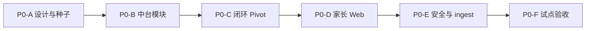

# 学生 Jarvis — P0 研发阶段计划（Pivot · 二年级 · Web）

> **产品需求** 见 **[学生Jarvis-v1-产品需求与PRD.md](./学生Jarvis-v1-产品需求与PRD.md)** v0.2（待确认）。

> **版本**：2026-06-14  
> **依据**：[学生Jarvis-v1-产品需求与PRD.md](./学生Jarvis-v1-产品需求与PRD.md)  
> **试点**：小学 **二年级** · **数学 + 语文** 各 1 单元 · **Web** 家长入口

---

## 0. 与 v1 阶段 1～7 的关系

| 项 | 说明 |
|----|------|
| 阶段 1～7 | **技术骨架已完成**（learning 闭环、Hermes、进化） |
| **P0** | **产品 Pivot**：内容、KP 中台、家长报告、安全、Web；**废弃初二分式为默认路径** |
| legacy | `question_bank/legacy/` 保留旧种子供回归对照；新默认 = G2 |

---

## 1. P0 子阶段



| 子阶段 | 名称 | 交付 | 设计 |
|--------|------|------|------|
| **P0-A** | 设计与种子 | PRD 冻结、KP catalog、G2 数学/语文种子题（≥10→30） | [p0/README.md](./learning/p0/README.md) |
| **P0-B** | 中台模块 | `kp_catalog`、`onboarding`、`dimension_model` | [p0-kp-catalog](./learning/p0/p0-kp-catalog-design.md) |
| **P0-C** | 闭环 Pivot | yaml/taxonomy/accept 切 G2；推题年级校验 | 复用 learning 域 |
| **P0-D** | 家长 Web | `student_panel` + 周报告 API | [p0-web-panel](./learning/p0/p0-web-panel-design.md) |
| **P0-E** | 安全与 ingest | `student_safety`、`textbook_ingest` v1 | [p0-safety](./learning/p0/p0-safety-dialog-design.md) · [p0-ingest](./learning/p0/p0-textbook-ingest-design.md) |
| **P0-F** | 试点验收 | `accept_learning_p0_smoke.py` + 用户故事 US-01/02/05/06/11 | [验证与用户故事](./学生Jarvis-v1-验证与用户故事.md) |

---

## 2. P0 试点单元（固定）

| 学科 | unit_id | 单元名 |
|------|---------|--------|
| 数学 | `math-g2-add-sub-100` | 100 以内加减法 |
| 语文 | `chinese-g2-sentence-basic` | 句子与标点基础 |

默认 onboarding 学科/单元：数学单元；可在 profile 中切换主学科。

---

## 3. 验收命令（P0 完成后）

```bash
cd $AGENT_COMMUNITY_ROOT
export PYTHONPATH=.

python agent_platform/learning/cli_student.py bank import
python agent_platform/learning/cli_student.py seed verify
python agent_platform/learning/accept_learning_p0_smoke.py

pytest agent_platform/tests/test_kp_catalog.py \
       agent_platform/tests/test_parent_report.py \
       agent_platform/tests/test_student_safety.py -q

# Web 家长面板
python agent_platform/learning/smoke_student_panel.py
# 浏览器 http://127.0.0.1:8770/?student_id=demo-g2-01
```

---

## 4. 当前进度

| 子阶段 | 状态 |
|--------|------|
| P0-A | 已完成（设计 + G2 种子） |
| P0-B | 已完成（kp_catalog / onboarding / dimension） |
| P0-C | 已完成（闭环 pivot + accept） |
| P0-D | 已完成（student_panel + 家长报告） |
| P0-E | 已完成（student_safety + textbook_ingest stub） |
| P0-F | 已完成（accept_learning_p0_smoke） |

---

## 修订记录

| 日期 | 说明 |
|------|------|
| 2026-06-02 | 六份 P0 设计、ingest stub、prompts 二年级润色 |
| 2026-06-14 | 初稿：二年级 + Web，Pivot 计划 |
