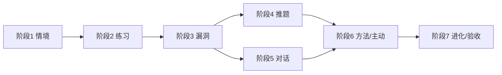

# 学生 Jarvis v1 — 研发阶段计划

> **版本**：2026-06-05  
> **前置**：[学生Jarvis-v1-架构图.md](./学生Jarvis-v1-架构图.md)（含 context/gap_map JSON Schema 附录）  
> **场景验收**：[学生Jarvis-v1-验证与用户故事.md](./学生Jarvis-v1-验证与用户故事.md)（用户旅程 · 数据依赖 · 需求差距）  
> **产品需求**：[学生Jarvis-v1-产品需求与PRD.md](./学生Jarvis-v1-产品需求与PRD.md)（用户故事 · 幻灯片 · 交互 Canvas 见 `presentations/`、`canvases/`）  
> **原则**：每阶段 **先设计 + 测试方案 → 你确认 → 再编码 → 单测 + 集成测试 → 阶段验收**；不跳步堆代码。

---

## 0. 总览

| 阶段 | 名称 | 业务价值（学生可感知） | 依赖 | 预估工期 |
|------|------|------------------------|------|----------|
| **1** | 学习情境底座 | 打开助理知道「学到哪、什么阶段」 | 无 | 1～1.5 周 |
| **2** | 练习提交与判定 | 做题立刻知道对错 | 阶段 1 | 1～1.5 周 |
| **3** | 漏洞地图 | 看见「错在哪类、几次、趋势」 | 阶段 2 | 1.5～2 周 |
| **4** | 推题闭环 | 按漏洞自动下一包题，练后队列变 | 阶段 3 | 2 周 |
| **5** | 对话助理集成 | chat 内情境注入、查漏洞、受控答疑 | 阶段 3（推题可选接 4） | 1.5～2 周 |
| **6** | 方法辅导与主动 | 微计划、练后小结、复发提醒 | 阶段 4、5 | 1.5 周 |
| **7** | 进化与试点验收 | skill 晋升、KPI、种子数据整包 | 阶段 6 | 2 周 |



**每阶段交付物（固定模板）**：

1. 《阶段 N 详细设计》— 追加到本文档对应章节或独立 `docs/learning/phase-N-design.md`
2. 《阶段 N 测试方案》— 单测列表 + 集成场景 + 验收命令
3. 代码 + `pytest` + `accept_learning_phaseN.py`（或等价脚本）
4. 阶段验收签字表（你可勾选）

---

## 阶段 1 — 学习情境底座（StudentContext）

### 1.1 业务目标

- 为**一名学生**持久化「当前学科 / 单元 / 学习阶段 / 目标」。
- 支持 **CLI 与 API** 读写；为后续 Hermes `pre_llm` 提供 **CTX 文本块**。
- **验收场景**：新学生会话初始化单元；次日 CLI 读取仍一致；修改 `pipeline_stage` 后 `updated_at` 刷新。

### 1.2 详细设计（实施前定稿，确认后编码）

| 项 | 内容 |
|----|------|
| **模块** | `agent_platform/learning/` 新建：`contracts.py`、`student_context.py`、`store.py`、`_config.py` |
| **配置** | `agent_platform/config/student_learning.yaml`：`data_root: student_data`、`default_curriculum`（种子单元） |
| **存储** | `student_data/{student_id}/context.json`，校验附录 A Schema |
| **服务 API** | `StudentContextService.get()` / `init(student_id, curriculum)` / `patch(StudentContextPatch)` / `to_prompt_block()` |
| **CLI** | `agent_platform/learning/cli_student.py`：`init` / `show` / `set-stage` |
| **不复用** | 不把单元进度写入 M2（避免与 gap 混源）；M2 仅 v5 用于偏好 |
| **边界** | `focus.*` 本阶段可写空数组；Phase 3/4 管道再填 |

### 1.3 测试方案

**单元测试**（`agent_platform/tests/test_student_context.py`）：

| ID | 用例 | 断言 |
|----|------|------|
| U1-1 | `init` 写入合法 context | schema 字段齐全 |
| U1-2 | `patch` 改 `pipeline_stage` | `updated_at` 变化 |
| U1-3 | 非法 `pipeline_stage` | `ValidationError` |
| U1-4 | `to_prompt_block` | 含 unit_title、stage 中文说明 |
| U1-5 | 并发两次 patch | 后写覆盖或乐观锁（设计时二选一） |

**集成测试**（`agent_platform/learning/accept_learning_phase1.py`）：

| ID | 场景 | 命令/步骤 | 预期 |
|----|------|-----------|------|
| I1-1 | CLI 初始化 | `cli_student init demo-stu-01 --unit math-8-fractional-equation` | 文件存在 |
| I1-2 | 跨进程读取 | init 后新进程 `show` | JSON 一致 |
| I1-3 | prompt 块 | Python 调 `to_prompt_block()` | 非空且含「分式方程」 |

**阶段验收（业务）**：

- [ ] 能用 CLI 为学生建立单元情境并查看  
- [ ] context.json 符合附录 A  
- [ ] `pytest` 阶段 1 相关全绿  

### 1.4 阶段 1 不包含

- Attempt、Gap、推题、Hermes 插件  

### 1.5 阶段 1 验收（已完成 2026-06-05）

- [x] CLI 为学生建立单元情境并查看  
- [x] `context.json` 符合架构附录 A  
- [x] `pytest test_student_context.py` + `accept_learning_phase1.py` 全绿  

---

## 阶段 2 — 练习提交与判定（Attempt + Grader）

### 2.1 业务目标

- 学生（或 CLI 模拟）**提交答案** → 得到 **对错 + 标准解析引用**。
- 每次提交更新 `context.session_stats`（次数、近 7 日正确率）。
- **验收场景**：连对 3 题正确率上升；错题为后续 Phase 3 留 `error_code` 占位（可先规则匹配）。

### 2.2 详细设计（阶段 1 完成后展开）

| 项 | 内容 |
|----|------|
| **模块** | `attempt.py`、`grader.py`；`attempts/{attempt_id}.json` schema |
| **题库** | 阶段 2 用 **内联 JSON 种子 10 题**（Phase 4 再迁 SQLite） |
| **API** | `AttemptService.submit(student_id, question_id, answer)` → `AttemptResult` |
| **Grader** | 客观题：精确/数值容差；主观步骤题 v1：规则 + 可选 LLM（默认关） |
| **联动** | 提交后 `StudentContextService.refresh_session_stats()` |

### 2.3 测试方案（提纲）

- 单测：对错判定、attempt 文件落盘、stats 计算  
- 集成：提交 5 次混合对错 → `correct_rate_7d` 符合手算  
- 验收：CLI `attempt submit` 返回 `correct: true/false`  

### 2.4 阶段 2 不包含

- Gap 聚合、推题队列  

### 2.5 阶段 2 验收（已完成 2026-06-02）

- [x] CLI `attempt submit` 返回 `correct: true/false`  
- [x] 提交后 `session_stats.attempts_today` / `correct_rate_7d` 更新  
- [x] 错题写入 `error_code` 占位  
- [x] `pytest test_grader.py test_attempt.py` + `accept_learning_phase2.py` 全绿  
- 详细设计见 [phase-2-design.md](./learning/phase-2-design.md)

---

## 阶段 3 — 漏洞地图（Taxonomy + GapMap）

### 3.1 业务目标

- 错题归入 **错因 taxonomy**（配置于 `student_learning.yaml`）。
- 维护 `gap_map.json`（附录 B）；支持 **查询 Top 漏洞、趋势、证据 attempt_id**。
- 更新 `context.focus.top_gap_ids`。
- **验收场景**：同一错因错 3 次 → gap `wrong_7d=3`；连对 3 次 → `mastered`（配置 N=3）。

### 3.2 详细设计（阶段 2 完成后展开）

| 项 | 内容 |
|----|------|
| **模块** | `gap_map.py`、`taxonomy.py`；`GapMapUpdater` 由 `attempt_submit` 钩子调用 |
| **API** | `gap_map_query(student_id, limit)` / `gap_get(gap_id)` |
| **CLI** | `gap list` / `gap show {gap_id}` |
| **AnswerGate 预备** | `evidence_attempt_ids` 必填才允许对外声称该 gap |

### 3.3 测试方案（提纲）

- 单测：taxonomy 映射、status 状态机、mastery 晋升  
- 集成：脚本模拟 10 次 attempt → gap_map 与 context.focus 一致  
- 验收：无 attempt 时 CLI `gap list` 不得显示「已掌握」类文案（仅数据层）  

### 3.4 阶段 3 验收（已完成 2026-06-02）

- [x] 错题归入 taxonomy，写入 `gap_map.json`  
- [x] 同错因错 3 次 → `wrong_7d=3`  
- [x] 同知识点连对 3 次 → `mastered`  
- [x] `context.focus.top_gap_ids` 随 gap 重算更新  
- [x] `pytest test_taxonomy.py test_gap_map.py` + `accept_learning_phase3.py` 全绿  
- 详细设计见 [phase-3-design.md](./learning/phase-3-design.md)

---

## 阶段 4 — 推题闭环（Question Bank + Push Engine）

### 4.1 业务目标

- **按 gap 优先级** 生成 `push_queue.json`，拉取下一包 3～5 题。
- 练后 **队列自动重排**（掌握降频、新漏洞插队）。
- **验收场景**：关闭一 gap 后，队列不再推同类题为主。

### 4.2 详细设计（阶段 3 完成后展开）

| 项 | 内容 |
|----|------|
| **模块** | `push_engine.py`、`question_bank/`（SQLite + import CLI） |
| **API** | `question_fetch` / `push_queue_peek` |
| **数据** | `push_queue.json` schema（本阶段设计时写入架构附录 C） |

### 4.3 测试方案（提纲）

- 单测：排队算法、mastery 降频  
- 集成：gap 变化 → queue 头变化 → fetch 题 id 属于对应 knowledge_point  
- 验收：`accept_learning_phase4.py` 端到端 错题→推题→再答  

### 4.4 阶段 4 验收（已完成 2026-06-02）

- [x] `push_queue.json` 按 gap 优先级生成  
- [x] `push peek` / `push fetch` CLI 可用  
- [x] gap mastered 后队列不再主推该 gap 题目  
- [x] `focus.queue_head_question_ids` 随 rebuild 更新  
- [x] `bank import` 种子题导入 SQLite  
- [x] `pytest test_push_engine.py` + `accept_learning_phase4.py` 全绿  
- 详细设计见 [phase-4-design.md](./learning/phase-4-design.md)

---

## 阶段 5 — 对话助理集成（Hermes + AnswerGate）

### 5.1 业务目标

- Hermes 插件 `agent-student`：`student_context_get`、`gap_map_query`、`attempt_submit`（已有则暴露）。
- `pre_llm_call` 注入 CTX + Top gaps 摘要。
- **AnswerGate**：生成回答中凡声称掌握/漏洞，必须带 `gap_id` 或 `attempt_id`，否则降级为引导式。
- **验收场景**：新 `hermes chat` 不问单元也能续接；无 gap 证据时不说「你反复在某点出错」。

### 5.2 详细设计（阶段 3 完成后可与 4 并行）

| 项 | 内容 |
|----|------|
| **模块** | `integrations/hermes/student_tools.py`、`agent_student/` |
| **Prompt** | `STUDENT_JARVIS_SYSTEM`、`ANSWER_GATE_RULES` 静态模板 |
| **复用** | `agent_combined_recall`（仅 Wiki+M2，GAP 由工具显式查） |

### 5.3 测试方案（提纲）

- 单测：tool handler JSON、prompt 块拼接  
- 集成：`TestClient` 或 smoke 无 uvicorn；模拟 search 空 + 断言 message  
- 验收：文档 §P4 式手动剧本（可选 Hermes 真人测）  

### 5.4 阶段 5 验收（已完成 2026-06-02）

- [x] Hermes 插件 `agent-student` 注册 5 工具 + `pre_llm_call`  
- [x] pre_llm 注入 StudentContext + Top gaps + AnswerGate 规则  
- [x] `student_answer_gate` 无证据时降级引导话术  
- [x] `pytest test_answer_gate.py test_student_hermes_tools.py` + `accept_learning_phase5.py` 全绿  
- 详细设计见 [phase-5-design.md](./learning/phase-5-design.md)

---

## 阶段 6 — 方法辅导与伴随主动

### 6.1 业务目标

- `study_plan_generate`：基于 Top gap 输出 20～30 分钟微计划（写 `context.focus.active_plan_id`）。
- 静态 skill 4 条（remediation/*）。
- proactive：**练后小结**、**gap 复发（wrong_7d 达阈值）**、**考前 cron**（仅规则）。
- **验收场景**：attempt 完成后收到小结；同类错第 3 次触发提醒（可关 DND）。

### 6.2 设计 / 测试

- 复用 `proactive_service`，新 event types in yaml  
- 集成：`accept_learning_phase6.py`  

### 6.3 阶段 6 验收（已完成 2026-06-02）

- [x] `study_plan_generate` 生成 20～30 分钟微计划并写 `active_plan_id`  
- [x] 4 条 remediation 静态 skill  
- [x] attempt 后练后小结（`learning_proactive.jsonl`）  
- [x] `wrong_7d >= 3` 触发 gap 复发提醒  
- [x] `do_not_disturb` 抑制投递仍落盘  
- [x] `pytest test_study_plan.py test_learning_proactive.py` + `accept_learning_phase6.py` 全绿  
- 详细设计见 [phase-6-design.md](./learning/phase-6-design.md)

---

## 阶段 7 — 进化与试点整包

### 7.1 业务目标

- C7：策略效果（gap wrong_7d 下降）→ promote 个人 skill  
- 种子：1 单元 Wiki + 30 题 + taxonomy  
- KPI 脚本：正确率、复错率、队列完成率  
- **验收**：90 天试点指标可自动出报告（CLI）

### 7.2 设计 / 测试

- `accept_learning_full.py` 串联 phase 1～7  
- 更新 [功能测试验证方案.md](./功能测试验证方案.md) 增加 Student Jarvis 章节（本阶段末）  

### 7.3 阶段 7 验收（已完成 2026-06-02）

- [x] gap `mastered` → 个人 skill 写入 `evolution/skills/`  
- [x] `wrong_7d` 下降可晋升/更新 skill（配置 `promote_on_wrong_7d_drop`）  
- [x] `kpi report --days 90` 输出正确率、复错率、队列完成率  
- [x] `seed verify` 校验 taxonomy + 题库 + remediation skills  
- [x] `pytest test_learning_evolution_bridge.py test_kpi_report.py` + `accept_learning_phase7.py` 全绿  
- [x] `accept_learning_full.py` 串联 phase 1～7 全绿  
- 详细设计见 [phase-7-design.md](./learning/phase-7-design.md)

---

## 8. 仓库与质量门禁（全程）

| 门禁 | 要求 |
|------|------|
| **目录** | 见架构图 §8；阶段 1 仅创建 `learning/` + `student_data/` |
| **风格** | 与 `memory/` 对齐：contracts + service + store + cli + accept |
| **测试** | 每 PR 阶段：`pytest agent_platform/tests/test_learning_*` + `accept_learning_phaseN.py` |
| **配置** | 不提交真实学生 PII；demo 用 `demo-stu-01` |
| **文档** | 每阶段完成更新架构附录 C（若新增 schema） |

---

## 9. 当前状态与下一步

| 项 | 状态 |
|----|------|
| 架构图 + context/gap_map Schema + §2.3 业务关系 | ✅ |
| 阶段 1～7 详细设计 | ✅ [learning/phase-1-design.md](./learning/phase-1-design.md) … [phase-7-design.md](./learning/phase-7-design.md) |
| 阶段 1～7 代码 + 测试 | ✅ `agent_platform/learning/` |
| 全链路验收 | ✅ `accept_learning_full.py` |

### 阶段 7 验收命令

```bash
cd $AGENT_COMMUNITY_ROOT
PYTHONPATH=. pytest agent_platform/tests/test_learning_evolution_bridge.py agent_platform/tests/test_kpi_report.py -q
PYTHONPATH=. python agent_platform/learning/accept_learning_phase7.py
PYTHONPATH=. python agent_platform/learning/accept_learning_full.py

# KPI 与种子
PYTHONPATH=. python agent_platform/learning/cli_student.py kpi report demo-stu-01 --days 90
PYTHONPATH=. python agent_platform/learning/cli_student.py seed verify
```

### 阶段 1 验收命令

```bash
cd $AGENT_COMMUNITY_ROOT
PYTHONPATH=. pytest agent_platform/tests/test_student_context.py -q
PYTHONPATH=. python agent_platform/learning/accept_learning_phase1.py

# 手动示例
PYTHONPATH=. python agent_platform/learning/cli_student.py init demo-stu-01 --from-defaults
PYTHONPATH=. python agent_platform/learning/cli_student.py show demo-stu-01
PYTHONPATH=. python agent_platform/learning/cli_student.py set-stage demo-stu-01 practice
PYTHONPATH=. python agent_platform/learning/cli_student.py prompt demo-stu-01
```

---

## 附录 — 阶段 1 文件清单（确认后创建）

```text
agent_platform/learning/__init__.py
agent_platform/learning/contracts.py          # StudentContext Pydantic ↔ JSON Schema
agent_platform/learning/_config.py
agent_platform/learning/store.py              # student_data 路径、原子写
agent_platform/learning/student_context.py    # StudentContextService
agent_platform/learning/cli_student.py
agent_platform/learning/accept_learning_phase1.py
agent_platform/config/student_learning.yaml
agent_platform/tests/test_student_context.py
```
