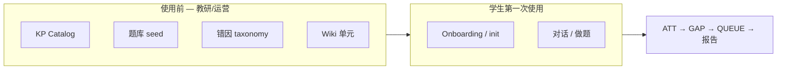
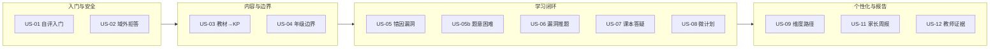
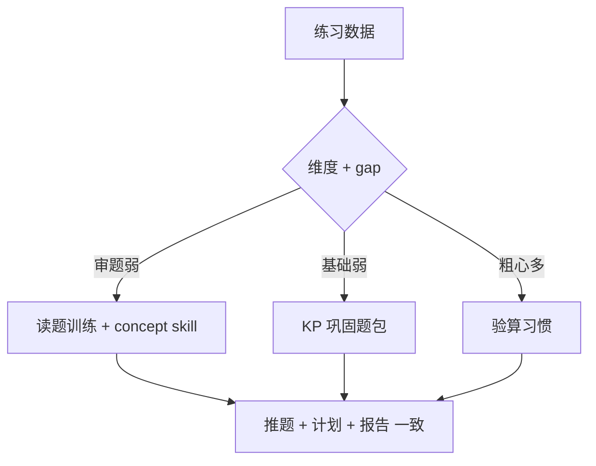

# 学生 Jarvis — 验证与用户故事

> **版本**：v0.2  
> **日期**：2026-06-02  
> **状态**：**待确认**  
> **主文档**：[学生Jarvis-v1-产品需求与PRD.md](./学生Jarvis-v1-产品需求与PRD.md)  
> **关联**：[架构图](./学生Jarvis-v1-架构图.md) · [功能测试验证方案](./功能测试验证方案.md)（工程回归）

---

## 修订说明

本文件合并原 **用户故事（客户验证）**、**场景验证测试方案**，并据 v0.2 产品哲学更新：

- 验证目标从「知识点对错」扩展为 **知识点 + 能力/行为/题意** 双层诊断。
- 用户旅程默认 **二年级乐乐**（与当前 Pivot 一致），不再以初二分式为主路径。
- 区分 **场景验证**（用户能不能用）与 **工程回归**（`accept_learning_*.py`）。

---

## 1. 验证要回答什么

| 问题 | 本文件如何回答 |
|------|----------------|
| 学生/家长/教师 **怎么用**？ | §3 旅程 · §5 剧本 |
| 要先准备哪些 **内容**？ | §4 必备数据 |
| 缺 Wiki/题库会怎样？ | §4 · §6 |
| LLM 还是规则？ | §5 |
| 当前版能验收什么？ | §7 · §8 |
| 给客户讲什么故事？ | §9 用户故事 |

**不覆盖**：单测用例 ID、JSON 字段逐项核对 — 见 `accept_learning_phaseN.py`。

---

## 2. 产品 30 秒版（对外讲解）

```text
┌──────────────────────────────────────────────────────────────────┐
│  校本教材 → 知识点树 → 题库 · Wiki · 错因体系                      │
│       ↑              ↑              ↑                              │
│   教研入库审核    年级边界      做题证据（非 LLM 猜）               │
├──────────────────────────────────────────────────────────────────┤
│  学生 Jarvis：不只盯知识点 —— 还看审题、习惯、能力维度              │
│  练—诊—辅—讲—推—报告 · 域外拒答 · 带证据的学情                      │
│  ≠ 刷题机 · ≠ 通用 ChatGPT                                        │
└──────────────────────────────────────────────────────────────────┘
```

---

## 3. 角色与一周旅程（二年级 · 乐乐）

### 3.1 四个角色

| 角色 | 人物 | 关注点 |
|------|------|--------|
| 学生 | 乐乐，2 年级 | 题合适、讲得懂、有目标 |
| 家长 | 乐乐妈妈 | 安全、周报、不胡说 |
| 教师 | 王老师 | 校本一致、证据链、入库审核 |
| 校方 | 张主任 | 年级边界、合规 |

### 3.2 第一周旅程（目标产品）

| 天 | 谁 | 场景 | 成功感受 |
|----|-----|------|----------|
| 0 | 教研 | `语文-二年级.kp.md` 审核入库；补题库与 Wiki | 「课本知识点进系统了」 |
| 1 | 学生 | 选年级、自评（基础/逻辑/粗心） | 「知道我是二年级」 |
| 2 | 学生 | 做错进退位或标点题 | 「不是笨，是 **某一类错**」 |
| 2b | 学生 | 应用题做错，Jarvis 先帮 **读懂题** | 「原来不是不会算，是没读懂」 |
| 3 | 学生 | 「练 20 分钟攻克这个漏洞」 | 「有目标，不是盲刷」 |
| 7 | 家长 | 周报告：知识 + **维度** + **习惯** + 证据 | 「看得见进步，能点开错题」 |

### 3.3 当前可演示 vs 待补齐

| 旅程环节 | 当前（2026-06） | 待补齐 |
|----------|-----------------|--------|
| KP 入库审核 | ✅ Web `/kp-review` | — |
| 浏览知识库 | ✅ `/kp-catalog` | — |
| 做题闭环 | ✅ CLI/Hermes | 题库仅 10 题/单元 |
| 双层报告 | ✅ 家长 API 含维度 | 题意类剧本待丰富 |
| 课本答疑 | ⚠️ LLM + 门控 | **Wiki 缺失** |
| 综合题/多 kp | ⚠️ 单 kp 选题 | P1 策略 |

---

## 4. 必备数据与框架模块

### 4.1 谁准备什么



| 数据 | 存储 | 必须？ | 对学生的意义 |
|------|------|--------|--------------|
| **KP Catalog** | `kp_catalog.json` | ✅ | 学什么、年级边界 |
| **题库** | seed JSON / SQLite | ✅ | 能做题；**推题唯一来源（v1）** |
| **Taxonomy** | `student_learning.yaml` | ✅ | 错题归类；连接 kp 与维度 |
| **Wiki** | `wiki_data/` | **P0 应有** | 答疑对齐课本；无则易泛化 |
| **CTX** | `context.json` | ✅ | 当前单元与阶段 |
| **ATT / GAP / QUEUE** | `student_data/{id}/` | 练习后生成 | 薄弱与下一包题 |
| **Memory** | M2 | 可选 | 偏好备注 |
| **Evolution skill** | gap 效果后 | 自动 | 个人讲法策略 |

### 4.2 缺数据时的表现

| 缺失 | 还能做什么 | 不能 / 退化 |
|------|------------|-------------|
| 无题库 | 聊天 | **不能**闭环、gap、推题 |
| 无 attempt | 聊天、看情境 | **不能**漏洞、个性化推题 |
| 无 Wiki | 做题+gap+推题 | 答疑 **易成通用 LLM** |
| taxonomy 与题不匹配 | 可能对错 | 错因 **误导** gap |
| 无 catalog 对齐的 kp | — | 推题/报告 **坐标混乱** |

---

## 5. LLM 与规则分工

| 学生感知能力 | 机制 | 依赖 LLM？ |
|--------------|------|------------|
| 对错判定 | Grader + 标准答案 | ❌ |
| 漏洞地图 | Taxonomy + GapMap | ❌ |
| 推题 | PushEngine **选题** | ❌ |
| 掌握/降频 | mastery streak | ❌ |
| 练后小结、主动 | proactive 规则 | ❌ |
| 微计划结构 | study_plan + skill 模板 | 模板为主 |
| **聊天答疑** | Hermes + LLM | ✅（受 AnswerGate 约束） |
| skill 晋升 | evolution_bridge | ❌ |

**结论**：闭环核心 **不依赖 LLM**；④ 答疑质量 **依赖 Wiki + 门控**。Jarvis **不是**纯聊天辅学。

---

## 6. 场景验证剧本

默认 persona：**乐乐 · 二年级 · `demo-g2-01`**。运营需先 `bank import`、`seed verify`、init 学生。

### 剧本 1 — 第一天不捏造薄弱点

| # | 操作 | 通过标准 |
|---|------|----------|
| 1 | 完成数据准备（§4） | seed verify ok |
| 2 | 首次对话 3 轮 | **无 attempt 前**不说「你总是错在…」 |
| 3 | 问「今天学什么单元」 | 与 init 的 unit_title 一致 |

### 剧本 2 — 错题后系统变聪明

| # | 操作 | 通过标准 |
|---|------|----------|
| 1 | 同一错因连错 3 题 | 有对错反馈 |
| 2 | 问「我哪类题容易错」 | 含 **gap 描述 + gap_id** |
| 3 | 要下一题 | 与 gap 相关（**从题库选出**） |
| 4 | 查看家长周报 | 含 **知识 + 至少一个维度/习惯项** |

### 剧本 3 — 题意困难（v0.2 新增）

| # | 操作 | 通过标准 |
|---|------|----------|
| 1 | 做错 **应用题/阅读题**（`READING_ERROR`） | 错因非仅「计算错」 |
| 2 | 问「我是不是不会加法」 | 助理区分 **审题/题意** vs **知识点**（或引导先读题） |
| 3 | 报告 | 审题维度或行为项有信号 |

> **当前**：taxonomy 有 `READING_ERROR`，remediation `concept_v1` 含「复述题目」；**产品剧本 P0 验收待 Wiki 与足够应用题 seed**。

### 剧本 4 — 掌握后降频

| # | 操作 | 通过标准 |
|---|------|----------|
| 1 | 同 kp 连对 3 题 | gap mastered |
| 2 | 再要推题 | 队列不再主攻该 gap |
| 3 | 问「我会了吗」 | 引用 mastered gap 或 attempt |

### 剧本 5 — 无 Wiki 风险（记录型）

| # | 条件 | 预期 |
|---|------|------|
| 1 | 不 ingest Wiki | 能讲但可能 **不符合校本** → 记为内容风险 |
| 2 | 有 gap 时问薄弱点 | **仍来自 gap 工具**，非 LLM 猜 |

### 剧本 6 — 教研入库（已实现）

| # | 操作 | 通过标准 |
|---|------|----------|
| 1 | 上传 `.kp.md` → 审核 → 批准 | `kp_catalog.json` 更新 |
| 2 | 打开 `/kp-catalog` | 可见新单元与知识点 |

---

## 7. 用户故事地图



---

## 8. 用户故事详表

格式：**作为** … **我希望** … **以便** …

### Epic 1 · 入门与安全

#### US-01 初始化画像

| 项 | 内容 |
|----|------|
| **作为** | 2 年级学生 |
| **我希望** | 选年级、学科、简单自评（基础/逻辑/粗心） |
| **以便** | 助理用适龄语言，只推本年级内容 |

**验证**：剧本 1 · MUST

---

#### US-02 域外拒答

| 项 | 内容 |
|----|------|
| **作为** | 家长 |
| **我希望** | 代写、游戏、情感倾诉等被拒绝并拉回学习 |
| **以便** | 放心孩子独自使用 |

**验证**：安全抽检剧本 · MUST

---

### Epic 2 · 内容与边界

#### US-03 教材入库 → 知识点

| 项 | 内容 |
|----|------|
| **作为** | 教研教师 |
| **我希望** | 文档/PDF 形成可审核的知识点树并发布 |
| **以便** | 推题和答疑与校本一致 |

**验证**：剧本 6 · **当前 Web 链路可签字** · MUST

---

#### US-04 年级边界

| 项 | 内容 |
|----|------|
| **作为** | 2 年级学生 |
| **我希望** | 绝不出现更高年级题或讲法 |
| **以便** | 不被超纲打击 |

**验证**：`assert_student_may_access_unit` + 推题抽检 · MUST（硬规则）

---

### Epic 3 · 学习闭环

#### US-05 错因漏洞（②）

| 项 | 内容 |
|----|------|
| **作为** | 学生 |
| **我希望** | 错后知道 **错因类型**（如进位、标点），不是只说「错了」 |
| **以便** | 知道该练什么 |

**验证**：剧本 2 · MUST

---

#### US-05b 题意/审题困难（v0.2 新增）

| 项 | 内容 |
|----|------|
| **作为** | 学生 |
| **我希望** | 综合题做错时，助理能区分「没读懂题」和「知识点不会」 |
| **以便** | 不用盲目刷同一类计算题 |

**验证**：剧本 3 · SHOULD（P0 末期 / P1 初）

---

#### US-06 漏洞推题（⑤）

| 项 | 内容 |
|----|------|
| **作为** | 学生 |
| **我希望** | 下一包题针对我的漏洞，掌握后不再主攻同类 |
| **以便** | 时间花在刀刃上 |

**说明（诚实）**：v1 **从题库选题**，不即时生成新题。

**验证**：剧本 2、4 · MUST

---

#### US-07 课本一致答疑（④）

| 项 | 内容 |
|----|------|
| **作为** | 学生 |
| **我希望** | 问步骤时讲法与课本一致 |
| **以便** | 在校考试不混乱 |

**验证**：剧本 5 对比 · MUST（需 Wiki）

---

#### US-08 二十分钟微计划（③）

| 项 | 内容 |
|----|------|
| **作为** | 学生 |
| **我希望** | 「帮我定 20 分钟计划」得到可执行步骤 |
| **以便** | 不是空泛「要多练」 |

**验证**：`plan generate` · SHOULD

---

### Epic 4 · 个性化与报告

#### US-09 维度化路径（合并原 US-09/10）

| 项 | 内容 |
|----|------|
| **作为** | 学生 |
| **我希望** | 系统识别我弱在「逻辑/审题」还是「基础 KP」，路径不同 |
| **以便** | 弱点真的被补起来 |



**验证**：报告含维度 + 路径差异 · P1 深化推题联动

---

#### US-11 家长周报告（F）

| 项 | 内容 |
|----|------|
| **作为** | 家长 |
| **我希望** | 周报含：知识掌握、**能力维度**、**行为习惯**、建议、证据 |
| **以便** | 知道如何配合孩子 |

**报告 mock**

```text
┌─────────────────────────────────────────┐
│  乐乐 · 数学 · 第 12 周学情              │
├─────────────────────────────────────────┤
│  知识  进退位：进步中 ↑  竖式：已掌握 ✓   │
│  能力  逻辑推理：待加强  审题：留意问法    │
│  习惯  粗心：本周 4 次（见 #12 #15）      │
│  建议  每天 15 分钟验算 + 2 道读题训练    │
└─────────────────────────────────────────┘
```

**验证**：Web `/api/.../parent-report` · MUST

---

#### US-12 教师证据链

| 项 | 内容 |
|----|------|
| **作为** | 教师 |
| **我希望** | 报告结论可点到具体错题 |
| **以便** | 面谈、备课有依据 |

**验证**：报告 `evidence` 字段 · SHOULD

---

## 9. 与「对话机」对比（客户沟通）

| 维度 | 普通 AI 学习机 | 学生 Jarvis（目标） |
|------|----------------|---------------------|
| 交互 | 一直聊天 | 聊天 + 练题 + 计划 |
| 进度 | 模型感觉 | attempt / gap **证据** |
| 诊断 | 模糊 | **KP + 维度 + 行为** |
| 内容 | 互联网泛知识 | 校本 KP + Wiki |
| 推题 | 随机或模型出 | **题库选题**（v1） |
| 安全 | 弱 | 域外拒答 + 适龄 |
| 输出 | 口头鼓励 | 结构化报告 |

---

## 10. 验收签字

### 10.1 P0 试点（二年级）建议签字项

| ID | 故事 | 剧本 | 当前可签？ |
|----|------|------|------------|
| US-01 | 自评入门 | 1 | ⚠️ CLI 可，UI 弱 |
| US-02 | 域外拒答 | 安全抽检 | ✅ |
| US-03 | 教材→KP | 6 | ✅ |
| US-04 | 年级边界 | 抽检 | ✅ |
| US-05 | 错因漏洞 | 2 | ✅（需有题） |
| US-05b | 题意困难 | 3 | ☐ 待内容与 Wiki |
| US-06 | 漏洞推题 | 2、4 | ✅（选题） |
| US-07 | 课本答疑 | 5 | ☐ 待 Wiki |
| US-08 | 微计划 | CLI | ⚠️ |
| US-09 | 维度路径 | 报告 | ⚠️ 报告有，路径弱 |
| US-11 | 家长周报 | 2 | ✅ |
| US-12 | 教师证据 | 报告 | ⚠️ |

### 10.2 客户验证打分表（可打印）

| ID | 摘要 | MUST | 可选 | 不需要 | 备注 |
|----|------|:----:|:----:|:------:|------|
| US-01 | 年级+自评 | ☐ | ☐ | ☐ | |
| US-02 | 域外拒答 | ☐ | ☐ | ☐ | |
| US-03 | 教材→KP | ☐ | ☐ | ☐ | |
| US-04 | 年级边界 | ☐ | ☐ | ☐ | |
| US-05 | 错因漏洞 | ☐ | ☐ | ☐ | |
| US-05b | 题意/审题 | ☐ | ☐ | ☐ | |
| US-06 | 漏洞推题 | ☐ | ☐ | ☐ | |
| US-07 | 课本答疑 | ☐ | ☐ | ☐ | |
| US-08 | 微计划 | ☐ | ☐ | ☐ | |
| US-09 | 维度路径 | ☐ | ☐ | ☐ | |
| US-11 | 家长周报 | ☐ | ☐ | ☐ | |
| US-12 | 教师证据 | ☐ | ☐ | ☐ | |

### 10.3 工程回归（非本文件主体）

```bash
export PYTHONPATH=.
python agent_platform/learning/accept_learning_full.py
python agent_platform/learning/accept_learning_p0_smoke.py
python agent_platform/learning/accept_kp_review_web.py
```

---

## 11. 文档沿革

v0.2 合并并取代原用户故事（客户验证）、场景验证测试方案等文档（已删除）。Canvas/幻灯片资源仍可使用。

---

## 修订记录

| 日期 | 说明 |
|------|------|
| 2026-06-06 | 场景验证方案初稿 |
| 2026-06-14 | 用户故事客户验证版 |
| 2026-06-02 | **v0.2**：合并、二年级旅程、双层诊断、US-05b、实现状态更新 |
