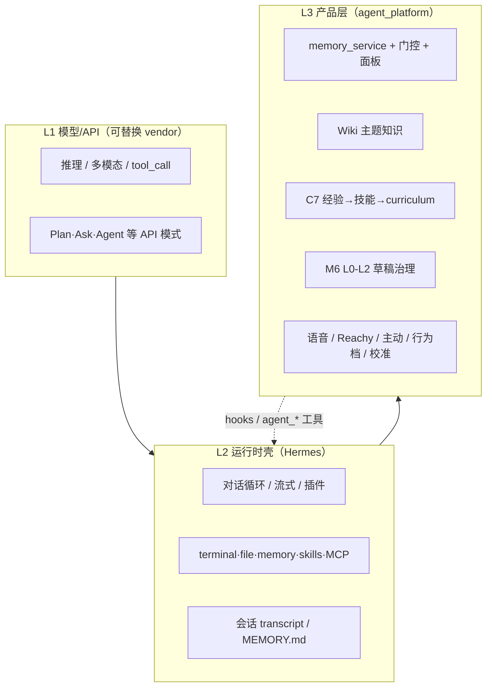

# 模型能力与产品层边界

> **版本**：2026-06-05  
> **关联**：[项目架构与配置说明.md](./项目架构与配置说明.md) · 参考 `research_repos/learn-coding-agent` · `research_repos/claude-code-source-code`  
> **问题**：多模态 MoE 大模型自带 Agent / Plan / Ask / Skill / MCP / Memory 后，与 agent_community 重合；如何界定 **模型/API**、**运行时壳（Hermes）**、**产品层（agent_platform）**？

---

## 目录

1. [为何感觉「全撞车」](#1-为何感觉全撞车)
2. [Claude Code 的三层划分（参考）](#2-claude-code-的三层划分参考)
3. [agent_community 三层边界](#3-agent_community-三层边界)
4. [与 Claude Code 对照表](#4-与-claude-code-对照表)
5. [四条实践规则](#5-四条实践规则)
6. [战略含义](#6-战略含义)
7. [能力归属判定表](#7-能力归属判定表)

---

## 1. 为何感觉「全撞车」

MoE 多模态模型若自带 **Agent / Plan / Ask / Multitask / Skill / MCP / Memory**，本质是把过去 **CLI Agent 壳** 里的能力，往 **API + 系统提示 + 内置工具** 方向收拢：

| 厂商侧常见能力 | 以前在哪一层 | 现在像什么 |
|----------------|--------------|------------|
| 多步推理 + tool_call | Hermes / Claude Code 循环 | API 原生 Agent 模式 |
| Plan / Ask | PermissionMode + 计划工具 | 产品模式切换 |
| Skill | SkillTool + 目录 | 平台 Skill 市场 |
| Memory | CLAUDE.md、会话 transcript | 云端/会话记忆 |
| MCP | MCPTool 包装 | 平台托管 MCP |
| Multitask | 子代理 / Swarm | 并行 Subagent API |

与 **agent_community** 的重合主要在：**循环、工具、记忆、技能、规划**。若不做边界，会重复造轮子，且出现 Hermes 内置 `memory`、`agent_memory_*`、模型云端记忆 **多套并行**（见架构文档 §6）。

**结论**：厂商做的是 **通用 Harness + 通用能力**；你们要做的是 **个人助理的产品语义 + 数据主权 + 可审计进化 + 物理共域**。重叠在 L2，差异在 L3。

---

## 2. Claude Code 的三层划分（参考）

`learn-coding-agent` 对 Claude Code 的拆解可直接借用：**不是学 40 个工具，而是学分层**。

### 2.1 L1 — 最小内核（≈ 模型/API）

```text
用户 → messages[] → Claude API → stop_reason == "tool_use"?
                              → 执行工具 → tool_result → 循环
```

**只做**：生成、理解、是否调工具、工具参数 JSON。  
**不做**：权限、落盘策略、删记忆、审计、物理设备策略。

### 2.2 L2 — 线束 Harness（≈ 运行时壳）

Claude Code 在循环外包 **12 条机制**（核心循环 → 工具调度 → 计划 → 子代理 → 按需 Skill → 压缩 → 持久任务 → … → 工作树隔离）。其中与「大模型 Agent 功能」对应关系：

| 机制 | 实现 | 归属 |
|------|------|------|
| Plan | `EnterPlanModeTool` + `PermissionMode` | **壳**（改权限，不是新模型） |
| Ask | 只读工具子集 + 规则 | **壳** |
| Agent | 默认权限 + 全工具 | **壳** |
| Skill | `SkillTool`，按需注入 | **壳 + 内容** |
| Memory | CLAUDE.md、memdir、JSONL 会话 | **壳 + 文件** |
| MCP | `mcp__server__tool` | **壳** |
| Multitask | `AgentTool`、fork、Swarm | **壳** |

**要点**：Plan / Ask / Agent **不是三个模型**，而是 **同一模型 + 不同 PermissionMode 与工具可见性**。路线图中的 KAIROS（自主代理）也是 **工具 + 调度**，不是 weights 里「多了一个人格」。

### 2.3 L3 — 产品/场景层

Claude Code 的产品边界：**代码仓库、git worktree、文件历史、IDE 权限、Desktop 桥接**——这是 **Coding Agent 产品语义**，不是「大模型能力」。

---

## 3. agent_community 三层边界



### L1 — 交给模型/API

- 单轮/多轮理解与生成、多模态输入  
- tool_call 协议（JSON schema）  
- API 自带的 thinking / plan / multitask（**会话内策略**，非产品真理源）  
- **不拥有**：跨会话主权、删即废止、审计链、设备策略  

**原则**：随 `hermes model` 换 DeepSeek 等 vendor 时，**agent_platform 零改**。

### L2 — 交给 Hermes（通用 Agent 壳）

- Agent 循环、插件、`pre_llm_call` / `post_llm_call`  
- 内置 `memory`（MEMORY.md）、skills hub、MCP、delegation  
- 通用工具：terminal、file、cronjob、tts…  

**原则**：**不在 agent_platform 再写 query loop**；Plan/Ask 优先 **Hermes 工具白名单 / hooks**，而非第三个规划引擎。

### L3 — agent_platform 必须拥有

| 产品语义 | 为何不能交给模型内置 memory/skill |
|----------|-----------------------------------|
| M2 用户记忆 | 分类、gate、tombstone、面板 US-7、MemVerse |
| M3 Wiki | 主题知识 vs 用户偏好严格分工 |
| C7 进化 | L1→L2→L3 生命周期、curriculum、**可审计文件** |
| M6 治理 | L2 写操作必须草稿确认 |
| M5 主动 | 静默时段、snooze、别打扰 dedup |
| M7 校准/行为档 | 不编造版本号、纠错 supersede、语气漂移 |
| M4 感知 | camera 默认关、非 always-on |
| combined_recall | 记忆 + Wiki **产品级**联合策略 |

**一句话**：模型擅长 **这一轮怎么想、调什么工具**；产品层擅长 **记什么、删什么、练什么、敢不敢自动执行、和身体/日程怎么相处**。

---

## 4. 与 Claude Code 对照表

| 能力 | Claude Code | agent_community | 建议 |
|------|-------------|-----------------|------|
| Agent 循环 | `query.ts` | Hermes | **用 Hermes，不自建** |
| Plan / Ask | PermissionMode + 工具 | 无独立 Plan 模式 | Hermes 工具白名单 / hook；**C7 curriculum ≠ Plan** |
| Skill | SkillTool + 目录 | C7 `skills_data/` + Hermes skills | Hermes=通用；C7=**个人蒸馏 + lifecycle** |
| Memory | CLAUDE.md + JSONL | `agent_memory_*` + 内置 memory | 产品真值 = **`agent_memory_*`** |
| MCP | 内置 + MCPTool | M6 沙箱 + L0–L2 | **保留 L2 draft gate** |
| Multitask | AgentTool / Swarm | Hermes delegation | 并行交 Hermes；敏感操作经 M6/M2 |
| 压缩 | autoCompact | Hermes 侧 | Wiki/进化 **外置存储**，减轻压缩依赖 |

Claude Code 证明：**厂商 Agent 产品 = 厚 Harness + 同一 API**；你们 = **Hermes 作 Harness + agent_platform 作 L3**。

---

## 5. 四条实践规则

### 规则 1 — 真理源单一（Single Source of Truth）

```text
用户偏好/事实       → memory_service（mock 落盘 / MemVerse）
主题知识             → wiki_data
个人 workflow 技能   → skills_data（C7）
会话便利贴           → Hermes MEMORY.md（可选，非验收真值）
模型云端记忆         → 若有，仅 cache；需同步策略，不默认信任
```

### 规则 2 — 能力矩阵（新功能先问三句）

1. 模型 API 是否已有？→ **adapter**，不 fork  
2. Hermes 是否已有？→ **插件 / hook**  
3. 是否含 **产品语义 / 合规 / 物理**？→ **必须 agent_platform**

### 规则 3 — 模式 = 策略，不是新系统

Plan / Ask / Agent / Multitask 映射为：

- 工具可见性子集  
- 权限 / `draft_gate` 松紧  
- 是否允许 `post_llm` 写 L1  

**不要**再建与 Hermes 平行的「大规划模块」。**C7 curriculum**（建议下一步练什么）是 **L3 独有**，不是 API Plan 的重复。

### 规则 4 — 可替换 vendor

L3 只依赖 `MemoryPort`、hooks、YAML；模型内置能力经 **薄 adapter** 接入，失败回退 rules/Hermes。

---

## 6. 战略含义

**短期（当前架构正确）**

- Hermes = L2 · agent_platform = L3  
- 强化：memory 落盘、gate、进化、治理、combined_recall  

**中期（模型能力上涨）**

- Native long memory → **MemVerse 同步/索引**，不替换 tombstone 面板  
- Native skill market → C7 仍保留 **个人蒸馏 + 纠正降权**  
- Native plan → **单任务分解**；C7 curriculum 仍管 **跨会话能力成长**  

**长期（差异化）**

Claude Code 锚定 **代码仓库**；agent_community 锚定 **共域陪伴 + 数据主权 + 自我进化**——同 Harness 哲学，**不同 L3 产品**。

---

## 7. 能力归属判定表

| 判定标准 | L1 模型/API | L2 Hermes | L3 agent_platform |
|----------|-------------|-----------|-------------------|
| 可随 vendor 替换而消失 | ✓ | | |
| 仅服务当前会话推理 | ✓ | 部分 | |
| 通用、与场景无关 | | ✓ | |
| 用户删数据、审计、合规 | | | ✓ |
| 物理世界 / 日程 / 语气一致 | | | ✓ |
| 个人知识 / workflow 复利 | | 辅助 | ✓ |

**MoE 大模型变成「综合框架」后，不要比「谁 loop 写得好」，要比「个人助理语义是否完整、数据是否真在你手里、进化是否可审计」。**

---

## 参考阅读

- 本仓库：`research_repos/learn-coding-agent/README_CN.md`（Claude Code 架构树、12 安全带、权限流）  
- 本仓库：`research_repos/claude-code-source-code/`（PlanMode、PermissionMode、SkillTool 等实现）  
- 本仓库：`research_repos/hermes-agent/README.md`（Hermes 学习循环 vs 产品层分工）  
- 产品实现：[项目架构与配置说明.md](./项目架构与配置说明.md)
