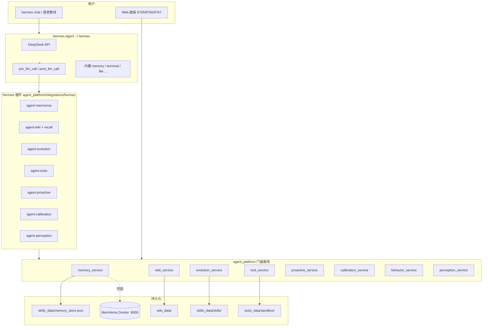
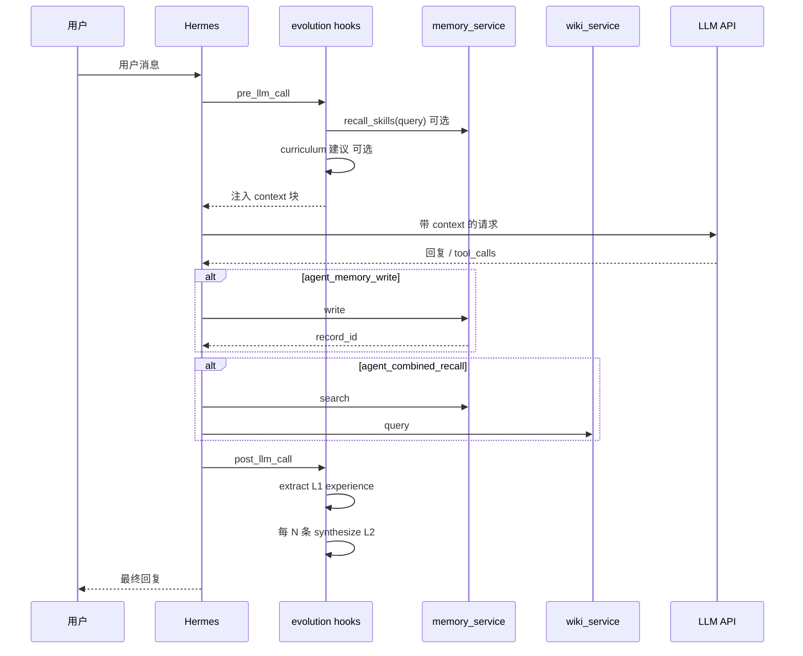

# agent_community — 项目架构与配置说明

> **版本**：2026-06-05  
> **运行环境**：WSL2 Ubuntu · Hermes Agent v0.14.0 · 项目根 `$AGENT_COMMUNITY_ROOT`  
> **定位**：基于 Hermes + MemVerse 的桌面个人 Agent——能对话、能记、能查知识、能调工具、能自我进化，数据在本地。

---

## 目录

1. [功能说明](#1-功能说明)
2. [项目架构](#2-项目架构)
3. [配置说明](#3-配置说明)
4. [数据目录与运行时](#4-数据目录与运行时)
5. [部署、启用与验证](#5-部署启用与验证)
6. [边界与已知限制](#6-边界与已知限制)
7. [与通用 Agent 框架的关系](#7-与通用-agent-框架的关系)

**测试验证**：[功能测试验证方案.md](./功能测试验证方案.md)

---

## 1. 功能说明

### 1.1 产品定位

本项目不是情感陪伴机器人，而是 **Jarvis 式桌面助理**：和你共享上下文、能执行任务、跨会话记住偏好与事实、不确定时诚实说明、敏感数据可查看可删除。

**技术壳**：本地 [Hermes Agent](https://github.com/...) 运行时 + 自研薄层 `agent_platform/` + 可选 MemVerse Docker 记忆后端。

### 1.2 能力总览

| 能力域 | 模块 | 用户可见能力 | Hermes 工具（节选） |
|--------|------|--------------|---------------------|
| **长期记忆** | `memory/` | 跨会话偏好/事实；写入门控；审计链；面板浏览删除 | `agent_memory_write` / `search` / `delete` |
| **主题知识** | `wiki/` | Markdown 知识库；沉淀；检索复利 | `wiki_ingest` / `wiki_query` / `wiki_precipitate_evaluate` |
| **联合召回** | `integrations/recall.py` | 一次查询同时命中记忆 + Wiki | `agent_combined_recall` |
| **自我进化** | `evolution/` | L1 经验 → L2 技能 → 召回；纠错；练习建议 | `agent_evolution_*` + 钩子自动注入 |
| **工具执行** | `tools/` | MCP 沙箱；L0–L2 分级；草稿确认 | `agent_tool_*` |
| **主动行为** | `proactive/` | 工时休息提醒；静默时段；「别打扰」 | `agent_proactive_*` |
| **校准** | `calibration/` | 低置信改写；用户纠错道歉 | `agent_calibrate_output` / `agent_handle_correction` |
| **行为档** | `behavior/` | 语气/verbosity 一致；漂移检测 | `agent_behavior_*` |
| **语音** | `voice/` | 唤醒/VAD/ASR/TTS；打断；接 Hermes | CLI `smoke_pipeline.py` 等 |
| **视觉** | `perception/` | Reachy/摄像头按需；策略开关 | `agent_perception_*` |
| **Web 面板** | `api/` | 记忆 8765 · 草稿 8766 · 设定 8767 | 浏览器 |

### 1.3 记忆 vs 进化 vs Wiki（分工）

| 层 | 记什么 | 存储 | 典型场景 |
|----|--------|------|----------|
| **M2 记忆** | 关于**用户**的事实/偏好 | `memory_store.json` 或 MemVerse | 「我喜欢简短回复」 |
| **M3 Wiki** | **主题**知识（How/What） | `wiki_data/wiki/` | 「MCP 怎么配置」 |
| **C7 进化** | **可复用做法/流程**（How） | `skills_data/` | 「fetch→markdown 周报流程」 |
| **Hermes 内置 memory** | 壳内小纸条 | `~/.hermes/MEMORY.md` | 与产品记忆**分开**，验收时勿混用 |

### 1.4 文本交互已闭环；多模态为可选

- **文本**：`hermes chat` + 全部 `agent_*` 插件即可完整使用记忆、Wiki、工具、进化等。
- **语音/视觉**：需额外依赖（麦克风、OpenCV、Reachy 等），见 `voice.yaml` / `perception.yaml`。

---

## 2. 项目架构

### 2.1 仓库顶层结构

```
agent_community/
├── agent_platform/          # 自研业务代码（核心）
├── skills_data/             # C7 运行时：经验、技能、curriculum 日志、memory 落盘
├── wiki_data/               # M3 知识库
├── tools_data/              # M6 沙箱 + 草稿 + 审计
├── proactive_data/          # M5 会话状态
├── behavior_data/           # M7 行为档
├── calibration_data/        # M7 校准事件
├── perception_data/           # M4 感知事件
├── research_repos/          # 参考/构建用（MemVerse Docker 等）
├── scripts/                 # WSL 安装、验收、MemVerse 脚本
└── docs/                    # 本文档
```

### 2.2 运行时拓扑



### 2.3 agent_platform 模块详解

#### 2.3.1 记忆层 `memory/`

| 组件 | 职责 |
|------|------|
| `contracts.py` | `MemoryRecord`、`MemoryPort` 契约 |
| `service.py` | **唯一业务入口** `MemoryService`：write/search/correct/delete |
| `adapters/mock.py` | 本地 JSON 落盘或进程内字典 |
| `adapters/memverse.py` | HTTP `/insert` `/query`，元数据经 `envelope.py` 编码 |
| `gate.py` | 去重、冲突、敏感词过滤 |
| `audit.py` | SQLite 审计链，`trace_id` 串联 |
| `api/memory_panel.py` | US-7 FastAPI 面板 |

**适配器切换**：`memory.yaml` → `backend: mock | memverse`，门面代码不变。

#### 2.3.2 知识层 `wiki/`

| 组件 | 职责 |
|------|------|
| `service.py` | ingest / query / precipitate 评估 |
| `store/` | `wiki_data/raw` → 编译到 `wiki/` + `index.md` + `log.md` |
| `search/` | ripgrep 检索（可扩展 qmd） |

#### 2.3.3 进化层 `evolution/`（C7）

| 组件 | 职责 |
|------|------|
| `extract.py` | L1：每轮对话提炼经验 → `experiences.jsonl` |
| `synthesize.py` | L2：同 topic 成功经验合成 skill → `skills/*.md` |
| `lifecycle.py` | L3：召回次数 promote；纠正降权/废弃 |
| `validate.py` | L5：用户纠正关键词；guardrails |
| `bridge.py` | M7 `agent_handle_correction` → 进化层 |
| `curriculum.py` | Phase 4：gap/verify/reinforce/recover 练习建议 |
| `llm_client.py` | Phase 3：可选 LLM 增强 extract/synthesize/curriculum |
| `service.py` | 门面 + `format_evolution_context_for_prompt()` |

**Hermes 钩子**（`agent-evolution` 插件）：

- `pre_llm_call`：注入 recalled skills +（可选）curriculum
- `post_llm_call`：L1 写入；每 N 条触发 L2；检测用户纠正

#### 2.3.4 工具层 `tools/`

| 组件 | 职责 |
|------|------|
| `service.py` | `invoke` 经治理路由到 MCP |
| `governance.py` | L0 立即执行 / L2 草稿 `draft_pending` |
| `adapters/` | mock MCP、stdio filesystem、fetch |
| `api/draft_panel.py` | L2 草稿确认 UI |

#### 2.3.5 主动层 `proactive/`

| 组件 | 职责 |
|------|------|
| `engine.py` | 静默时段、session snooze、工时阈值 |
| `service.py` | evaluate / feedback / report_work |
| `intent.py` | 从自然语言解析工作时长 |

#### 2.3.6 校准与行为 `calibration/` + `behavior/`

| 组件 | 职责 |
|------|------|
| `calibrator.py` | 置信度分级、敏感字段降级 |
| `apology.py` | 用户纠错后的道歉模板 |
| `behavior/service.py` | 行为档 load/save、注入 prompt、漂移检测 |
| `api/settings_panel.py` | 行为规则 Web 编辑 |

#### 2.3.7 语音与感知 `voice/` + `perception/`

| 组件 | 职责 |
|------|------|
| `voice/pipeline.py` | 唤醒→VAD→ASR→Hermes→TTS |
| `voice/hermes_bridge.py` | 子进程调用 `hermes chat -q` |
| `perception/service.py` | 按需抓帧、VLM describe、策略门控 |
| `perception/bus.py` | 事件总线、session jsonl |

#### 2.3.8 集成层 `integrations/`

| 路径 | 职责 |
|------|------|
| `hermes/*_tools.py` | 各模块 Hermes 工具 handler |
| `hermes/agent_*/` | 插件入口（symlink 到 `~/.hermes/plugins/`） |
| `recall.py` | `combined_recall(memory + wiki)` |
| `integration/` | M8 回归脚本、trace 审计、US-8 项目状态 |

### 2.4 模块交互（典型对话轮次）



### 2.5 Hermes 插件与工具清单

安装：`bash scripts/install_hermes_plugins_wsl.sh`  
启用：`bash scripts/enable_hermes_text_plugins.sh`

| 插件 | 工具集 | 工具名 |
|------|--------|--------|
| `agent-memverse` | `agent_memory` | `agent_memory_write`, `agent_memory_search`, `agent_memory_delete` |
| `agent-wiki` | `agent_wiki`, `agent_recall` | `wiki_ingest`, `wiki_query`, `wiki_precipitate_evaluate`, `agent_combined_recall` |
| `agent-evolution` | `agent_evolution` | `agent_evolution_recall`, `agent_evolution_curriculum`, `agent_evolution_status` + **钩子** |
| `agent-tools` | `agent_tools` | `agent_tool_status`, `agent_tool_invoke`, `agent_tool_list_drafts`, `agent_tool_approve_draft`, `agent_tool_reject_draft` |
| `agent-proactive` | `agent_proactive` | `agent_proactive_status`, `evaluate`, `feedback`, `report_work` |
| `agent-calibration` | `agent_calibration`, `agent_behavior` | `agent_calibrate_output`, `agent_handle_correction`, `agent_behavior_*` |
| `agent-perception` | `agent_perception` | `agent_perception_describe`, `agent_perception_policy` |

---

## 3. 配置说明

所有 YAML 位于 `agent_platform/config/`。路径类配置中相对路径均相对于 **`AGENT_COMMUNITY_ROOT`**（或代码推断的项目根）。

### 3.1 环境变量

| 变量 | 用途 |
|------|------|
| `AGENT_COMMUNITY_ROOT` | 项目根；插件 `AGENT_COMMUNITY_ROOT` 文件与之同步 |
| `PYTHONPATH` | 含项目根，供插件 import `agent_platform` |
| `HERMES_HOME` | 默认 `~/.hermes` |
| `~/.hermes/.env` | `DEEPSEEK_API_KEY` / `OPENAI_API_KEY` 等 LLM 密钥 |
| `DASHSCOPE_API_KEY` | 感知 VLM（可选） |
| MemVerse | 经 `deploy/memverse/env.sh` 从 `~/.hermes/.env` 注入 |

**WSL bashrc 片段**：`scripts/wsl_bashrc_snippet.sh` → `scripts/apply_wsl_bashrc.sh`

### 3.2 `memory.yaml` — 长期记忆

| 键 | 默认 | 说明 |
|----|------|------|
| `backend` | `mock` | `mock` 本地适配器；`memverse` 走 Docker :8000 |
| `mock.persist_path` | `skills_data/memory_store.json` | mock 落盘；Hermes/CLI/面板共用 |
| `device.default_id` | `reachy-desktop-01` | 多设备隔离 |
| `memverse.base_url` | `http://127.0.0.1:8000` | MemVerse API |
| `memverse.timeout_s` | `180` | HTTP 超时 |
| `gate.enabled` | `false` | 生产建议 `true`：去重/冲突/敏感词 |
| `gate.dedup` | `true` | 同 content_hash 去重 |
| `gate.conflict_check` | `true` | 同 subject 冲突检测 |
| `gate.sensitive_keywords` | 密码/密钥等 | 拒绝写入 |
| `audit.enabled` | `false` | SQLite 审计 |
| `audit.db_path` | `/tmp/agent_platform_audit.db` | 审计库路径 |
| `panel.host` / `port` | `127.0.0.1:8765` | 记忆面板 |
| `panel.force_mock_backend` | `true` | 面板列表用 mock（MemVerse 无 list API） |
| `panel.enable_audit` | `true` | 面板删除写审计 |

### 3.3 `wiki.yaml` — LLM Wiki

| 键 | 默认 | 说明 |
|----|------|------|
| `store.root` | `wiki_data` | 知识库根 |
| `store.auto_init` | `true` | 自动建 raw/wiki 子目录 |
| `search.backend` | `ripgrep` | 检索实现 |
| `search.limit_default` | `8` | 默认条数 |
| `ingest.default_kind` | `concept` | 页面类型 |
| `precipitate.enabled` | `true` | 沉淀提示 |
| `precipitate.min_assistant_turns` | `3` | 第 3 轮后可提示沉淀 |
| `precipitate.explicit_commands` | `/沉淀` 等 | 显式沉淀命令 |
| `lint.enabled` | `false` | v1 未启用自动 lint |

### 3.4 `evolution.yaml` — 自我进化

| 键 | 默认 | 说明 |
|----|------|------|
| `store.root` | `skills_data` | 经验/技能根 |
| `store.experiences_file` | `experiences.jsonl` | L1 |
| `store.skills_dir` | `skills` | L2 Markdown+JSON |
| `store.curriculum_log_file` | `curriculum_log.jsonl` | 练习建议日志 |
| `extract.min_user_chars` | `8` | 过短跳过 |
| `extract.blacklist_topics` | 闲聊/general | 不提炼 topic |
| `synthesize.min_experiences_per_skill` | `3` | L2 触发条数 |
| `orchestrator.l2_every_n_experiences` | `3` | 每 N 条 L1 尝试 L2 |
| `recall.top_k` | `5` | 召回技能数 |
| `phase3.extract_mode` | `auto` | `rules` / `llm` / `auto` |
| `phase3.synthesize_mode` | `auto` | 同上 |
| `llm.timeout_s` / `max_tokens` | `30` / `800` | LLM 客户端 |
| `lifecycle.promote_after_uses` | `3` | 召回 3 次 → active |
| `lifecycle.demote_on_correction` | `0.15` | 纠正降权 |
| `l5.correction_keywords` | 不对/错了… | 纠正检测 |
| `bridge.m7_enabled` | `true` | 对接 M7 纠错 |
| `bridge.post_llm_detect_correction` | `true` | 每轮检测纠正 |
| `phase4.curriculum_enabled` | `true` | 练习建议 |
| `phase4.inject_when_no_recall` | `true` | 无 skill 时注入 curriculum |
| `phase4.log_curriculum` | `true` | 写 curriculum_log |

### 3.5 `mcp.yaml` — 工具与治理

| 键 | 默认 | 说明 |
|----|------|------|
| `sandbox.root` | `tools_data/sandbox` | 文件工具沙箱 |
| `governance.tool_levels` | 见文件 | L0/L1/L2 映射 |
| `draft_gate.enabled` | `true` | L2 需确认 |
| `draft_gate.ttl_hours` | `48` | 草稿过期 |
| `servers.filesystem` | stdio npx MCP | 真 filesystem；`mock` 可离线 |
| `servers.fetch` / `obsidian` | mock | 可改 stdio |
| `store.root` | `tools_data` | 草稿与 events |
| `panel.port` | `8766` | 草稿面板 |

### 3.6 `proactive.yaml` — 主动行为

| 键 | 默认 | 说明 |
|----|------|------|
| `enabled` | `true` | 总开关 |
| `quiet_hours` | 22:00–07:00 Asia/Shanghai | 静默不主动 |
| `triggers.work_break.work_minutes_threshold` | `120` | 连续工作提醒 |
| `session.snooze_rest_of_session` | `true` | 「别打扰」本会话静默 |
| `memory.write_dismiss_preference` | `true` | 反馈写入记忆 |
| `store.root` | `proactive_data` | 会话状态 |

### 3.7 `calibration.yaml` — 校准

| 键 | 默认 | 说明 |
|----|------|------|
| `confidence.low_threshold` | `0.45` | 低置信改写 |
| `require_source_for` | version/date/number | 无来源则降级 |
| `apology.template` | 道歉+更新模板 | 纠错话术 |
| `audit.log_path` | `calibration_data/events.log.md` | 事件日志 |

### 3.8 `behavior.yaml` — 行为档

| 键 | 默认 | 说明 |
|----|------|------|
| `default_profile.verbosity` | `short` | 默认简短 |
| `default_profile.rules` | 简短/不拟人… | 注入 LLM 的规则 |
| `drift.enabled` | `true` | 回复漂移检测 |
| `panel.port` | `8767` | 设定面板 |

### 3.9 `voice.yaml` — 语音管线

| 键 | 说明 |
|----|------|
| `tts.zh_voice` / `en_voice` | Edge-TTS 音色 |
| `wake.*` | 唤醒词模型与阈值 |
| `asr.*` | Whisper / FunASR |
| `barge_in.enabled` | 打断 |
| `hermes.provider` / `model` | 语音链路用的 LLM |
| `perception.enabled` | 语音轮次是否接视觉 |
| `proactive.enabled` | 语音侧主动行为桥接 |

### 3.10 `perception.yaml` — 视觉感知

| 键 | 默认 | 说明 |
|----|------|------|
| `backend` | `mock` | `reachy_sdk` 真机 |
| `policy.camera_enabled` | `false` | 默认关摄像头 |
| `vision.provider` | `mock` | VLM；可 `openai_compatible` |
| `store.root` | `perception_data` | 事件与抓帧 |

### 3.11 Hermes 自身配置

| 路径 | 说明 |
|------|------|
| `~/.hermes/config.yaml` | `plugins.enabled`、`tools.enabled` |
| `~/.hermes/.env` | API 密钥 |
| `~/.hermes/plugins/` | 指向 `agent_platform/integrations/hermes/agent_*` 的 symlink |

---

## 4. 数据目录与运行时

| 目录/文件 | 模块 | 内容 |
|-----------|------|------|
| `skills_data/memory_store.json` | M2 mock | 用户记忆落盘 |
| `skills_data/experiences.jsonl` | C7 L1 | 对话经验 |
| `skills_data/skills/*.md` | C7 L2 | 技能文件 |
| `skills_data/curriculum_log.jsonl` | C7 | 练习建议历史 |
| `wiki_data/raw/` | M3 | 原始材料 |
| `wiki_data/wiki/` | M3 | 编译页 |
| `tools_data/sandbox/` | M6 | MCP 可写沙箱 |
| `tools_data/drafts/` | M6 | L2 待确认草稿 |
| `proactive_data/` | M5 | 会话 snooze 等 |
| `behavior_data/profile.yaml` | M7 | 行为档 |
| `calibration_data/` | M7 | 校准日志 |
| `perception_data/` | M4 | 感知事件 |

**MemVerse Docker**：镜像 `memverse-local:amd64`，端口 `8000`（API）、`5250`；构建路径 `research_repos/MemVerse`。

---

## 5. 部署、启用与验证

### 5.1 首次环境（WSL2）

```bash
cd $AGENT_COMMUNITY_ROOT
bash scripts/check_wsl_env.sh
bash scripts/install_hermes_plugins_wsl.sh
bash scripts/enable_hermes_text_plugins.sh
export PATH=$HOME/.hermes/hermes-agent/venv/bin:$PATH
hermes doctor
```

### 5.2 MemVerse（可选）

```bash
bash scripts/run_memverse_wsl.sh
# memory.yaml → backend: memverse
```

### 5.3 启动对话

```bash
hermes chat
```

### 5.4 本地 Web 面板

```bash
PYTHONPATH=. python -m agent_platform.api.memory_panel      # :8765
PYTHONPATH=. python -m agent_platform.api.draft_panel       # :8766
PYTHONPATH=. python -m agent_platform.api.settings_panel    # :8767
```

### 5.5 自动化验证

```bash
bash scripts/verify_m2_memory_persist.sh          # M2 落盘
bash scripts/run_wsl_text_full_acceptance.sh      # 文本全量回归
bash scripts/run_wsl_acceptance.sh --memverse     # M2+C7 + MemVerse
```

**完整功能测试（自动化 + Hermes 剧本 + 面板 + 签字表）**：见 **[功能测试验证方案.md](./功能测试验证方案.md)**。

### 5.6 M2 手动要点

写入时必须使用 **`agent_memory_write`**（非 Hermes 内置 `memory`）。跨会话依赖 `mock.persist_path` 或 `backend: memverse`。

---

## 6. 边界与已知限制

| 项 | 说明 |
|----|------|
| 面板 vs MemVerse | MemVerse 无 list API；面板仅可靠列出 **mock 落盘** 数据 |
| Hermes `memory` vs `agent_memory_*` | 两套存储，验收与生产应统一用后者 |
| 进化 skill promote | 未接 M6 人工 gate；纠正会降权/废弃 |
| L4 user_model / Reflexion | 未实现，属后续深化 |
| US-2 视觉 / M1 全链路 | 需硬件与额外 smoke，文本验收可 `--skip-us2` |
| `hermes doctor` 大量 ⚠ | 多为可选扩展工具缺 API，不影响 `agent_*` 主线 |

---

## 7. 与通用 Agent 框架的关系

多模态 MoE 大模型与 IDE Agent（如 Claude Code）普遍自带 **Agent / Plan / Ask / Skill / MCP / Memory**，与本品在能力清单上高度重合。本项目采用 **三层边界**，避免与模型、Hermes 重复建设：

```text
L1 模型/API     → 推理、tool_call、厂商 Plan/Ask 模式（可换 DeepSeek 等）
L2 Hermes 壳    → 循环、插件、内置 memory/skills/MCP、delegation
L3 agent_platform → 用户记忆主权、Wiki、C7 进化、M6 治理、感知/主动/校准
```

**分工原则**

| 层 | 做什么 | 不做什么 |
|----|--------|----------|
| L1 | 当前轮理解与生成 | 删记忆、审计、tombstone、Reachy 策略 |
| L2 | 通用 Agent 循环与工具注册 | 用户偏好 vs Wiki 分工、L2 草稿 gate、curriculum |
| L3 | 产品语义与本地真理源 | 重写 query loop、替代 Hermes |

**与 Claude Code 对齐的一点**：Plan / Ask / Agent 在 Claude Code 中是 **PermissionMode + 工具子集**，不是三个模型；本品 **C7 curriculum**（建议练什么 workflow）属于 L3，**不是** API Plan 的重复。

**记忆真理源**（与 §6 一致）：产品层以 **`agent_memory_write` / `agent_memory_search`** 为准；Hermes 内置 `memory`（MEMORY.md）仅作会话便利贴。

完整论述、对照表、四条实践规则与战略建议见：

**[docs/模型与产品层边界.md](./模型与产品层边界.md)**

---

## 附录：依赖安装

```bash
pip install -r agent_platform/requirements-memory.txt
pip install -r agent_platform/requirements-wiki.txt
pip install -r agent_platform/requirements-evolution.txt
pip install -r agent_platform/requirements-tools.txt
pip install -r agent_platform/requirements-proactive.txt
pip install -r agent_platform/requirements-voice.txt      # 语音
pip install -r agent_platform/requirements-perception.txt # 视觉
```

Hermes 运行时本身位于 `~/.hermes/hermes-agent/venv`，与上述包可共用同一 venv。
