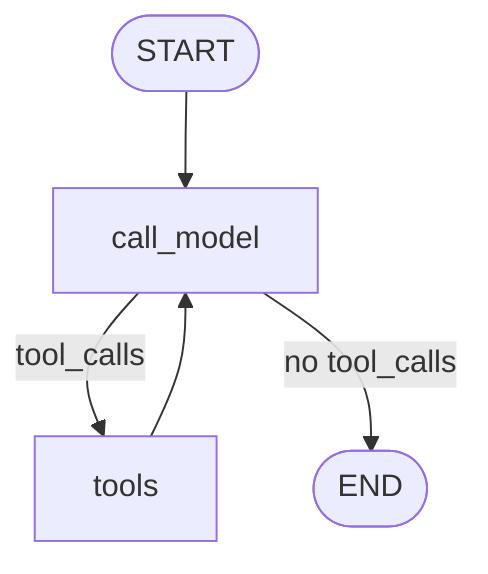

# LangGraph 迁移与实现详解

> 本文档面向已阅读旧项目 [`chapter11-实战-小学生智能助手`](../chapter11-实战-小学生智能助手/) 的开发者，
> 说明如何用 **LangGraph 显式 StateGraph** 重构 Agent 核心，并落地到新项目
> [`chapter11-实战-小学生智能助手-langgraph`](../chapter11-实战-小学生智能助手-langgraph/)。

---

## 目录

1. [为什么要迁移](#1-为什么要迁移)
2. [架构对比总览](#2-架构对比总览)
3. [LangGraph 核心概念（本项目如何用）](#3-langgraph-核心概念本项目如何用)
4. [主对话图：ReAct StateGraph 逐步实现](#4-主对话图react-stategraph-逐步实现)
5. [学习卡片子图：线性流水线](#5-学习卡片子图线性流水线)
6. [记忆系统：checkpointer 与 store](#6-记忆系统checkpointer-与-store)
7. [工具与 ToolRuntime](#7-工具与-toolruntime)
8. [对外接口层：保持兼容](#8-对外接口层保持兼容)
9. [文件级迁移映射表](#9-文件级迁移映射表)
10. [落地迁移步骤（操作清单）](#10-落地迁移步骤操作清单)
11. [用例级代码对照](#11-用例级代码对照)
12. [调试与可视化](#12-调试与可视化)
13. [常见问题 FAQ](#13-常见问题-faq)

---

## 1. 为什么要迁移

### 1.1 旧项目的局限

旧项目使用 LangChain 1.2 的 **`create_agent`**：

```python
# 旧项目 app/agent.py
return create_agent(
    model=get_llm(),
    tools=build_tools(),
    store=get_store(),
    checkpointer=get_checkpointer(),
    state_schema=KidsState,
    system_prompt=KIDS_SYSTEM_PROMPT,
)
```

优点：**几行代码即可跑通**，适合教程入门。

局限：

| 问题 | 说明 |
|------|------|
| **图结构不可见** | ReAct 循环（LLM → 工具 → LLM）在框架内部，新手难以理解 |
| **扩展点模糊** | 想加「预检索 RAG 节点」「人工审核节点」不知道改哪里 |
| **调试困难** | 无法单独 Step 某个节点，无法用 Mermaid 导出拓扑 |
| **多图组织弱** | 学习卡片与主对话混在 `agent.py`，难以独立演进 |

### 1.2 LangGraph 原生版的目标

| 目标 | 实现方式 |
|------|----------|
| **图结构显式化** | `StateGraph` + `add_node` + `add_edge` + `add_conditional_edges` |
| **State 可扩展** | `TypedDict` + `add_messages` reducer |
| **记忆仍用 LangGraph 标准能力** | `compile(checkpointer=..., store=...)` |
| **上层 API 不变** | `ask()` / `stream_answer()` / `generate_study_card()` 签名一致 |
| **基础设施复用** | RAG、向量库、记忆后端、FastAPI、engines 几乎原样拷贝 |

---

## 2. 架构对比总览

```
┌─────────────────────────────────────────────────────────────────┐
│  旧项目                          新项目（LangGraph 版）           │
├─────────────────────────────────────────────────────────────────┤
│  api.py / cli.py / engines/*  →  相同（只换 import 路径）        │
│  tools.py / knowledge.py      →  相同                            │
│  short_term / long_term       →  相同                            │
│                                                                 │
│  agent.py                     →  agent.py（薄封装，调 graph）     │
│    └ create_agent (黑盒)          └ app/graph/                  │
│                                      ├ state.py                 │
│                                      ├ nodes.py                 │
│                                      ├ builder.py  ← 主图       │
│                                      └ study_card_graph.py      │
└─────────────────────────────────────────────────────────────────┘
```

**数据流（一次用户提问）**：

```
用户问题
  → agent.ask()
  → graph.invoke({messages, user_id}, config={thread_id})
  → [checkpoint 恢复历史 messages]
  → call_model 节点（LLM + bind_tools）
  → tools_condition?
       ├ 有 tool_calls → tools 节点 → 回到 call_model
       └ 无 tool_calls → END
  → [checkpoint 持久化新 messages]
  → 返回最后一条 AIMessage.content
```

---

## 3. LangGraph 核心概念（本项目如何用）

### 3.1 StateGraph

`StateGraph` 是 LangGraph 的图构建器。每个节点接收**当前 State**，返回**部分 State 更新**，LangGraph 负责 merge。

```python
from langgraph.graph import StateGraph, START, END

builder = StateGraph(KidsGraphState)
builder.add_node("call_model", call_model)
builder.add_edge(START, "call_model")
graph = builder.compile(checkpointer=..., store=...)
```

### 3.2 State 与 reducer

```python
# app/graph/state.py
class KidsGraphState(TypedDict):
    messages: Annotated[list[BaseMessage], add_messages]  # reducer：追加消息
    user_id: NotRequired[str]                             # 普通字段：覆盖/合并
```

**`add_messages` 的作用**（LangGraph 内置 reducer）：

- 新消息**追加**到列表，而不是整表替换；
- 支持按 `id` 去重/更新（工具结果回写时很重要）。

旧项目用 `AgentState`，本质相同；本项目改为显式 `TypedDict`，字段一目了然。

### 3.3 条件边 `tools_condition`

LangGraph 预置函数，检查最后一条消息是否有 `tool_calls`：

```python
from langgraph.prebuilt import tools_condition

builder.add_conditional_edges(
    "call_model",
    tools_condition,
    {"tools": "tools", END: END},
)
```

| 返回值 | 含义 | 下一跳 |
|--------|------|--------|
| `"tools"` | AIMessage 含 tool_calls | 进入 `ToolNode` 执行工具 |
| `END` | 无 tool_calls | 结束图执行 |

这就是 **ReAct** 的「思考 → 行动 → 再思考」循环。

### 3.4 ToolNode

```python
from langgraph.prebuilt import ToolNode

tool_node = ToolNode(build_tools())
builder.add_node("tools", tool_node)
builder.add_edge("tools", "call_model")  # 工具执行完回到 LLM
```

`ToolNode` 会：

1. 读取最后一条 AIMessage 的 `tool_calls`；
2. 逐个调用对应 `@tool` 函数；
3. 把结果包装成 `ToolMessage` 追加到 `messages`。

### 3.5 compile 时的 checkpointer 与 store

```python
graph = builder.compile(
    checkpointer=get_checkpointer(),  # 短期记忆
    store=get_store(),                # 长期记忆（ToolRuntime.store）
)
```

| 参数 | LangGraph 能力 | 本项目用途 |
|------|----------------|------------|
| `checkpointer` | 按 `thread_id` 持久化 **State 快照** | 同一会话多轮对话 |
| `store` | 跨 thread 的 **KV 存储** | 学生 profile / facts |

调用时必须传 `config={"configurable": {"thread_id": "..."}}`，checkpointer 才知道写/read 哪个会话。

---

## 4. 主对话图：ReAct StateGraph 逐步实现

完整代码见 `app/graph/builder.py`。下面按**执行顺序**拆解。

### 4.1 步骤 1：定义 State

```python
# app/graph/state.py
class KidsGraphState(TypedDict):
    messages: Annotated[list[BaseMessage], add_messages]
    user_id: NotRequired[str]
```

**用例**：调用时传入学生身份

```python
graph.invoke(
    {"messages": [HumanMessage("我叫小明")], "user_id": "xiaoming"},
    config={"configurable": {"thread_id": "session-1"}},
)
```

`user_id` 会保存在 State 中，长期记忆工具通过 `ToolRuntime.state["user_id"]` 读取。

### 4.2 步骤 2：实现 call_model 节点

```python
# app/graph/nodes.py
def call_model(state: KidsGraphState) -> dict:
    tools = build_tools()
    llm = get_llm().bind_tools(tools)
    messages = _ensure_system_message(list(state["messages"]))
    response = llm.invoke(messages)
    return {"messages": [response]}
```

**技术细节**：

1. **`bind_tools(tools)`**：让 LLM 知道有哪些工具，输出可能带 `tool_calls`；
2. **`_ensure_system_message`**：首轮在 messages 前插入 System Prompt；checkpoint 持久化后第二轮不再重复插入；
3. **返回值** `{"messages": [response]}`：只返回**增量**，由 `add_messages` 追加。

**与 create_agent 的等价关系**：`create_agent` 内部的 model 节点做的就是这件事（外加框架自带的 prompt 模板）。

### 4.3 步骤 3：注册 tools 节点与边

```python
builder = StateGraph(KidsGraphState)
builder.add_node("call_model", call_model)
builder.add_node("tools", ToolNode(build_tools()))

builder.add_edge(START, "call_model")
builder.add_conditional_edges("call_model", tools_condition, {"tools": "tools", END: END})
builder.add_edge("tools", "call_model")
```

**Mermaid 拓扑**：



### 4.4 步骤 4：compile 并单例缓存

```python
# app/graph/builder.py
@lru_cache(maxsize=1)
def get_kids_graph():
    return build_kids_graph()
```

**为什么要 `build_kids_graph()` 与 `get_kids_graph()` 分开？**

- 测试里可以 `build_kids_graph()` 拿新实例，不污染全局单例；
- 生产入口 `ask()` 用 `get_kids_graph()` 避免重复 compile。

### 4.5 用例：一次带工具调用的完整 trace

用户问：「帮我算 (25+17)*3」

| 步骤 | 节点 | State.messages 变化 |
|------|------|---------------------|
| 1 | START→call_model | + AIMessage(tool_calls=[calculator...]) |
| 2 | tools | + ToolMessage("...= 126") |
| 3 | call_model | + AIMessage("算出来啦，答案是 126...") |
| 4 | tools_condition→END | 结束 |

---

## 5. 学习卡片子图：线性流水线

旧项目在 `agent.py` 里用单次 `llm.invoke` + 正则解析 JSON。
新项目拆成 **独立 StateGraph**，演示「一项目多图」：

```python
# app/graph/study_card_graph.py
builder = StateGraph(StudyCardGraphState)
builder.add_node("retrieve_context", retrieve_context)
builder.add_node("generate_card_json", generate_card_json)
builder.add_edge(START, "retrieve_context")
builder.add_edge("retrieve_context", "generate_card_json")
builder.add_edge("generate_card_json", END)
```

### 5.1 子图 State

```python
class StudyCardGraphState(TypedDict):
    question: str
    context: NotRequired[str]
    card_json: NotRequired[str]
```

无 `messages` 字段——此图不需要对话历史，State 更精简。

### 5.2 节点 1：retrieve_context

```python
def retrieve_context(state: StudyCardGraphState) -> dict:
    hits = retrieve(state["question"])
    return {"context": format_context(hits)}
```

纯 RAG，不调 LLM，**零 API 成本**（keyword 后端时连 Embedding 都不需要）。

### 5.3 节点 2：generate_card_json

```python
def generate_card_json(state: StudyCardGraphState) -> dict:
    user_prompt = f"小朋友的问题：{state['question']}\n\n可参考的资料：\n{state.get('context')}"
    response = get_llm().invoke([SystemMessage(...), HumanMessage(user_prompt)])
    return {"card_json": response.content}
```

### 5.4 对外封装

```python
# app/agent.py
def generate_study_card(question: str) -> StudyCard:
    result = get_study_card_graph().invoke({"question": question})
    return StudyCard.model_validate_json(extract_json(result["card_json"]))
```

**扩展建议**：若以后要加「人工审核」节点，在 `generate_card_json` 与 `END` 之间插入 `human_review` 节点即可，主对话图不受影响。

---

## 6. 记忆系统：checkpointer 与 store

### 6.1 短期记忆（checkpointer）

**语义**：同一 `thread_id` 内的多轮对话共享 `messages` 历史。

```python
# 第一轮
graph.invoke({"messages": [HumanMessage("我叫小明")], "user_id": "u1"},
             config={"configurable": {"thread_id": "t1"}})

# 第二轮（同一 thread）
graph.invoke({"messages": [HumanMessage("我叫什么？")], "user_id": "u1"},
             config={"configurable": {"thread_id": "t1"}})
# → LLM 能看到第一轮的 HumanMessage + AI 回复
```

**实现文件**（与旧项目相同）：

- `app/short_term_memory.py`：`InMemorySaver` / `PostgresSaver(get_pool())`

### 6.2 长期记忆（store）

**语义**：同一 `user_id` 跨不同 `thread_id` 共享 profile/facts。

```python
# thread-A 保存
graph.invoke(..., config={"thread_id": "A"})

# thread-B 回忆（同一 user_id）
graph.invoke(..., config={"thread_id": "B"})
# → recall_about_student 仍能读到 thread-A 写入的 store
```

**compile 时必须传 store**：

```python
builder.compile(checkpointer=..., store=get_store())
```

否则 `ToolRuntime.store` 为空，记忆工具无法工作。

### 6.3 PostgreSQL 生产级（连接池）

与旧项目相同，见 `app/db.py`。LangGraph 版 **无额外改动**，迁移时原样拷贝即可。

---

## 7. 工具与 ToolRuntime

工具定义文件 `app/tools.py` **与旧项目 100% 相同**。

长期记忆工具签名示例：

```python
@tool
def save_student_profile(name: str, grade: str, runtime: ToolRuntime) -> str:
    sid = runtime.state.get("user_id") or "anonymous"
    runtime.store.put(("students", sid, "profile"), "info", {...})
```

### 7.1 自定义图下 ToolRuntime 如何注入？

当 `StateGraph.compile(store=get_store())` 时，LangGraph 在执行 `ToolNode` 时会：

1. 把当前 **State** 注入 `runtime.state`（含 `user_id`）；
2. 把 **store** 注入 `runtime.store`。

**无需改工具代码**——这是 LangGraph 与 `create_agent` 共用的一套机制。

### 7.2 工具列表

| 工具 | 类型 | 说明 |
|------|------|------|
| search_knowledge_base | 普通 | RAG 检索 |
| calculator | 普通 | AST 安全求值 |
| get_today_info | 普通 | 日期 |
| save/get/remember/recall_* | ToolRuntime | 长期记忆 |
| web_search | 可选 | Tavily，无 Key 时不注册 |

---

## 8. 对外接口层：保持兼容

`app/agent.py` 故意保持与旧项目**相同函数签名**，这样以下文件**无需修改**即可运行：

- `app/api.py`
- `app/cli.py`
- `app/engines/task_worker.py`
- `smoke_test.py`

```python
def ask(question, user_id="default-student", thread_id="default-thread") -> str: ...
def stream_answer(...) -> Iterator[str]: ...
def generate_study_card(question) -> StudyCard: ...
```

**唯一变化**：内部从 `get_agent().invoke` 改为 `get_kids_graph().invoke`。

---

## 9. 文件级迁移映射表

| 旧项目路径 | LangGraph 版 | 变更说明 |
|------------|--------------|----------|
| `app/agent.py` | `app/agent.py` | **重写**：薄封装，调 graph |
| — | `app/graph/state.py` | **新增**：State 定义 |
| — | `app/graph/prompts.py` | **新增**：System Prompt |
| — | `app/graph/nodes.py` | **新增**：节点函数 |
| — | `app/graph/builder.py` | **新增**：主图 compile |
| — | `app/graph/study_card_graph.py` | **新增**：学习卡片子图 |
| `app/tools.py` | 相同 | 拷贝 |
| `app/knowledge.py` | 相同 | 拷贝 |
| `app/models.py` | 相同 | 拷贝 |
| `app/short_term_memory.py` | 相同 | 拷贝 |
| `app/long_term_memory.py` | 相同 | 拷贝 |
| `app/db.py` | 相同 | 拷贝 |
| `app/api.py` | 相同（标题/version 微调） | 拷贝 |
| `app/engines/*` | 相同 | 拷贝 |
| `run_*.py` | 相同（`run_api` 端口 8001） | 拷贝 |
| — | `graph_selftest.py` | **新增**：图结构离线自测 |

---

## 10. 落地迁移步骤（操作清单）

### 阶段 A：准备（5 分钟）

1. 克隆/复制旧项目为 `chapter11-实战-小学生智能助手-langgraph`
2. 确认 `myenv312` 已安装 `langgraph>=1.1`、`langchain>=1.2`
3. 复制 `.env` 或继续使用教程根目录 `.env`（变量名不变）

### 阶段 B：替换 Agent 核心（核心工作）

1. 新建 `app/graph/` 包（state / prompts / nodes / builder / study_card_graph）
2. 重写 `app/agent.py` 为 graph 薄封装
3. **删除**旧 `agent.py` 中对 `create_agent` / `AgentState` 的依赖

### 阶段 C：验证

```bash
# 不调 API：图拓扑 + 路由
python graph_selftest.py

# 不调 API：RAG/记忆/工具
python local_selftest.py

# 调 API：端到端
python run_ingest.py
python smoke_test.py
```

### 阶段 D：并行运行（可选）

| 服务 | 旧项目 | LangGraph 版 |
|------|--------|--------------|
| Web | `:8000` | `:8001` |
| 数据 | 各自 `data/` | 各自 `data/`（可共享 knowledge.txt） |

---

## 11. 用例级代码对照

### 用例 1：同步问答

**旧项目**

```python
from app.agent import ask
answer = ask("太阳系有几大行星？", user_id="u1", thread_id="t1")
```

**LangGraph 版**

```python
# 调用方式完全相同
from app.agent import ask
answer = ask("太阳系有几大行星？", user_id="u1", thread_id="t1")

# 底层实际执行：
from app.graph import get_kids_graph
from langchain_core.messages import HumanMessage

graph = get_kids_graph()
result = graph.invoke(
    {"messages": [HumanMessage("太阳系有几大行星？")], "user_id": "u1"},
    config={"configurable": {"thread_id": "t1"}},
)
answer = result["messages"][-1].content
```

### 用例 2：流式 SSE

**旧项目**

```python
for tok in stream_answer(q, user_id=uid, thread_id=tid):
    yield tok
```

**LangGraph 版**（接口相同，内部 `graph.stream(..., stream_mode="messages")`）

### 用例 3：长期记忆跨 thread

```python
# thread-1：自我介绍
ask("我叫小测试，三年级，喜欢恐龙", user_id="smoke-user", thread_id="thread-1")

# thread-2：换会话仍记得
ask("你还记得我吗？", user_id="smoke-user", thread_id="thread-2")
```

两版行为一致：靠 `store` + `user_id`，不靠 `thread_id`。

### 用例 4：学习卡片

**旧项目**：`agent.py` 内 `llm.invoke` + JSON 正则

**LangGraph 版**：

```python
from app.graph import get_study_card_graph
from app.schemas import StudyCard
import re

result = get_study_card_graph().invoke({"question": "长方形面积怎么算？"})
# result = {"question": "...", "context": "...", "card_json": "{...}"}
card = StudyCard.model_validate_json(re.search(r"\{[\s\S]*\}", result["card_json"]).group())
```

### 用例 5：扩展——添加预检索节点（教学示例）

若希望**每条用户消息先自动 RAG 再进 LLM**（不依赖 LLM 决定是否调工具）：

```python
def preload_rag(state: KidsGraphState) -> dict:
    last = state["messages"][-1].content
    ctx = format_context(retrieve(last))
    return {"messages": [SystemMessage(content=f"[参考资料]\n{ctx}")]}

builder.add_node("preload_rag", preload_rag)
builder.add_edge(START, "preload_rag")
builder.add_edge("preload_rag", "call_model")
```

这是 LangGraph 原生版的**核心优势**：改图即可，无需 fork 框架。

---

## 12. 调试与可视化

### 12.1 导出 Mermaid

```python
from app.graph import get_kids_graph
print(get_kids_graph().get_graph().draw_mermaid())
```

### 12.2 LangSmith

在 `.env` 设置 `KIDS_ENABLE_TRACING=true`，可在 LangSmith 看到**每个节点的输入/输出**（比 create_agent 黑盒更清晰）。

### 12.3 单节点单元测试

```python
from app.graph.nodes import call_model
from langchain_core.messages import HumanMessage

# mock get_llm 后单独测 call_model 节点
out = call_model({"messages": [HumanMessage("你好")], "user_id": "test"})
assert "messages" in out
```

---

## 13. 常见问题 FAQ

**Q1：LangGraph 版和旧版行为会完全一致吗？**

ReAct 主循环与 `create_agent` 等价，但在极端情况下（如 LLM 一次返回多个 tool_calls、消息 merge 细节）可能有细微差异。建议以 `smoke_test.py` 回归为准。

**Q2：还需要 `create_agent` 吗？**

不需要。本项目完全用 `StateGraph`。**RAG / 记忆 / HTTP / engines 层**仍与旧项目相同。

**Q3：能否只迁移 Agent，保留旧项目其它代码？**

可以。最小迁移集 = `app/graph/*` + 重写 `app/agent.py`（约 200 行新增代码）。

**Q4：多 worker 部署要注意什么？**

与旧项目相同：checkpointer + store 改用 PostgreSQL（`app/db.py` 连接池），见旧项目文档。

**Q5：学习卡片为什么不用 ToolStrategy？**

推理模型 thinking mode 不支持 `tool_choice`。子图 + JSON 解析更稳，且图结构更清晰。

**Q6：如何与 loop engine / harness 配合？**

`engines/*` 调用 `agent.ask()`，与 Agent 实现解耦。换 LangGraph 版后 engines **无需改动**。

---

## 附录：依赖版本

与教程根 `requirements.txt` 对齐：

- `langgraph>=1.1.2`
- `langchain>=1.2.12`
- `langgraph-checkpoint>=4.0.1`（Postgres 短期记忆可选）
- `langgraph-checkpoint-postgres`（可选）

---

*文档版本：与 `chapter11-实战-小学生智能助手-langgraph` v2.0.0 同步。*
