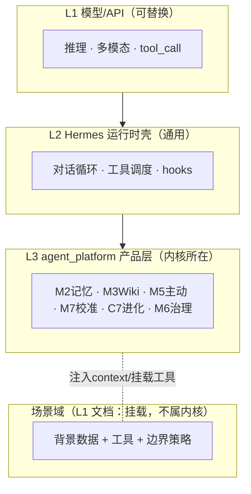

# L0 · Jarvis 能力契约（宪法级）

> **层级**：L0 — 不变内核
> **改动频率**：极低（季度级；改它等于改产品本体，需显式评审）
> **效力**：本文件是 Jarvis「是什么」的**单一真相源**。L1 场景域、L2 验证切片、任何 PRD/用户故事**均不得重新定义本文件描述的能力**，只能注入数据、挂载工具、施加边界。
> **依据**：升格自 `_参考/docs-v1/模型与产品层边界.md`，对齐 `_参考/docs-v1/功能测试验证方案.md`（M2–M8 + C7）。

---

## 1. Jarvis 是什么（一句话，跨场景不变）

> **Jarvis 是一个以「自然对话」为底座的通用个人智能体：它能跨会话记住你、理解你、在你允许时主动帮你，并随使用对你越来越有效。任何具体场景（如小学学习）都是挂载在这套能力之上的应用，而非它的定义。**

**它不是什么**：不是某个垂直功能的外壳（不是「学习机 + 聊天皮肤」），不是无状态问答机，不是拟人化情感关系产品。

---

## 2. 不变内核能力（Capability Core）

以下能力**与场景无关**，在所有场景中都存在；场景只改变它们「面对的数据和边界」，不改变它们「是什么」。

| 能力 | 契约定义（场景无关） | 实现归属 | 验收锚点 |
|------|----------------------|----------|----------|
| **C-DIALOG 自然对话** | 多轮理解、推理、工具调用；对话是默认主线程 | L1 模型 + L2 Hermes | 自然连续对话 |
| **C-IO 多模态交互** | **输入与输出均支持文字 / 语音 / 图像等多种载体**；按场景与内容选择合适载体（学习过程尤其依赖多信息载体，如看图、听读、写画） | L1 模型（多模态理解/生成）+ L3（ASR/TTS 路由 · 图像渲染与呈现） | 语音往返、图像输入/输出 |
| **C-MEM 跨会话记忆** | 记住偏好/事实/关系；可检索、可删除(tombstone)、可审计；数据主权在用户 | L3 `memory_service`(M2) | 跨会话召回、面板删除 |
| **C-PROFILE 用户画像** | 对「这个人」的整体理解：沟通偏好、情绪、习惯、关系——来自对话与记忆 | L3（M2 聚合） | 画像随交互演进 |
| **C-KNOW 主题知识** | 把高价值知识沉淀为可检索 Wiki；与「用户偏好」严格分开 | L3 `wiki_service`(M3) | 沉淀→次日召回 |
| **C-PROACT 主动行为** | 在合适时机主动；有静默时段；可被一句话关闭并记住 | L3 `proactive`(M5) | 主动但不打扰 |
| **C-CALIB 校准与一致性** | 不确定就说不确定、不编造、可被纠正；有可见可改的「行为设定档」 | L3 `calibration`+`behavior`(M7) | 不编造、纠错 |
| **C-EVO 自我进化** | 把反复有效的做法蒸馏为个人技能；可审计、可纠正降权 | L3 `evolution`(C7) | 技能晋升、curriculum |
| **C-GOV 工具治理** | 工具调用分级 L0–L2；写操作经草稿确认 | L3 `tools`(M6) | L2 草稿门控 |
| **C-PERCEIVE 共域感知**（可选） | 在用户允许时共享环境输入；按需触发非 always-on | L3 `perception`(M4) | 场景按需启用 |

> **C-IO 与 C-PERCEIVE 的区别**：C-IO 是**用户主动发起**的交互通道（用户发文字/语音/图，Jarvis 也用这些载体回应）；C-PERCEIVE 是**用户授权下共享环境输入**（如摄像头看到桌面），按需触发、非 always-on。两者都不重定义，由场景决定启用哪些载体。

> **判定规则**：一项能力若「随更换底层模型 vendor 而消失」→ 属 L1，不写进契约；若「仅服务当前会话推理」→ 属 L2；若「涉及用户数据主权 / 跨会话 / 审计 / 物理 / 个人复利」→ 属 L3，是本契约的内核。（详见 `_参考/docs-v1/模型与产品层边界.md` §7）

---

## 3. 三层实现边界（可替换 vendor）

**原则**：换模型 vendor 时 L3 零改；场景变化时 L0/L3 零改，只改场景域挂载。

---

## 4. 场景如何挂载到内核（接口契约）

任何场景（学生学习、办公、家庭…）只能通过以下 **4 个接口**接入，**不得绕过去重写内核**：

| 接口 | 场景能做什么 | 场景不能做什么 |
|------|--------------|----------------|
| **I1 背景注入** | 通过 `pre_llm` 注入场景上下文（如「当前在二年级数学单元」） | 不能把场景状态写成新的「记忆系统」 |
| **I2 工具挂载** | 注册场景专用**业务操作（动词）**工具（如 `submit_attempt`/`query_gap`/`push_question`/`classify_photo`/`explain_kp`），由 Agent 编排成流程 | 不能用场景工具替代 C-DIALOG 主线程；**不能把"操作"固化成强制流水线**（见 P7） |
| **I3 边界策略** | 施加域内/域外、年级、安全策略（拒答→共情→拉回） | 不能因边界把对话退化成菜单/学习机 |
| **I4 画像/进化分轨** | 提供场景画像（学情）与场景进化信号（学习技能） | 不能把场景结论混入通用记忆当真理 |

> **I2 与 C-IO/C-DIALOG 的关系**：场景通过 I2 提供的是**业务操作（动词）**与数据，**不是流程**；流程由 Agent 当场编排（P7）。**多模态输入（图/文/语音）是 Agent 理解意图的输入，不是触发某条固定管线的开关**——是否、何时、按何序调用某个操作，由 C-DIALOG 推理决定。

---

## 5. 双层画像与双轨进化（防「学习机化」的关键）

| 维度 | Agent 轨（内核，C-PROFILE / C-EVO） | 场景轨（L1 提供） |
|------|--------------------------------------|--------------------|
| **画像** | 沟通偏好、情绪、习惯、关系——来自对话与 M2 | 学情：gap、能力维度、掌握度——必须有 attempt 证据 |
| **进化** | 怎么陪、怎么说话、怎么提醒更有效 | 怎么讲某个知识点更有效（remediation skill） |
| **数据边界** | M2 不存知识点树/掌握度结论 | 学情结论不混入 M2 当通用真理 |

> 两轨共用 C7 机制，但**晋升信号不同**；两类画像并存，**不互相覆盖**。

---

## 6. 不可违反的原则（与 README 治理规则一致）

- **P1 对话主线程**：学习管线是被调用的工具，不是预设脚本。
- **P2 内核单一真相源**：能力只在本文件定义一次。
- **P3 证据优先（仅限场景结论）**：学情结论可追溯 attempt/gap；不约束 Agent 记忆与共情。
- **P4 数据主权**：记忆可删、可审计、tombstone 后不召回。
- **P5 校准诚实**：不确定就说不确定，可被纠正。
- **P6 主动不打扰**：静默时段绝对静默，提醒可一句话关闭并记住。
- **P7 灵活编排（流程非硬编码）**：**业务流程由 Agent 基于多模态输入 + 对话 + 上下文当场推理意图、动态编排**；场景只提供「**操作（工具）+ 数据**」，**不提供硬编码流程/状态机**。例：同一张照片，Agent 据用户意图可走「讲解」「归类入学情」或「按知识点出题」，而非"拍照=固定管线"。这是防"退化成学习机"的执行底线。

---

## 7. 本契约的「不在范围」

- 具体场景的功能清单（→ L1）。
- 具体单元/年级/题库/报告样式（→ L1）。
- 某次迭代要验证什么（→ L2）。
- 底层模型选型与调参（→ L1 模型层，随 vendor 可换）。

---

## 修订记录

| 日期 | 说明 |
|------|------|
| 2026-06-20 | 骨架：从 `模型与产品层边界.md` 升格，确立不变内核 + 场景挂载接口，待确认 |
| 2026-06-23 | 锐化「灵活编排」：新增 **P7（流程非硬编码，Agent 编排）**；I2 明确场景提供「业务操作（动词）+ 数据」而非流程，多模态输入是意图理解输入而非固定管线开关。属澄清既有原则（P1/C-DIALOG/C-IO），非新增内核能力。 |
