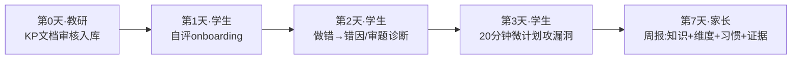
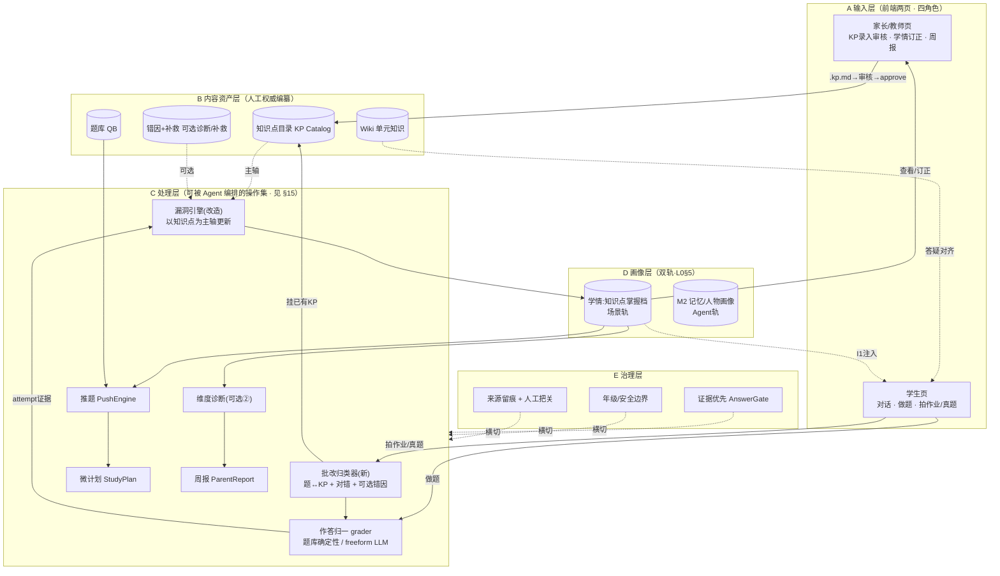
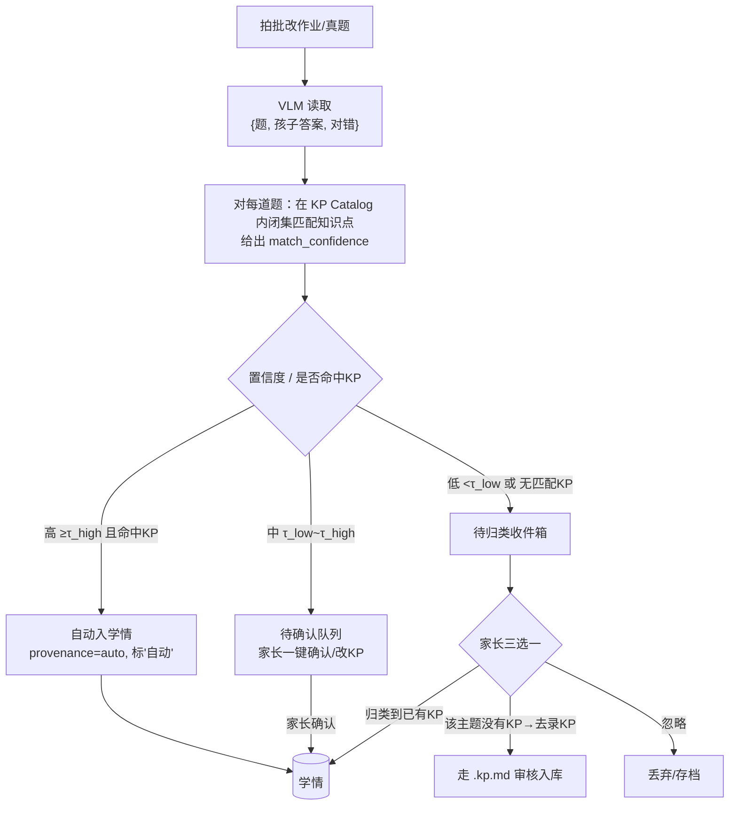

# L1 · 小学学习域 — 功能架构（模块 · 数据流 · 更新机制）

> **层级**：L1 场景域的「功能架构」子文档（隶属 [小学学习域](./小学学习域.md)）
> **改动频率**：中（模块边界演进时）
> **效力前提**：**本文件不得重定义 L0 能力契约**，仅把场景轨的模块、数据流、更新机制讲清楚。见 [Jarvis能力契约](../L0-能力契约/Jarvis能力契约.md)。
> **状态**：🟢 完整版 · 逻辑自洽 · 待讨论（其中需拍板处见 §14；其余开放问题已由设计就地解决）

---

## 0. 这份文档解决什么 · 在分层里的位置

| 层 | 回答的问题 | 形态 |
|----|-----------|------|
| 用户故事（业务功能） | 用户**经历什么过程** | 叙事 / 场景（v1 US-01..12） |
| **功能架构（本文件）** | 从过程里**抽象出哪些模块、各模块怎么更新、怎么协作** | 模块图 + 数据流 |
| L0 能力契约 | Jarvis **是什么** | 宪法 |
| L2 验证切片 | 这次**验证什么** | 假设卡 |

> 之前反复推翻的结构性缺口：L0（是什么）与 L2（验证什么）之间，**缺一层「模块与数据流」**——导致"知识点/学情如何更新、谁能写、新输入怎么接"始终没定清。本文件补上这层，并把已拍板的三个决策固化为架构。

| 决策 | 内容 | 落点 |
|------|------|------|
| **D1** | 学情主轴：从「错因码」转为「**知识点**」 | §3 |
| **D2** | 知识点**只能由家长/教师经 KP 文档确认录入**（权威源） | §5 知识点目录、§9 流① |
| **D3** | 错题归类由 **Jarvis 自动**做；家长可**查看/修改/补充/纠正**学情 | §7、§8、§9 流②③ |

**本版自行解决的 4 个开放问题**（不再回头问）：

| # | 原开放问题 | 本版的设计解法 |
|---|-----------|----------------|
| Q1 | 「未归类」题怎么处理 | §7「待归类收件箱」+ 家长三选一（归类/补录KP/忽略）|
| Q2 | 自动归类置信度阈值 | §7 三档分流：高=自动入、中=待确认、低/无KP=收件箱 |
| Q3 | 错因/补救先补哪个主题 | §6 能力成熟度阶梯 + 规则「先把已有加减法接上新主轴，其余按真实作业频率升级」|
| Q4 | 人工订正 vs 自动证据 冲突 | §8 来源优先级：人工结论置顶留痕、底层证据不删、有新证据提示复核 |

---

## 1. 设计原则（从 L0 + 业务过程提炼）

| 原则 | 含义 | 来源 |
|------|------|------|
| **AP1 对话主线程** | 学习模块是 Agent 按需调用的工具，不是预设脚本 | L0 P1 |
| **AP2 知识点为坐标系** | 学情、推题、报告都以知识点为坐标；错因/维度是其上的叠加层 | D1 |
| **AP3 权威与自动分离** | 课程结构（知识点）由人权威定义；学情证据由系统自动累积；结论可人工订正 | D2+D3 |
| **AP4 证据优先（仅约束场景结论）** | 任何"掌握/薄弱"结论可追溯到 attempt；不约束 Agent 对人的记忆与共情 | L0 P3 |
| **AP5 能力分层、逐层可选** | 记录→诊断→补救三层，门槛只在第一层；后两层按主题成熟度逐步补 | §6 |
| **AP6 双轨画像不互染** | 学情（场景轨）与 M2 记忆/人物画像（Agent 轨）分开存、互不覆盖 | L0 §5 |

---

## 2. 角色与业务过程总览

| 角色 | 人物 | 核心诉求 | 主要触点 |
|------|------|----------|----------|
| 学生 | 乐乐（二年级） | 题合适、讲得懂、有目标、被理解 | 学生页：对话/做题/拍作业 |
| 家长 | 乐乐妈妈 | 安全、看得见进步、能点开证据、能纠正 | 家长页：学情查看/订正、周报 |
| 教师/教研 | 王老师 | 校本一致、知识点权威、证据链 | 家长/教师页：KP 录入审核 |
| 校方 | 张主任 | 年级边界、合规 | 配置（年级边界硬规则）|

**一周旅程（目标态，对齐 v1 用户故事）**：



> 新增触点（本架构补入旅程）：学生**拍批改作业/拍真题** → 自动入学情；家长在周报旁**直接订正学情**。

---

## 3. 核心转变（D1）：学情主轴 = 知识点

| | 现状（as-is） | 目标（to-be） |
|--|----------------|----------------|
| 学情（gap）主键 | **`(错因码, 知识点)`**，错因码必填 | **`知识点`** 为主轴，一个知识点一条掌握档 |
| 错因码（进位/退位/审题…） | 进学情的**唯一闸门**，固定 7 个、全是二年级加减法 | 知识点档下**可选**的"错因明细 + 维度信号" |
| 后果 | 再丰富的知识点目录都进不了学情；方向/语文/任何新主题被挡门外 | 任何挂得上知识点的错题都进学情；有错因模型的（如加减法）再叠加精准诊断与补救 |

**新学情条目（概念模型，知识点为主轴）**：

| 字段 | 含义 |
|------|------|
| `student_id + knowledge_point_id` | 主键（一个知识点一条）|
| `mastery_state` | 未学 / 在学 / 薄弱 / 改善中 / 已掌握 |
| `stats` | 总对错数、近7天错数、连对streak、趋势 |
| `evidence_attempt_ids` | 支撑结论的作答证据（可追溯，AP4）|
| `error_breakdown`（可选·②层） | 该知识点下观察到的错因类型分布 |
| `provenance` | 结论来源：自动累积 / 家长订正（含 who+when+note，§8）|

> 因果纠正：**"能进学情"的前提从"有错因码"改为"有知识点"**。错因码从闸门降为锦上添花。

---

## 4. 模块全景图（五层）



---

## 5. 各模块：定义 · 更新机制 · 如何发挥作用 · 权威性

### B 内容资产层（人工权威，使用前/持续编纂）

| 模块 | 是什么 | 谁更新 / 何时 | 如何发挥作用 | 权威性 | 复用 v1 |
|------|--------|---------------|--------------|--------|---------|
| **知识点目录 KP Catalog** | 课程结构树（科目→年级→单元→知识点）| **仅**家长/教师经 `.kp.md`→diff→审核(R1-R6)→approve（带备份+审计）| 学情**主轴**；归类器只能往**已有 KP** 挂 | 👤 权威；Jarvis 只读，**不得自造** | ✅ `/kp-review` 全链路已建 |
| **题库 QB** | 练习题（每题挂 KP + 答案 + 解析）| 种子 + 后续扩充 | 按薄弱知识点选题（v1 选题非生成）| 半自动 | ✅ |
| **错因+补救（可选②③）** | 某知识点下"为什么错/怎么补" | 人工按主题逐步编纂 | 有则诊断+推补救练习；无则仅记录掌握度 | 👤 按需 | ✅ taxonomy/remediation |
| **Wiki 单元知识** | 课本对齐的讲法 | 教研 ingest | 答疑与校本一致（无则易泛化）| 👤 | P0 应有 |

> **谁维护这些资产 / 是否要专门开发页面？**（澄清，2026-06-23）
>
> | 资产 | 必须人工维护？ | 由谁 | 是否需新页面 |
> |------|----------------|------|--------------|
> | 知识点目录 | ✅ 是（权威主轴，D1+D2）| 家长/教师 | ✅ **已有**（`/kp-review`）|
> | 题库 QB | ❌ 非必须由家长 | 教研 seed 导入；未来可 LLM 选/生题 | 暂不需专门页面，先用 seed |
> | 错因+补救（②③）| ❌ 非必须、非全量 | 教研/产品按主题编纂，可 LLM 辅助 | 暂不需；按 §6 成熟度阶梯仅高频主题才建 |
> | Wiki 单元知识 | ❌ 可选（仅校本对齐）| 教研 ingest | 暂不需；无则回退通用讲解（受 C-CALIB 诚实约束）|
>
> **结论**：四项里**只有「知识点目录」必须由家长/教师维护且页面已具**。题库/错因补救/Wiki 属教研内容层、可按需补、很多可由 Jarvis 通用能力替代（讲解、选题、甚至生题），**不必急于各建维护页面**——这正契合 §15「灵活编排」框架：**能力优先，内容只在校本一致/精准补救硬要求处才形式化**。

### C 处理层（可被 Agent 编排的操作集）

> 这些不是固定流水线，而是 Agent 据意图按需调用、组合的**业务操作（工具）**（L0 P7 / §15）。"何时触发"列指"通常在什么意图下被编排到"，非硬编码顺序。

| 模块 | 是什么 | 何时触发 | 产出 | 复用 v1 |
|------|--------|----------|------|---------|
| **批改归类器（新增）** | VLM 读题+批改 → 闭集匹配 KP + 置信度分流 | Agent 判定「入学情」意图时调 `classify_photo` | 候选 attempt + inbox/auto | ✅ `photo_triage`（切片10）|
| **作答归一 grader** | 题库题确定性判分 / freeform LLM 判分 | 学生做题 / freeform 提交 | 标准 attempt 证据 | ✅ grader + freeform |
| **漏洞引擎（改造）** | 把 attempt 按其**知识点**累积成掌握档 | 每条 attempt 落库后 | 更新学情条目（§3）| ✅ 需改主轴 |
| **维度诊断（可选②）** | 从错因码统计基础/逻辑/粗心/审题信号 | 出周报时 | DimensionScore | ✅ dimension_model |
| **推题 PushEngine** | 按薄弱知识点从题库选题 | 学生要题/计划 | 题包 | ✅ |
| **微计划 StudyPlan** | 20 分钟可执行步骤 | 学生要计划 | 计划步骤 | ✅ |
| **周报 ParentReport** | 知识掌握+维度+习惯+证据 | 家长查看 | 结构化报告 | ✅ 含 evidence |

### D 画像层（双轨，对齐 L0 §5）

| 轨 | 内容 | 边界 |
|----|------|------|
| **场景轨 = 学情** | 知识点掌握档、维度、证据 | 必须有 attempt 证据；**不混入 M2** |
| **Agent 轨 = M2** | 沟通偏好、情绪、习惯、关系 | 不存知识点树/掌握度结论 |

### E 治理层（横切）

| 模块 | 作用 |
|------|------|
| **证据优先 AnswerGate** | 声称掌握/薄弱须带 attempt/gap；无证据领域明说"暂无记录"（F3）|
| **年级/安全边界** | 不出超纲题；域外拒答→共情→拉回 |
| **来源留痕 + 人工把关** | 每条结论记 provenance；家长订正留痕（§8）|

---

## 6. 能力成熟度阶梯（解决 Q3：诊断/补救先补哪个主题）

每个知识点独立地处在三层成熟度的某一层，**门槛只在第①层**：

```
① 记录层（必达·任何科目）  作答 = {知识点, 对/错, 题面, 孩子答案, 证据} → 掌握度
② 诊断层（可选）           该KP配了错因映射 → 标错因类型 + 维度信号（基础/逻辑/粗心/审题）
③ 补救层（可选）           该KP/错因配了补救素材+练习 → 推题 + 微计划 + 校本讲法
```

| 知识点示例 | 当前成熟度 | 说明 |
|------------|-----------|------|
| 二年级加减法（进位/退位/审题）| **①②③ 全有** | taxonomy + 维度 + remediation + 题库齐 |
| 语文 标点/语序 | ①② 部分 | 有 2 个错因码，补救弱 |
| 数学 方向与位置 | 仅 ① | 目录里有 KP 即可记录掌握度；无错因/补救 |

**升级规则（架构级，不必逐次问）**：

1. **先把已有加减法接到新主轴**——它已具①②③，是验证主轴改造的最佳样本。
2. 其余主题**默认停在①层**（能进学情/错题本/报告掌握度即可）。
3. 当某主题在真实作业中**反复出现**（频率信号）→ 才投入编纂②③，避免提前为冷门主题建模。
4. ②③的编纂入口仍是**人工权威**（教研/家长），与 KP 录入同源。

> 这样"覆盖面"（①层，靠 D2 录知识点即可铺开）与"精准补救"（②③层，按需投入）解耦，不再被"错因表只有加减法"卡死。

---

## 7. 批改归类器 + 待归类收件箱（解决 Q1/Q2）

> **定位修正（见 §15）**：归类器是 Agent 可调用的**一个工具**，不是"拍照后必走"的强制流水线。下面的三档分流描述的是"**该工具产出如何在自动入库与人工确认间分流**"，仅当 Agent 判定用户意图为"入学情"时才触发。

拍照入学情的核心新模块。它把一张批改图拆成若干"候选作答"，每条尝试**匹配到目录里的已有知识点**（闭集匹配，绝不新建——守 D2），并给出置信度，再按置信度**三档分流**：



**三档分流规则（Q2 答案）**：

| 档 | 条件 | 行为 | 家长负担 |
|----|------|------|----------|
| 高 | `match_confidence ≥ τ_high` 且命中已有 KP 且对错明确 | **自动入学情**，标"自动"，可事后改 | 零（事后可审）|
| 中 | `τ_low ≤ conf < τ_high` | 进**待确认队列**，家长一键确认或改 KP | 轻 |
| 低/无 | `conf < τ_low` 或 **无匹配 KP** 或对错不明 | 进**待归类收件箱** | 需处理 |

> 阈值 `τ_high/τ_low` 为可配置项，初值建议保守（宁可多进"待确认"，少误入学情）；上线后按家长纠错率回调。

**「未归类」处理（Q1 答案）**：收件箱里每条，家长三选一——① 归类到某个已有知识点；② 识别为"目录还没有这个主题"→ 引导去走 `.kp.md` 录入审核（守 D2，先补轴再入学情）；③ 忽略/存档。**归类器永不自造知识点**，挂不上就停在收件箱。

---

## 8. 作答来源、可信度与冲突解决（解决 Q4）

**每条 attempt 记录来源（provenance）**，决定可信度与处理方式：

| source | 含义 | 对错判定者 | 默认可信度 |
|--------|------|-----------|-----------|
| `bank` | 题库题 | grader 确定性 | 高 |
| `freeform` | 对话中真实题 | LLM 判分 | 中（标注）|
| `graded_photo` | 拍批改作业 | VLM 读老师批注 + 归类器 | 视 confidence 分档（§7）|
| `manual_parent` | 家长手工补录/订正 | 家长 | 权威（人工）|

**学情结论的来源优先级与冲突解决（Q4 答案）**：

1. **自动证据**持续累积，形成"系统结论"；**家长订正**写为 `manual_override`，**置顶且留痕**（who/when/note）。
2. **人工结论不被自动证据静默覆盖**：当新 attempt 与家长已订正的结论冲突时，系统**不自动翻转**，而是给家长一条**复核提示**（"这个知识点你标过已掌握，但最近又错了 2 次，要更新吗？"）。
3. **底层 attempt 证据永不删除**（AP4）：人工订正只改"结论展示与权重"，原始证据仍可被教师/家长点开追溯。
4. **教师视图**能看到结论是"自动"还是"家长订正"，保证证据链可信。

> 一句话：**自动求快、人工把关、证据留痕、冲突走复核而非覆盖**。

---

## 9. 关键数据流（五条主线）

**① 家长/教师录入知识点（D2，复用 v1 `/kp-review`）**
```
家长页传 .kp.md → 解析 parsed_draft → 与 catalog diff → 审核 R1-R6（确认学科年级/解决冲突/不静默删）
→ approve（备份+审计）→ 写入 KP Catalog（权威主轴）
（新主题如"方向与位置"：必须先走这条，学情才有轴可挂）
```

**② 学生做题 → 入学情（题库/freeform）**
```
做题 → grader 判分 → attempt(source=bank/freeform) → 漏洞引擎按知识点累积 → 学情更新
→ 有②③则叠加错因/维度/推题
```

**③ 学生拍批改作业 → 自动归类入学情（D1+D3，§7）**
```
拍照 → VLM读{题,答案,对错} → 归类器闭集匹配KP+置信度
→ 高:自动入 / 中:待确认 / 低·无KP:收件箱 → 入学情(source=graded_photo, 留痕)
```

**④ 家长查看/订正学情（D3，§8）**
```
家长页看各知识点掌握度+证据 → 手动调整状态/补充薄弱/纠正归类
→ 写 manual_override(留痕) → 冲突时走复核提示，不覆盖证据
```

**⑤ 出周报（消费学情）**
```
学情 + 维度诊断(②) + 行为信号 → ParentReport(知识掌握+维度+习惯+建议+evidence)
→ 教师可点证据到具体错题
```

---

## 10. 三个决策如何落地（回扣）

| 决策 | 架构落点 | 守护机制 |
|------|----------|----------|
| **D1 学情主轴=知识点** | §3 掌握档主键=knowledge_point_id；错因降为可选叠加（§6 ②层）| 进学情只需挂知识点，不再被 7 个错因码卡住 |
| **D2 知识点仅家长/教师权威录入** | §5 KP Catalog 唯一写入口=`/kp-review`；归类器/Jarvis 只读、只挂已有KP | 挂不上→收件箱→引导补录；**绝不自造**，保证主轴准确 |
| **D3 自动归类 + 家长可改可补** | §7 归类器自动分流 + §8 来源留痕；家长页查看/订正 | 自动求快 + 人工把关 + 冲突走复核 |

---

## 11. 与 L0 / L1 的一致性（合规声明）

- **不重定义 L0**：所有模块属**场景轨**，经契约 §4 接口挂载——知识点/题库/错因/Wiki 是 I2 工具 + L1§5 数据资产；学情是 I4「场景轨画像」；学情摘要经 I1 注入对话；补救技能经 I4 走场景轨进化。
- **gap 主轴改知识点** 是场景轨内部演进，不触及 C-PROFILE / C-MEM 内核（L0 §5：两轨画像并存、互不覆盖）。
- **证据优先（P3）不变**：学情结论可追溯 attempt；人工订正同样留痕（§8）。
- **对话主线程（P1）不变**：拍照/做题/订正都是被调用的工具或旁路，不把对话退化成菜单。

---

## 12. 与现状的差距 → 改造清单（映射后续切片，本文件不实现）

| 项 | 现状 | 目标 | 候选切片 | 状态 |
|----|------|------|----------|------|
| 学情主轴 | ~~gap 以 `error_code` 必填为轴~~ → `knowledge_point_id` 主轴 | error_code 可选叠加（error_breakdown）| **S-A** | ✅ 完成 2026-06-23 |
| freeform 入口 | ~~错因白名单为闸门~~ → "必须挂 KP，错因可选" | | S-A | ✅ 完成 |
| 加减法接新主轴 | ②③接到知识点主轴 | 烟测验证不退化 | S-A | ✅ 完成 |
| 批改归类器 | ~~无（VLM 仅转写）~~ → `photo_triage` 归类器 | 题↔KP 闭集匹配 + 对错 + 置信度三档分流 | **S-B 拍批改作业入学情** | ✅ 完成 2026-06-23 |
| 待归类收件箱 | ~~无~~ → 学情页「尚未归类的题」区块（`photo_inbox.json` 存储） | 与 gap 同屏，非独立页 | S-B/S-C | ✅ 完成 2026-06-23 |
| 家长学情订正 | ~~仅查看/周报~~ → 学情总览 + 待归类可操作 | 挂 KP 入学情 / 忽略 | **S-C 家长学情面板** | ✅ 完成 2026-06-23 |
| 来源/留痕 | attempt `source`：`photo_auto`/`photo_manual`/`freeform` | manual_override 完整 provenance 留后续 | S-C | 🟡 部分完成 |
| Agent 拍照编排 | Hermes `classify_photo` + 学生页不直连 ingest | S-C | ✅ 完成 2026-06-23 |
| 学生页理解型 VLM | `/api/vision/understand` + Vision 卡片 + pre_llm | S-D 切片12 | ✅ 完成 2026-06-23 |

> **S-A→S-D 拍照入学情主线已全部关闭**（2026-06-23）。验证索引：
> [切片09](../L2-验证切片/切片09-学情主轴改造.md) · [切片10](../L2-验证切片/切片10-拍批改作业入学情.md) · [切片11](../L2-验证切片/切片11-家长学情与拍照编排.md) · [切片12](../L2-验证切片/切片12-拍照理解型VLM与Agent编排.md)

---

## 13. 模块责任边界速查（防再次混淆）

| 关注点 | 归属模块 | 谁能写 |
|--------|----------|--------|
| "要学哪些知识点" | KP Catalog | 仅家长/教师（D2）|
| "这孩子每个知识点掌握得怎样" | 学情掌握档 | 系统自动累积 + 家长订正 |
| "为什么错（错因/维度）" | 错因+维度（②，可选）| 人工编纂映射 + 系统统计 |
| "怎么补（练习/讲法）" | 补救+题库+Wiki（③，可选）| 人工编纂 |
| "这孩子是谁、喜欢什么" | M2 记忆/人物画像（Agent轨）| 对话自然沉淀，**不进学情** |

---

## 14. 设计取舍（T1–T4 已决 · T5 升级为框架问题）

T1–T4 已按建议确定（2026-06-23）；T5 升级为"灵活编排"框架问题，见 §15。

| # | 取舍点 | 决定 | 落地说明 |
|---|--------|------|----------|
| T1 | 旧"错因为轴"数据 | ✅ **迁移不废弃** | 加减法 gap 重挂知识点主轴，error_code 转叠加明细（S-A）|
| T2 | 高置信度是否免确认自动入学情 | ✅ **是，但首期 τ_high 很高 + 全部可撤回** | 先建立家长信任再放宽阈值 |
| T3 | 无 KP 时 Jarvis 能否建 KP 草稿 | ✅ **允许"建议草稿"，必须走 `.kp.md` 审核才生效** | 减负又不破坏 D2 权威 |
| T4 | 学生页是否展示学情 | ✅ **只给鼓励性视图**，薄弱清单仅家长/教师 | 避免打击孩子 |
| T5 | 拍照如何决定后续业务 | ⤴ **升级为框架问题** | 不是"拍照=固定入学情"，而是 Agent 按多模态输入+上下文灵活编排，见 §15 |

---

## 15. 执行框架：能力 × 情景 × 灵活编排（核心对齐）

> 本节是比"模块清单"更上位的执行模型，统摄前面所有模块，并修正了 §7 早期把拍照写成"硬编码分流"的偏差。

学生 Jarvis = **能力底座 × 学习情景 × 灵活理解执行**：

| 层 | 是什么 | 归属 |
|----|--------|------|
| **能力底座** | 通用原语：对话理解、推理、多模态 I/O、工具调用、记忆、画像、主动、校准、进化 | L0 |
| **学习情景** | ①**数据组件(名词)**：知识点 / 学情 / 题库 / Wiki / 错因·补救；②**业务操作(动词)**：讲解知识点 / 分析学情 / 选题出题 / 判分 / 归类入学情 / 生成报告 / 定微计划——以**工具**挂载（L0 I2）| L1 |
| **灵活理解执行** | **不是硬编码流程**：Agent 接收多模态输入（图/文/语音）+ 对话 + 上下文 + 当前学情，**推理意图，动态编排**调用哪些业务操作、按何顺序 | L0 对话主线程 + Agent 编排 |

**核心原则**：场景只提供"**数据 + 操作**"，**不规定流程**；流程由 Agent 当场编排。

**例（同一张照片，意图不同 → 业务不同）**：

| 用户输入（示例，非固定口令） | Agent 推理意图 | 编排的操作 | **禁止** |
|----------|----------------|------------|----------|
| 「讲讲 / 学这一单元 / 什么是乘加混合运算」 | 讲新课 | 对话分步讲解（可选 Wiki/KP） | `push_queue_peek`、出题 |
| 「出几道题 / 练一练 / 考考我」 | 求练习 | `questions_suggest`（实时）→ `question_get` → 作答 → `attempt_submit` | 盲目读离线 `push_queue` |
| 「退位还不会 / 再练练 XX」 | 补薄弱 | `gap_map_query` → `questions_suggest(focus=remediation)` | 与请求无关的旧队列题 |
| 拍题 +「这道我不会 / 教教我」 | 求讲解 | 讲解知识点（必要时 Wiki 对齐）| 整页 classify |
| 拍批改作业 +「记错题 / 复盘卷子 / 看看错哪记一下」 | 入学情/复盘 | 归类 → 判分 → 入学情 → 点评（口播以批改为准）| — |
| 拍题 +「再给我出两道像这样的」 | 求练习 | 归类 → `questions_suggest` 按 KP 选题 | — |

> **push_queue / PushEngine**：离线**微计划候选池**，供主动推送或明确「继续上次计划」时使用；**不是** pre_llm 默认注入项，**不是**「讲讲」或一般「学习」的默认后续步骤。练题首选 **`questions_suggest` 实时按 unit/KP 选题**（2026-06-24 家庭 Alpha 纠偏）。

> **P7 要点**：触发 classify_photo 的是**语义意图**（记录/复盘错题），不是某一句固定话术；讲解意图默认不整页入库，可事后问是否记学情。

> 因此 §7 的"VLM→三档分流"**降级为一个工具（归类器）的内部语义**：Agent 判定用户确实要"入学情"时才调它；置信度三档只决定"自动落库 vs 找人确认"，**不再是顶层强制流水线**。当前"拍照直连 VLM 理解 → 选后续逻辑"作为**基线实现**保留，目标态是上面的 Agent 编排。

**对 L0 / L1 的影响（单独回顾）**：此框架**基本已被 L0 编码**（C-DIALOG 工具调用 + 对话主线程 P1 + C-IO 多模态 + I2 工具挂载）。是否需小幅锐化，见与本文件配套的 L0/L1 回顾结论。

---

## 修订记录

| 日期 | 说明 |
|------|------|
| 2026-06-23 | 草案：确立 D1/D2/D3 与模块/数据流骨架 |
| 2026-06-23 | **完整版**：…T1-T5 待讨论取舍 |
| 2026-06-23 | §12 S-A→S-D 全部关闭；批改归类器状态更新 |

---

## 16. 当前产品状态与建议下一步（2026-06-23）

> 本节从**产品能力**描述状态，不绑定某个学生或某次验证数据。内容资产（KP 目录广度、题库题量、Wiki 篇数）属**教研运营**，不算产品功能缺口，除非「录入/审核/挂载」机制本身缺失。

### 16.1 产品定位（一句话）

**学生 Jarvis** = L0 通用对话智能体 + **小学学习场景挂载**：以自然对话为主线程，提供「练—诊—讲—推—拍—报」等**可被 Agent 编排的业务操作**，学情以**知识点**为轴、**证据**可追溯，家长/教师可订正。

### 16.2 能力成熟度（按角色 × 模块）

| 模块 | 产品能力 | 成熟度 | 说明 |
|------|----------|--------|------|
| **学生·对话** | 多轮聊天、记忆、适龄语气、安全拒答 | ✅ 已验证 | 切片01–03 |
| **学生·做题** | 题库推题、判分、freeform 真实题入学情 | ✅ 已验证 | 切片02–04 |
| **学生·入口** | Web 聊天 UI | ✅ | 切片06 |
| **学生·语音** | ASR（浏览器）+ TTS + 智能朗读策略 | ✅ | 切片07 |
| **学生·拍照** | 理解型 VLM、Vision 卡片、P7 意图编排 | ✅ | 切片08/12 |
| **学生·拍照→学情** | Agent 调 `classify_photo`，非上传即入库 | ✅ | 切片10–12 |
| **学生·微计划/主动** | 工具在，端到端产品验证弱 | 🟡 | v1 有，v2 未单列切片 |
| **学生·鼓励性学情视图** | 只看进步、不看薄弱清单（T4） | ❌ 未做 | 架构已决，无 UI |
| **家长·学情总览** | gap + 待归类同屏 | ✅ | 切片11 |
| **家长·待归类操作** | 挂 KP / 忽略 | ✅ | 切片11 |
| **家长·周报** | 知识+维度+习惯 API/Tab | 🟡 | 有报告，与拍照证据/待归类联动弱 |
| **家长·学情订正** | 改掌握状态、冲突复核、provenance | ❌ | §8 Q4 设计有，产品未做 |
| **家长·中档待确认** | 置信度 between auto/inbox 的确认 UI | ❌ | 后端语义有，前端无 |
| **教师·KP 治理** | `.kp.md` 审核入库 | ✅ | v1 `/kp-review` |
| **引擎·学情主轴** | gap = knowledge_point_id | ✅ | 切片09 |
| **引擎·归类分流** | auto / confirm / inbox | ✅ | 切片10 |
| **引擎·来源留痕** | photo_auto / photo_manual / freeform | 🟡 | attempt 有 source；gap 级 manual_override 未完整 |
| **引擎·掌握晋升** | streak → mastered | 🟡 | 代码有，产品级验证未闭环 |
| **引擎·维度诊断** | 周报维度分 | 🟡 | 后端有，剧本/展示待丰富 |
| **内容·KP/QB/Wiki** | 目录、题库、校本 Wiki | 🟡 **运营** | 机制在；**广度**靠教研补，非当前产品工程主线 |

### 16.3 已关闭的产品主线（S-A→S-D）

```text
感知（Vision）→ 意图编排（P7）→ 归类（classify_photo）→ 学情（gap/inbox）→ 家长视图（订正入口）
```

对应 v1 用户旅程中「拍批改作业 → 入学情 → 家长看见并处理」**产品链路已通**。

### 16.4 与目标旅程的对照（v1 §3.2 一周旅程）

| 旅程环节 | 产品状态 |
|----------|----------|
| 教研 KP 入库审核 | ✅ 产品能力完备 |
| 学生 onboarding / 自评 | 🟡 弱（无专门 v2 切片） |
| 学生做错 → 诊断讲解 | ✅ 对话 + gap + 推题 |
| 学生 20 分钟微计划 | 🟡 工具有，体验未验 |
| 学生拍作业入学情 | ✅ 刚闭环 |
| 家长周报 + 证据 | 🟡 报告有，证据链未产品化串联 |
| 家长订正学情 | 🟡 仅 inbox 挂 KP/忽略；gap 状态订正未做 |

### 16.5 建议下一阶段的**产品**工作（非内容运营）

按「补产品能力缺口、完成目标旅程」排序：

1. **家长侧：学情订正与证据链（治理闭环）**  
   manual_override、冲突复核提示、报告可点到 attempt/photo 证据 — 完成 §8/D3 的产品化。

2. **家长侧：周报 × 学情一体化**  
   周报消费 gap + 待归类 + 本周 photo 来源，形成「第 7 天」可演示闭环。

3. **学生侧：微计划 + 掌握晋升（练—攻—掌握）**  
   把 PushEngine / StudyPlan / streak→mastered 做成可验证的产品路径（非单次对话）。

4. **学生侧：T4 鼓励性进度视图**  
   孩子端只看「最近进步/练了什么」，不看薄弱清单。

5. **体验层：流式回复、待确认队列 UI**  
   降低等待感；中置信归类给家长轻量确认（非 inbox 重操作）。

6. **内容层（并行、非阻塞产品发布）**  
   教研扩 KP/QB/Wiki — 用现有 `/kp-review` 与 ingest 机制即可，**不另开产品切片**除非审核/挂载流程本身要改。


