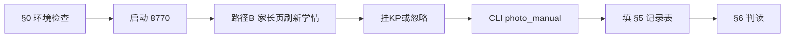

# 切片 11 · 执行手册（家长学情 + 拍照 Agent 编排 · S-C）

> **配套**：[切片11-家长学情与拍照编排](./切片11-家长学情与拍照编排.md)（假设 H 与通过标准）
> **前置**：[切片09](./切片09-学情主轴改造.md)（学情主轴=知识点）· [切片10](./切片10-拍批改作业入学情.md)（归类器后端）
> **原则**：验两条闭环——①孩子页 **P7 灵活编排**（拍照≠自动入学情）；②家长页 **学情统一视图**（掌握档 + 尚未归类的题同屏）。
> **状态**：**✅ 已关闭**（2026-06-23）

## 验证结论摘要

| 标准 | 结果 |
|------|------|
| 1 无前端直连 ingest | ☑ 切片12 |
| 2 Agent + photo_auto | ☑ |
| 3 学情统一视图 | ☑ 数学卷 + 方向卷 |
| 4 挂 KP / 忽略 | ☑ `54-6×3`→photo_manual；「1米=100厘米」→dropped |
| 5 来源留痕 | ☑ photo_auto + photo_manual |

---

| # | 项 | 怎么确认 | 期望 |
|---|----|----------|------|
| 1 | 插件 | `hermes doctor` | 含 `✓ agent_student` |
| 2 | 默认学生 | `student_learning.yaml` → `hermes.default_student_id` | `g2-stu-01`（盈熙） |
| 3 | 视觉 key | `~/.hermes/.env` 有 `DASHSCOPE_API_KEY` | Vision 理解可用 |
| 4 | 文本 key | 同文件有 `DEEPSEEK_API_KEY` / `DEEPSEEK_BASE_URL` | Agent 对话 + 归类闭集匹配 |
| 5 | 学生上下文 | 下面 CLI | `context.json` 存在 |
| 6 | 新工具 | 下面 CLI 或 `hermes doctor` | 已注册 `classify_photo` |

```bash
cd /mnt/c/Users/Administrator/Desktop/agent_community
export PATH=$HOME/.hermes/hermes-agent/venv/bin:$PATH
PY=$HOME/.hermes/hermes-agent/venv/bin/python

# 学生是否存在
$PY -m agent_platform.learning.cli_student context show g2-stu-01

# headless 烟测（可选，已通过可跳过）
$PY -m agent_platform.learning.smoke_sc_learning_profile
```

**准备一张测试图**（二选一或两张都有更好）：

| 图 | 用途 | 预期归类结果 |
|----|------|--------------|
| **数学批改图**（含进位加法错题，如 47+38） | 验自动入学情 | 高置信 → `photo_auto` 进 gap |
| **方向与位置类题**（或目录外主题） | 验待归类 | 无匹配 KP → 出现在家长页「尚未归类的题」 |

> 若只有数学加减法批改图，也能完成大部分标准；方向题用于验「待归类」兜底。

---

## 1. 启动两个页面（每次验证）

开 **两个终端**（WSL / Ubuntu）：

**终端 A — 孩子聊天页（8771）**

```bash
cd /mnt/c/Users/Administrator/Desktop/agent_community
PY=/home/administrator/.hermes/hermes-agent/venv/bin/python
$PY -m uvicorn agent_platform.api.student_chat:app --host 127.0.0.1 --port 8771
```

浏览器打开：**http://127.0.0.1:8771/**

**终端 B — 家长学情页（8770）**

```bash
cd /mnt/c/Users/Administrator/Desktop/agent_community
PY=/home/administrator/.hermes/hermes-agent/venv/bin/python
$PY -m uvicorn agent_platform.api.student_panel:app --host 127.0.0.1 --port 8770
```

浏览器打开：**http://127.0.0.1:8770/**

---

## 2. 路径 A：孩子页 · 拍照 + 意图（已由切片12验收 ✅）

> 本路径不再重复步骤；详见 [切片12-执行手册](./切片12-执行手册.md)。
>
> **已验要点**：
> - Network：`/api/vision/understand` + `/api/chat`（带 `vision_id`），无上传即 ingest
> - 记学情 → `classify_photo` → `photo_auto`
> - 讲解 → 不整页 classify

**快速 CLI 核对**（可选）：

```bash
$PY -m agent_platform.learning.cli_student attempt list g2-stu-01 --limit 5
# 应有 source=photo_auto
```

---

## 2′. 路径 A 归档（旧 OCR 流程 · 勿再使用）

<details>
<summary>展开：切片12 之前的 OCR 验证步骤（仅供对照）</summary>

### 2.1 正例：拍批改作业 +「看看我错哪了」

1. 在孩子页点 **📷**，选**数学批改图**（最好有明确错题）。
2. 等待 OCR 完成，输入框出现题目文字。
3. **确认 hint**：应提示类似「可以说『看看我错哪了』或『这道题不会』再点发送」。
4. 在输入框**保留 OCR 文字**，追加或单独发送一句：
   > **看看我错哪了**
5. 发送，等待 Jarvis 回复（约 20–40 秒）。

**你要观察 Jarvis 是否：**

- 口头总结错了哪些题 / 哪个知识点（如进位加法）；
- 语气仍是学伴，不是冷冰冰报分；
- **没有**在你说意图之前就擅自「已经帮你记入学情了」（若 OCR 后未发送消息不应有任何学情变化）。

### 2.2 负例对照：同一张图 +「这道我不会」（验 P7 不绑死管线）

1. 再拍一次（或换一道单题图）。
2. OCR 完成后发送：
   > **这道我不会，教教我**
3. **期望**：Jarvis **讲解**为主，**不应**强调「已记入你的学情档案」或批量归类整页作业。
   - 若它仍调了 `classify_photo`，记录到 §8 问题表——属于编排过宽，需后续调 prompt。

### 2.3 事后 CLI 核对（标准 5 · 来源留痕）

```bash
PY=/home/administrator/.hermes/hermes-agent/venv/bin/python

# 最近作答，看 source 字段
$PY -m agent_platform.learning.cli_student attempt list g2-stu-01 --limit 8

# 学情 gap 是否更新
$PY -m agent_platform.learning.cli_student gap list g2-stu-01
```

**通过线：**

| 字段 | 期望 |
|------|------|
| `source` | 出现 `photo_auto`（Agent 自动归类入学情） |
| `knowledge_point_id` | 如 `kp-g2-add-carry`（进位加法）等目录内 KP |
| gap | 对应知识点 `total_wrong` 增加或有新 gap |

</details>

---

## 3. 路径 B：家长页 · 学情总览（掌握档 + 尚未归类 · 同屏）⭐ 当前重点

> **没有单独的「收件箱」菜单**；默认 Tab 就是「学情总览」。
> 孩子页经切片12 已产生 `photo_auto` 与 inbox 待归类项，**直接在本页验收**。

### 3.1 加载学情

1. 打开 **http://127.0.0.1:8770/**
2. `student_id` 填 **`g2-stu-01`**
3. 确认顶部 Tab 在 **「学情总览」**（不是「周报」）
4. 点 **「刷新学情」**

**应看到两块：**

| 区块 | 内容 |
|------|------|
| **知识点掌握** | 表格：知识点名、状态（薄弱/已掌握…）、对错次数、错因分布 |
| **尚未归类的题** | 若路径 A 中有目录外题，或中/低置信题，列表在此（黄色卡片） |

### 3.2 操作：挂知识点入学情（标准 4）

若「尚未归类的题」里有条目：

1. 在下拉框选一个 KP（如「不进位加法」）
2. 选 **错** 或 **对**
3. 点 **「挂知识点入学情」**
4. 再点 **「刷新学情」**

**期望：**

- 该条从「尚未归类的题」消失或减少；
- 「知识点掌握」里对应 KP 的对错数更新。

### 3.3 操作：忽略

对一条不打算入库的题，点 **「忽略」** → 刷新后该条不再出现在 pending 列表。

### 3.4 CLI / API 交叉验证

```bash
# API 一眼看 gaps + pending 是否同包
curl -s http://127.0.0.1:8770/api/students/g2-stu-01/learning-profile | python3 -m json.tool | head -80

# 手动归类后的 source
$PY -m agent_platform.learning.cli_student attempt list g2-stu-01 --limit 5
# 期望最新一条 source=photo_manual
```

---

## 4. 路径 C（可选）：方向与位置 · 验「待归类是学情的一部分」

若你有**方向与位置**类批改图（目录里暂无该 KP）：

1. 孩子页：拍照 →「帮我把错题记进学情」（见切片12）
2. Jarvis 应说明有的题**挂不上现有知识点**，需家长帮忙
3. 家长页刷新学情 → **「尚未归类的题」** 出现该题（`matched_kp_id` 为空）
4. 家长选最接近的 KP 或点忽略

> 这验的是 D2（不臆造 KP）+ 你的决定（待归类算学情、在同页处理）。

---

## 5. 每日记录表（对应切片11 §2 五条标准）

| 标准 | 检查项 | 结果 |
|------|--------|------|
| **1 无前端直连 ingest** | Network：`understand` + `chat`，无 ingest/classify 直连 | ☑ 切片12 |
| **2 Agent 工具可用** | `attempt list` 有 `photo_auto` | ☑ 切片12 |
| **3 学情统一视图** | 家长页同屏「知识点掌握」+「尚未归类的题」 | ☑ |
| **4 同页可操作** | 挂 KP 或忽略 | ☑ |
| **5 来源留痕** | photo_auto + photo_manual | ☑ |

**主观体验（建议记一句）：**

- 孩子愿意用拍照+说话这种方式吗？
- 家长在一个页面看清学情+待处理题，是否比「单独收件箱」更自然？

---

## 6. 判读（回到切片11 §1/§4）

- **标准 1–5 全过** → S-C 真人验证成立：沉淀进 L1，本切片停止。
- **标准 1 不过**（前端上传后直接写学情）→ 架构违规，需回滚前端逻辑。
- **标准 2 不过**（Agent 从不调 `classify_photo`）→ 优先补 **prompt / 工具说明**，不是改前端直连。
- **标准 3/4 不过** → 查家长页 API `/learning-profile` 与 resolve/drop 接口。
- **标准 5 不过** → 查 `attempt.py` source 传参链路。

把对话截图、`attempt list` 片段、家长页截图贴回 [切片11 §4](./切片11-家长学情与拍照编排.md)。

---

## 7. 常见问题

| 现象 | 可能原因 | 处理 |
|------|----------|------|
| OCR 失败 | `DASHSCOPE_API_KEY` 未加载 | 确认 `~/.hermes/.env`；重启 8771 服务 |
| Jarvis 只讲解、不记学情 | 未说「看看我错哪了」类意图；或模型未调工具 | 明确说复盘意图；查 `hermes doctor` 是否有 `classify_photo` |
| Jarvis 说了记学情但 `attempt list` 无新记录 | 工具调用失败 | 用 `hermes chat` 同句重试；看终端/日志 |
| 家长页 pending 为空但应有 | 题被高置信 auto 了；或 student_id 不对 | 换方向题再试；确认 `g2-stu-01` |
| 归类到错误 KP | 闭集匹配/模型判断问题 | 家长页手动改挂 KP（验标准 4）；记录 bad case |

**若 Agent 长期不调工具，临时 CLI 模拟（仅 debug，不算切片通过）：**

```bash
# 不应作为常规路径；只用于确认后端链路
$PY -c "
from agent_platform.integrations.hermes import student_tools
print(student_tools.classify_photo(
    {'items': [{'stem': '47+38=?', 'student_answer': '75', 'is_correct': False}]},
    student_id='g2-stu-01',
))
"
```

---

## 8. 推荐验证顺序（约 20 分钟）



1. §0 环境检查（可跳过）
2. **路径 B 家长页：刷新 → 挂 KP / 忽略**（10 min）
3. CLI 核对 `photo_manual` + 填记录表
4. 更新切片11 §4

---

## 修订记录

| 日期 | 说明 |
|------|------|
| 2026-06-23 | 初稿 |
| 2026-06-23 | 孩子页经切片12验收 |
| 2026-06-23 | **关闭**：家长页路径 B/C + 标准 3–5 |
