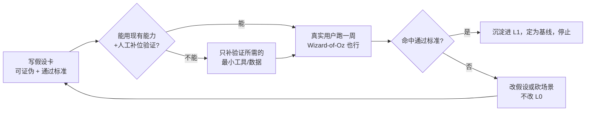

# 学生 Jarvis v2 — 重启工作区

> **创建日期**：2026-06-20
> **状态**：骨架（待填充）
> **为什么有这个文件夹**：与 `docs/` 下 v1 旧文件**物理隔离**，用一套新的「分层 + 假设驱动」方式重新组织产品定义与开发，避免再次「换场景就推翻整份 PRD」。

---

## 0. 一页纸说明：我们这次换了什么

过去两个月反复推翻重来，根因不是「没想清楚」，而是**定义和开发方式**有结构性问题：

| 旧方式（导致反复） | 新方式（本文件夹） |
|--------------------|--------------------|
| 换场景就重写整份完整 PRD | 只动最薄那层（验证切片），内核不动 |
| 把通用能力绑死在学习管线上 | 能力契约冻结为宪法，场景只「挂载」 |
| 先写完整规格 + 先把代码堆完 | 先写可证伪假设 + 真实用户验证，再投工程 |
| 三个层次（能力/场景/管线）压平在一份文档 | 显式分三层文档，各管各的 |
| 没有「算成功/该停」的判据 | 每个切片必须带通过标准与停止条件 |

**一句话**：Jarvis 是「以自然对话为底座的通用智能体」，小学学习只是**挂载在它之上的一个场景**，不是它的定义。

---

## 1. 三层文档结构

```
学生Jarvis-v2/
├── README.md                      ← 本文件：方法论 + 导航 + 治理规则
├── L0-能力契约/
│   └── Jarvis能力契约.md           ← 【宪法级·不变】跨场景能力底座，季度级才动
├── L1-场景域/
│   └── 小学学习域.md               ← 【可演进】学习场景如何挂载到 L0（KP/题库/报告/边界）
├── L2-验证切片/
│   ├── _切片模板.md                ← 假设驱动切片模板（可证伪假设 + 通过标准）
│   └── 切片01-二年级自然对话.md     ← 第一个真实用户验证切片
└── _参考/
    └── docs-v1/                    ← v1 旧文档副本（已复制，新项目自包含，不再依赖 docs/）
```

| 层 | 文档 | 改动频率 | 谁不能动它 |
|----|------|----------|------------|
| **L0 能力契约** | `Jarvis能力契约.md` | 极低（季度级） | **任何场景/切片文档都不得重定义它** |
| **L1 场景域** | `小学学习域.md` | 中（场景演进时） | 不得违反 L0 |
| **L2 验证切片** | `切片NN-*.md` | 高（每次迭代） | 廉价、可丢弃、可证伪 |

---

## 2. 不可违反的治理规则（写在最前，强制执行）

1. **R1 — 内核单一真相源**：Jarvis 的对话、记忆、画像、主动、校准、进化能力**只在 L0 定义一次**。L1/L2 只能「注入背景数据 + 挂载工具 + 施加边界」，**不得重新描述这些能力是什么**。
2. **R2 — 对话是主线程**：自然交流是默认态；学习管线（做题→漏洞→推题）是 Agent **按需调用的工具**，不是每次交互的预设脚本。
3. **R3 — 证据优先只约束「场景结论」**：学情结论（掌握/薄弱）必须能追到 attempt/gap；但这**不约束** Agent 对「这个人」的记忆与共情（那些来自对话与 M2）。
4. **R4 — 假设先于代码**：任何新切片先写「可证伪假设 + 真实用户通过标准」，再决定要不要写代码；能用现有能力 + 人工补位先验证的，不提前编码。
5. **R5 — 薄切片端到端**：一次只打通一个真实场景从头到尾，不横向铺多个 phase。
6. **R6 — 必须有停止判据**：每个切片定义清楚「满足什么就算通过、就停下来用」，杜绝「有更好想法就重写」。

> 任何文档（包括 PRD、用户故事）顶部都应写：**「本文件不得重定义 L0 能力契约，仅约束场景。」**

---

## 3. 开发工作流（每个迭代）



要点：**先证伪产品假设，再投工程**；验证不过时改的是 L2 切片或 L1 场景，**永远不动 L0**。

---

## 4. 与 v1 旧文件的关系

- **文档自包含**：v1 的相关文档已**复制**进 `_参考/docs-v1/`（PRD、用户故事、架构图、阶段计划、learning 设计、KP 内容、M0-M8 参考 PDF 等）。本项目的所有引用一律指向 `_参考/docs-v1/`，**不再依赖根目录 `docs/`**。
- 原 `docs/` 旧文件**保留不动**，仅作历史归档。
- 旧的**工程代码**（`agent_platform/` 的 M2–C7、learning 域）是**复用资产**而非文档依赖——它正好就是 L0 能力的实现，本次复用而非重写（代码不复制进本文件夹，避免产生分叉）。

---

## 5. 当前进度

| 文档 | 状态 |
|------|------|
| README（本文件） | ✅ 骨架 |
| L0 能力契约 | ✅ 已成文（含 C-IO 多模态；已确认） |
| L1 小学学习域 | 🟡 骨架（章节占位，待填；按流程**先验证再填**） |
| L2 切片模板 + 切片01 | ✅ 假设已定 + 执行手册就绪，**可开跑** |
| 适龄行为档（`behavior.yaml`） | ✅ 已切换为二年级学伴档并验证生效 |

**下一步**：选定开跑当天，按 [切片01-执行手册](./L2-验证切片/切片01-执行手册.md) 跑 3 天对话 + 第 4 天做题，用 §5 记录表对照 5 条通过标准判读。
