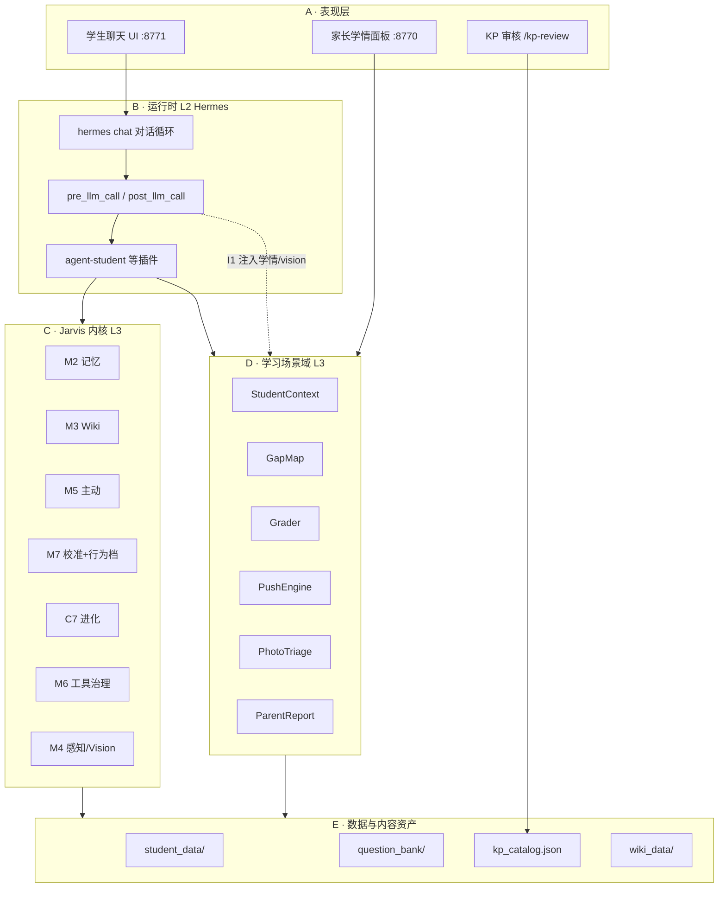
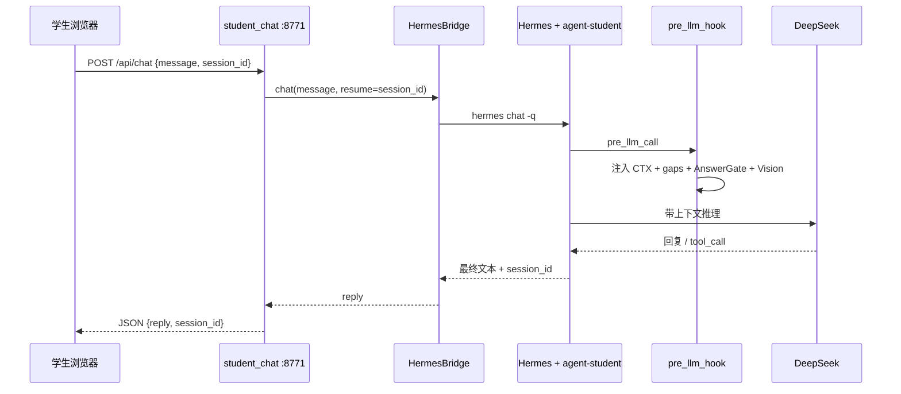

# 学生 Jarvis v2 — 架构文档与模块详解

> **版本**：2026-06-30  
> **范围**：`agent_community` 仓库全栈 · 文档层 `学生Jarvis-v2/` · 实现层 `agent_platform/`  
> **读者**：产品、研发、教研、家长试用  
> **关联**：[README](./README.md) · [L0 能力契约](./L0-能力契约/Jarvis能力契约.md) · [L1 功能架构](./L1-场景域/功能架构-模块与数据流.md) · [家庭 Alpha 启动手册](./家庭Alpha-启动手册.md)

---

## 1. 项目是什么

### 1.1 一句话定位

**学生 Jarvis** 是一个以**自然对话**为底座的**通用个人智能体（Jarvis）**，在之上挂载**小学学习场景**：能陪聊、能记住孩子、能教能练能查、能拍作业记学情、能给家长看进步——学习管线是 Agent **按需调用的工具**，不是每次对话的固定脚本。

### 1.2 核心设计哲学（v2 相对 v1 的结构性变化）

| 维度 | 旧方式（易反复推翻） | v2 方式 |
|------|---------------------|---------|
| 产品定义 | 换场景就重写整份 PRD | **L0 内核不动**，只动最薄验证切片 |
| 能力归属 | 通用能力绑死在学习管线 | **能力契约冻结为宪法**，场景只挂载 |
| 开发节奏 | 先写完整规格再堆代码 | **先可证伪假设 + 真实用户验证**，再投工程 |
| 流程模型 | 做题→漏洞→推题 预设流水线 | **Agent 当场编排**（P7），同一输入不同意图走不同业务 |

### 1.3 当前产品能力（家庭 Alpha · 2026-Q3）

面向单学生家庭试用，已打通：

- **教**：自然语言分步讲解（含 G3 混合运算等新单元）
- **练**：`questions_suggest` 实时选题 → 判分 → 入学情
- **查**：基于 gap/attempt 证据的薄弱分析（AnswerGate 防臆测）
- **补弱**：按历史 gap 推 G2 退位等补救题
- **拍**：Vision 理解批改卷 → Agent 编排 `classify_photo` → 学情或 inbox
- **报**：家长面板学情总览 + 周报 API

**入口**：孩子 `http://127.0.0.1:8771/` · 家长 `http://127.0.0.1:8770/`

---

## 2. 项目如何分工

### 2.1 文档治理分工（`学生Jarvis-v2/`）

```
学生Jarvis-v2/
├── README.md                 # 方法论、治理规则、导航
├── L0-能力契约/              # 【宪法】Jarvis 是什么，季度级才动
├── L1-场景域/                # 【场景】小学学习如何挂载到 L0
├── L2-验证切片/              # 【迭代】假设驱动、可丢弃的验证单元
├── _参考/docs-v1/            # v1 历史文档副本（自包含）
└── 家庭Alpha-启动手册.md     # 家庭试用操作手册
```

| 层 | 谁维护 | 改动频率 | 约束 |
|----|--------|----------|------|
| **L0** | 产品/架构评审 | 极低 | 任何场景文档不得重定义 |
| **L1** | 产品 + 研发 | 中 | 不得违反 L0 |
| **L2** | 迭代负责人 | 高 | 廉价、可证伪、有停止判据 |

**六条治理规则（摘要）**：内核单一真相源 · 对话主线程 · 场景结论证据优先 · 假设先于代码 · 薄切片端到端 · 必须有停止判据。

### 2.2 代码实现分工（`agent_platform/`）

实现按 **三层技术边界** 组织（对齐 L0 §3）：

| 层 | 目录/组件 | 职责 | 可替换性 |
|----|-----------|------|----------|
| **L1 模型** | DeepSeek / DashScope VLM 等 | 推理、多模态、tool_call | 换 vendor 时 L3 零改 |
| **L2 运行时** | Hermes Agent (`~/.hermes`) | 对话循环、hooks、插件调度 | 通用壳 |
| **L3 产品层** | `agent_platform/` | 记忆、Wiki、学习域、治理、API | **内核所在** |

### 2.3 角色与触点分工

| 角色 | 核心诉求 | 主要触点 | 后端 |
|------|----------|----------|------|
| **学生** | 题合适、讲得懂、被理解 | 8771 聊天 UI（文字/语音/拍照） | `api/student_chat.py` |
| **家长** | 看得见进步、能纠正 | 8770 学情面板、inbox 处理 | `api/student_panel.py` |
| **教师/教研** | 知识点权威、校本一致 | `/kp-review` KP 审核 | `learning/kp_ingest_review.py` |
| **Agent** | 编排教练查拍 | Hermes + `agent-student` 插件 | `integrations/hermes/student_tools.py` |

### 2.4 双轨画像分工（防「学习机化」）

| 轨道 | 存什么 | 存储 | 谁能写 |
|------|--------|------|--------|
| **Agent 轨** | 沟通偏好、情绪、习惯、关系 | M2 `memory_service` | 对话自然沉淀 |
| **场景轨** | 知识点掌握、gap、维度 | `student_data/{id}/gap_map.json` | attempt 管道 + 家长订正 |

两轨**互不覆盖**：学情结论不进 M2 当通用真理；M2 不存知识点树。

---

## 3. 总体架构

### 3.1 逻辑架构（五层 + 运行时）



### 3.2 场景挂载接口（L0 → L1 四条契约）

任何场景只能通过以下接口接入内核：

| 接口 | 学习场景实现 |
|------|--------------|
| **I1 背景注入** | `pre_llm_student_context_hook`：注入 CTX、Top3 gap、AnswerGate、Vision 块 |
| **I2 工具挂载** | `student_tools.py`：`attempt_submit`、`questions_suggest`、`classify_photo` 等 |
| **I3 边界策略** | `student_safety_check`、AnswerGate、二年级行为档 `behavior.yaml` |
| **I4 画像/进化分轨** | gap_map（场景轨）vs M2（Agent 轨）；remediation skills（场景进化） |

### 3.3 技术栈

| 组件 | 技术 |
|------|------|
| 语言 | Python 3.x |
| Web API | FastAPI + Uvicorn |
| Agent 运行时 | Hermes Agent v0.14+ |
| LLM | DeepSeek API（对话） |
| VLM | DashScope（拍照理解） |
| 存储 | JSON 文件 + SQLite（题库） |
| 记忆后端 | Mock JSON 或 MemVerse Docker |
| 运行环境 | WSL2 Ubuntu（推荐） |

### 3.4 仓库目录结构

```
agent_community/
├── 学生Jarvis-v2/              # 产品定义与治理文档（本文件所在）
├── agent_platform/             # 全部实现代码
│   ├── api/                    # Web 入口（student_chat, student_panel）
│   ├── learning/               # 学习场景域（核心新建域）
│   ├── memory/                 # M2
│   ├── wiki/                   # M3
│   ├── evolution/              # C7
│   ├── proactive/              # M5
│   ├── calibration/            # M7 校准
│   ├── behavior/               # M7 行为档
│   ├── perception/             # M4 + Vision
│   ├── voice/                  # ASR/TTS + HermesBridge
│   ├── tools/                  # M6 工具治理
│   ├── integrations/hermes/    # Hermes 插件与工具注册
│   └── config/                 # behavior.yaml, student_learning.yaml
├── student_data/{student_id}/  # 每学生学情运行时数据
├── skills_data/                # M2 落盘 + C7 技能
├── wiki_data/                  # M3 知识库
└── scripts/                    # 安装与验收脚本
```

---

## 4. 核心数据流

### 4.1 对话主路径（学生聊天）



### 4.2 做题闭环（快循环）

```
学生要题 → questions_suggest(unit/KP/gap)
         → question_get(题面，不含答案)
         → 学生作答
         → attempt_submit / attempt_submit_freeform
         → grader 判分
         → gap_map 按 knowledge_point_id 更新掌握档
         → push_engine 可选重排微计划队列
         → student_context.focus 写回 Top gap
```

**原则**：掌握度由 **规则管道**（ATT → GAP）决定，LLM 只负责讲解与 freeform 判分建议。

### 4.3 拍照入学情（S-A→S-D 已闭环）

```
拍批改卷 → /api/vision/understand (VLM 理解题+对错)
         → Vision 卡片展示 + vision_id 注入 pre_llm
         → 学生说「记错题」等语义意图
         → Agent 调 classify_photo(items)
         → photo_triage 闭集匹配 KP + 置信度三档分流
              ├─ 高置信 → 自动入学情 (photo_auto)
              ├─ 中置信 → 待确认队列
              └─ 低/无KP → photo_inbox.json
         → 家长 8770 挂 KP / 忽略
```

### 4.4 知识点权威录入（D2）

```
教研编写 .kp.md → 上传 /kp-review
               → 解析 + 与 catalog diff + R1-R6 冲突审核
               → approve（备份+审计）→ kp_catalog.json
```

归类器**只挂已有 KP**，绝不自造知识点。

---

## 5. 模块详解

### 5.1 表现层（`agent_platform/api/`）

#### `student_chat.py` — 孩子聊天后端（:8771）

| 项 | 说明 |
|----|------|
| **职责** | Web 聊天、Vision 上传、TTS 合成、session 续接 |
| **关键接口** | `GET /` 聊天页 · `POST /api/chat` · `POST /api/vision/understand` · `POST /api/tts` |
| **依赖** | `HermesBridge`（接完整 Hermes agent）、`VisionSessionStore`、`understand_image` |
| **设计要点** | 复用 CLI 同款 agent，不改对话/记忆/学情逻辑；bridge 用进程组+输出稳定检测解决 PTY 阻塞 |

#### `student_panel.py` — 家长学情面板（:8770）

| 项 | 说明 |
|----|------|
| **职责** | 学情总览、gap 列表、photo inbox、周报、KP 审核入口 |
| **关键接口** | `/api/profile` · `/api/gaps` · `/api/photo-inbox` · `/api/parent-report` · `/kp-review` |
| **依赖** | `LearningProfileService`、`PhotoTriageService`、`ParentReportService`、`KpIngestReviewService` |

---

### 5.2 运行时桥接（`agent_platform/voice/` + `integrations/hermes/`）

#### `HermesBridge` — Web/语音 ↔ Hermes 适配器

| 项 | 说明 |
|----|------|
| **职责** | 以子进程方式调用 `hermes chat`，管理 session_id、超时、取消 |
| **关键修复** | 非交互管道下轮询 STDOUT 稳定即回收进程组（F5） |

#### `student_tools.py` — 学习场景 Hermes 工具面

| 工具 | 作用 |
|------|------|
| `student_context_get` | 读学生情境快照 |
| `gap_map_query` | 查漏洞/掌握（带证据） |
| `attempt_submit` | 题库题提交判分 |
| `attempt_submit_freeform` | 真实题 LLM 判分入学情 |
| `questions_suggest` | **实时**按 unit/KP/gap 选题（主练题入口） |
| `question_get` | 按 ID 取题面（不含答案） |
| `push_queue_peek` | 读离线微计划队列（非默认练题入口） |
| `study_plan_generate` | 生成 20 分钟微计划 |
| `classify_photo` | 批改归类 + 三档分流入学情/inbox |
| `student_answer_gate` | 教育版输出校验 |
| `student_safety_check` | 域外拒答 |
| `pre_llm_student_context_hook` | **I1** 每轮注入 CTX + gap + AnswerGate + Vision |

#### `agent-student` 插件

- 路径：`integrations/hermes/agent_student/`
- 注册上述工具 + pre_llm hook
- 与 `agent-memverse`、`agent-calibration`、`agent-proactive`、`agent-evolution` 等同轨运行

---

### 5.3 Jarvis 内核模块（L3 通用能力）

#### M2 · `memory/` — 跨会话记忆

| 项 | 说明 |
|----|------|
| **契约** | C-MEM：记住偏好/事实；可检索、可删除(tombstone)、可审计 |
| **核心类** | `MemoryService` |
| **存储** | `skills_data/memory_store.json` 或 MemVerse Docker |
| **Hermes 工具** | `agent_memory_write` / `search` / `delete` |
| **与学习边界** | 不存知识点掌握度；学情不进 M2 |

#### M3 · `wiki/` — 主题知识库

| 项 | 说明 |
|----|------|
| **契约** | C-KNOW：高价值知识沉淀为可检索 Wiki |
| **核心类** | `WikiService`、沉淀评估 `PrecipitateSessionStore` |
| **存储** | `wiki_data/wiki/` Markdown |
| **学习用途** | 答疑与校本讲法对齐（`explain_kp` 可选引用） |

#### M5 · `proactive/` — 主动行为

| 项 | 说明 |
|----|------|
| **契约** | C-PROACT：合适时机主动；静默时段；可一句话关闭 |
| **学习扩展** | `learning_proactive.py`：练后小结、gap 复发提醒 |
| **触发** | `attempt_submit` 后事件、规则引擎（非 LLM 猜） |

#### M7 · `calibration/` + `behavior/` — 校准与行为档

| 项 | 说明 |
|----|------|
| **契约** | C-CALIB：不确定就说不确定；可见可改行为设定档 |
| **学习扩展** | `answer_gate.py` + `ANSWER_GATE_RULES`：薄弱/掌握须带 gap_id/attempt_id |
| **适龄语气** | `config/behavior.yaml` 二年级学伴档（warm/简单词/先共情） |

#### C7 · `evolution/` — 自我进化

| 项 | 说明 |
|----|------|
| **契约** | C-EVO：蒸馏个人技能；可审计、可纠正降权 |
| **学习分轨** | `remediation/*.yaml` 场景技能 vs Agent 陪聊技能 |
| **机制** | post_llm → L1 experience → synthesize → promote |

#### M6 · `tools/` — 工具治理

| 项 | 说明 |
|----|------|
| **契约** | C-GOV：L0–L2 分级；写操作经草稿确认 |
| **实现** | `draft_gate.py`、MCP 沙箱 |

#### M4 · `perception/` — 感知与 Vision

| 项 | 说明 |
|----|------|
| **契约** | C-PERCEIVE（可选）：授权下环境输入 |
| **学习关键** | `vision_understand.py`：理解型 VLM；`vision_session.py`：多轮 vision_id |
| **与 C-IO 区别** | C-IO 是用户主动发起的图/文/语音；C-PERCEIVE 是授权环境感知 |

---

### 5.4 学习场景域（`agent_platform/learning/`）

这是 v1 架构评估中 **~55% 需新建** 的核心域，v2 在其上演进（知识点主轴、拍照归类等）。

#### 情境与画像

| 模块 | 文件 | 职责 |
|------|------|------|
| **StudentContext** | `student_context.py` | 慢变量（年级/单元/目标）+ 快变量（Top gap、队列头）；`context.json` |
| **LearningProfile** | `learning_profile.py` | 家长面板用的学情聚合视图 |
| **Onboarding** | `onboarding.py` | 学生初始化流程 |

#### 学情引擎（快循环核心）

| 模块 | 文件 | 职责 |
|------|------|------|
| **Attempt** | `attempt.py` | 作答记录模型；`attempts/*.json` |
| **Grader** | `grader.py` | 题库确定性判分 / 调用 LLM freeform 判分 |
| **GapMap** | `gap_map.py` | **主轴 = knowledge_point_id**；掌握状态机；证据链 |
| **Taxonomy** | `taxonomy.py` + `student_learning.yaml` | 错因码映射（可选②层诊断） |
| **PushEngine** | `push_engine.py` | 按薄弱 KP 选题；`push_queue.json` 微计划池 |
| **StudyPlan** | `study_plan.py` | 20 分钟可执行步骤 |
| **DimensionModel** | `dimension_model.py` | 基础/逻辑/粗心/审题维度分（周报用） |

#### 内容与治理

| 模块 | 文件 | 职责 |
|------|------|------|
| **KpCatalog** | `kp_catalog.py` | 知识点目录只读服务 |
| **KpIngestReview** | `kp_ingest_review.py` | `.kp.md` 解析、diff、R1-R6 审核、approve |
| **QuestionBank** | `question_bank.py` + `sqlite_store.py` | 题库 SQLite + seed JSON 导入 |
| **PhotoTriage** | `photo_triage.py` | 批改归类、置信度三档、inbox |
| **ParentReport** | `parent_report.py` | 周报：知识+维度+习惯+证据 |
| **StudentSafety** | `student_safety.py` | 域外话题拒答与拉回 |
| **AnswerGate** | `answer_gate.py` | 教育版诚实断言规则 |
| **RemediationSkills** | `remediation_skills.py` + `skills/remediation/` | 概念/步骤/审题等静态补救技能 |

#### CLI 与验收

| 模块 | 文件 | 职责 |
|------|------|------|
| **cli_student** | `cli_student.py` | `context` / `attempt` / `gap` / `push` / `bank import` 等运维命令 |
| **accept_*** | `accept_learning_phase*.py` 等 | 分阶段自动化验收脚本 |

---

### 5.5 数据资产与运行时文件

#### 每学生目录 `student_data/{student_id}/`

| 文件 | 含义 | 写入方 |
|------|------|--------|
| `context.json` | 学习情境快照 | StudentContextService + 管道 |
| `gap_map.json` | 知识点掌握档 | GapMapService（attempt 触发） |
| `push_queue.json` | 微计划推题队列 | PushEngine |
| `attempts/*.json` | 单次作答证据 | AttemptService |
| `photo_inbox.json` | 待归类错题 | PhotoTriageService |

#### 全局内容资产

| 路径 | 含义 |
|------|------|
| `learning/catalog/kp_catalog.json` | 权威知识点树 |
| `learning/question_bank/*.json` | 种子题库 |
| `config/student_learning.yaml` | 错因 taxonomy、mastery streak、Hermes 注入开关 |
| `config/behavior.yaml` | 全局行为档（验证期二年级学伴） |

#### Attempt 来源（provenance）

| source | 含义 | 可信度 |
|--------|------|--------|
| `bank` | 题库题 | 高（确定性 grader） |
| `freeform` | 对话真实题 | 中 |
| `photo_auto` / `photo_manual` | 拍照批改 | 视置信度分档 |
| `manual_parent` | 家长手工（设计有，产品未完整） | 权威 |

---

## 6. Agent 编排模型（P7 执行底线）

场景只提供 **数据（名词）+ 操作（动词）**，**不提供硬编码流程**：

| 学生输入（示例） | Agent 意图 | 编排操作 | 禁止 |
|------------------|------------|----------|------|
| 「讲讲混合运算」 | 讲新课 | 对话分步讲解 | 盲目出题、读 push_queue |
| 「再给我 3 道题」 | 求练习 | `questions_suggest` → `question_get` → `attempt_submit` | 读离线队列当头 |
| 「退位还不会」 | 补薄弱 | `gap_map_query` → `questions_suggest(focus=remediation)` | 无关旧题 |
| 拍题 +「教教我」 | 求讲解 | 讲解（可选 Wiki） | 整页 classify 入库 |
| 拍批改 +「记错题」 | 入学情 | `classify_photo` → gap/inbox | 固定「拍照=入库」状态机 |

---

## 7. 能力成熟度与缺口（2026-06 基线）

### 7.1 已验证 ✅

| 能力 | 验证来源 |
|------|----------|
| 自然对话 + M2 记忆 + 适龄语气 | 切片01 |
| 做题闭环 + AnswerGate | 切片02 |
| 真实题答疑 + freeform 入学情 | 切片03–04 |
| Web 聊天 UI | 切片06 |
| 语音 ASR/TTS | 切片07 |
| 学情主轴 = KP | 切片09 |
| 拍照归类 + inbox | 切片10–12 |
| 家长学情同屏 | 切片11 |

### 7.2 部分完成 🟡

- 周报与拍照证据链产品化串联
- gap 级 `manual_override` 完整 provenance
- 掌握晋升（streak → mastered）产品级闭环
- 微计划 + 主动推送端到端体验
- 流式回复、中置信「待确认」家长 UI

### 7.3 未做 ❌

- 孩子端鼓励性进度视图（T4：只看进步不看薄弱清单）
- 家长 gap 状态订正与冲突复核 UI
- 多孩子切换 UI、公网部署

---

## 8. 部署与启动（摘要）

详见 [家庭Alpha-启动手册](./家庭Alpha-启动手册.md)。

```bash
# 环境：WSL2，~/.hermes/.env 含 API Key
hermes doctor   # 确认 agent_student 插件

# 孩子端（必开）
python -m uvicorn agent_platform.api.student_chat:app --host 0.0.0.0 --port 8771

# 家长端（按需）
python -m uvicorn agent_platform.api.student_panel:app --host 0.0.0.0 --port 8770
```

**运维 CLI 示例**：

```bash
python -m agent_platform.learning.cli_student context show g2-stu-01
python -m agent_platform.learning.cli_student gap list g2-stu-01
python -m agent_platform.learning.cli_student attempt list g2-stu-01 --limit 5
```

---

## 9. 架构决策索引

| 编号 | 决策 | 落点 |
|------|------|------|
| D1 | 学情主轴 = 知识点 | `gap_map.py` · knowledge_point_id |
| D2 | KP 仅家长/教师权威录入 | `/kp-review` · 归类器闭集匹配 |
| D3 | 自动归类 + 家长可改 | `photo_triage.py` · inbox · 8770 |
| P7 | 流程非硬编码，Agent 编排 | `student_tools.py` · pre_llm 不默认注入队列头 |
| 双轨 | Agent 画像 vs 学情画像 | M2 vs gap_map，互不覆盖 |

---

## 10. 延伸阅读

| 文档 | 内容 |
|------|------|
| [Jarvis能力契约.md](./L0-能力契约/Jarvis能力契约.md) | L0 宪法全文 |
| [小学学习域.md](./L1-场景域/小学学习域.md) | 场景挂载与已验证基线 |
| [功能架构-模块与数据流.md](./L1-场景域/功能架构-模块与数据流.md) | 模块图、五条数据流、成熟度表 |
| [_参考/docs-v1/学生Jarvis-v1-架构图.md](./_参考/docs-v1/学生Jarvis-v1-架构图.md) | v1 业务×本体融合详图 |
| [_参考/docs-v1/项目架构与配置说明.md](./_参考/docs-v1/项目架构与配置说明.md) | agent_platform 通用能力配置 |

---

## 修订记录

| 日期 | 说明 |
|------|------|
| 2026-06-30 | 初版：整合 L0/L1 文档与 agent_platform 实现，产出全栈架构与模块详解 |
